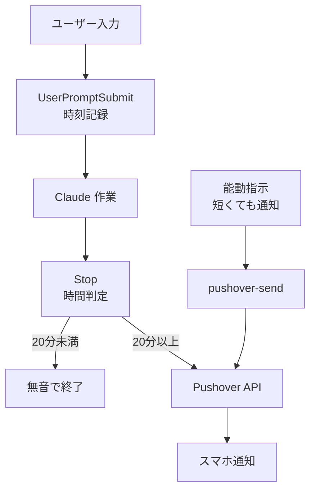
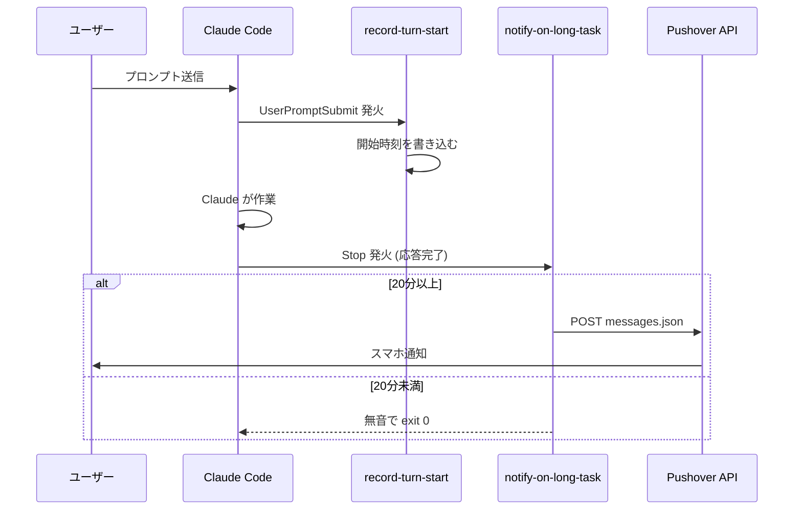
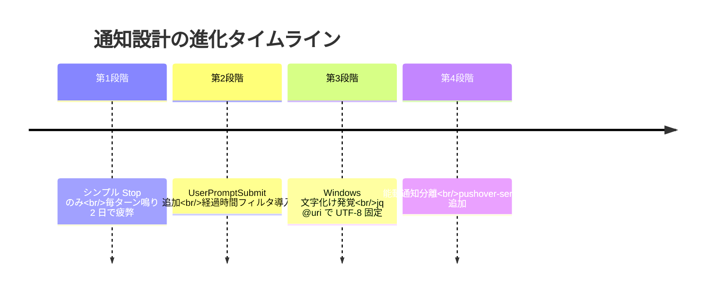
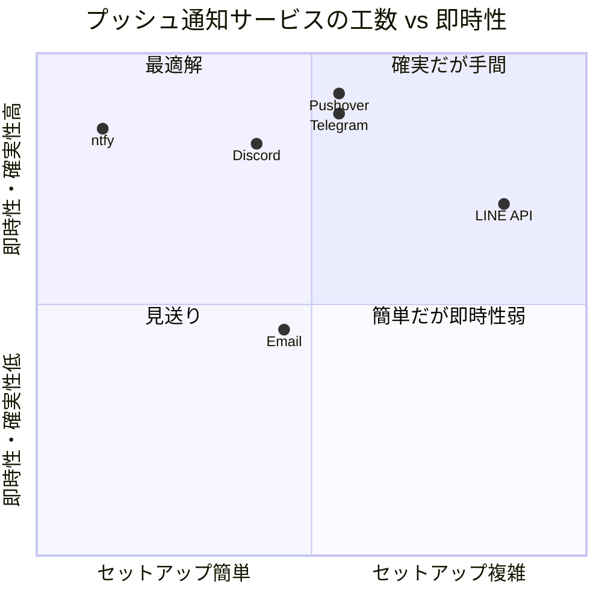
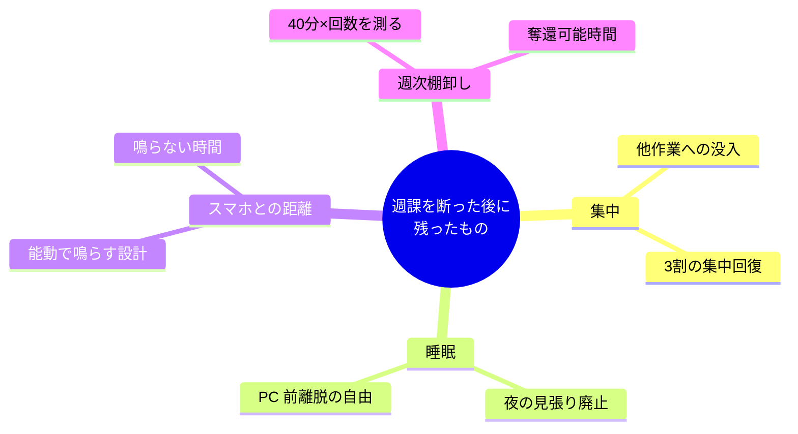

火曜の夕方、冷蔵庫からお茶を出して戻ると、Claude Code が静かに止まっていた。応答欄の最後の行には 40 分前のタイムスタンプ。またか、と思う。先週の金曜も、その前の水曜も、私は同じ席に戻って同じ空白を見つけていました。**これが週課だった**。予定表には書かない、でも毎週 2-3 回必ずある時間の穴。40 分 × 週 3 回 = 2 時間、1 ヶ月で丸 1 日。書き出して初めて気付きました。

この記事は、その週課を **「通知」という道具ではなく「配置換え」という判断** で断ち切る話です。`CLAUDE.md` ではなく `settings.json` の `hooks` へ。たった 1 ファイルの引っ越しで、見張る側から降りる。

## 先に要点

- プッシュ通知は `CLAUDE.md` や memory ではなく `~/.claude/settings.json` の `hooks` に仕込む。ハーネスが直接 shell を叩くので必ず鳴る
- `Stop` は毎ターン発火するので、`UserPromptSubmit` と組んで **「20 分以上かかったターンだけ鳴らす」フィルタ** を挟む
- プッシュ先は `curl` 1 行で差し替え可能。Pushover / ntfy.sh / Discord / Telegram / LINE / メールから 2 軸で選ぶ

## この記事で分かること

- なぜ CLAUDE.md・memory・slash に書いた指示は発火しないのか、その理由と対処
- `UserPromptSubmit` + `Stop` の 2 段構成と 20 分フィルタの実装
- 受動通知(自動検知)と能動通知(ラッパー)の **2 輪構造** の設計判断
- 無料サービス 6 つへの移植手順 (`curl` 1 行)

---

## 1. 火曜の 40 分 — 気付かなかった週課

冒頭の火曜は、たまたま記録していた週だったので数字が残った。記録してなかった他の週を思い返すと、もっとあった気がします。**時間ロスの内訳** を 2 週間分きちんと計ると、だいたいこの 3 パターンに分かれました。

| パターン | 発生頻度 | 1 回あたりの損失 |
|---|---|---|
| タスクが 1h38m で終わって、見積もり 2 時間で待ち続けた | 週 1-2 回 | 20-30 分 |
| 冷蔵庫や別部屋の打ち合わせから戻ったら 40 分前に完了していた | 週 2-3 回 | 30-45 分 |
| 「終わったか?」と覗きに行って戻る往復(5 回/日 × 1 分) | 毎日 | 5 分 |

4 時間タスクで 40 分ロスなら **その日の作業時間の 17%** がそのまま消える。さらに厄介なのが「終わってるかもしれない」という思考が頭に居座り続けて、他の作業の集中力が体感で 3 割落ちることです。**見張ること自体は 0.1 秒の行為でも、見張る待機状態が 40 分続くと、思考全体がその 40 分に縛られる。** 喫茶店でノート PC を開いたまま、本当はコーヒーを冷ましているだけ、みたいな時間。

この連載の記事を書き始める動機は、ずっとこの「週 2-3 回起きる、自分だけの無駄時間」でした。不思議なのは、この無駄を 1 年ほど放置していたこと。原因は単純で、**対症療法の通知設定を 2-3 個試しては全部ハズレて、その都度オフにしていた** だけ。この記事はその試行錯誤の結論だけを書きます。

## 2. AI に渡したのに、渡した人が見張っている — CLAUDE.md / memory / slash が鳴らない理由

これは自分だけの話ではないはずで、2026 年の 1 年間で「AI エージェントに自律実行を任せる」運用は日常化しました。ところが **「AI に任せる」と「AI の完了を検知する」は別の技術層** で、前者ばかりが進化して後者は放置されています。結果、AI エージェントを回すエンジニアは **自分が AI の監視カメラになる** という不思議な役割を押し付けられている。本稿の主題はその層の欠落を埋める小さな工作です。

「終わったらスマホにプッシュ通知が飛んでほしい」と思い、素朴に 3 つ試しました。どれも鳴りません。

| 書き場所 | 発火保証 | 却下理由 |
|---|---|---|
| `CLAUDE.md` / ルール | ❌ | モデルが読み飛ばす・忘れる |
| memory | ❌ | セッション圧縮や `/compact` で失われる |
| slash command / skill | △ | モデルが呼ぶ判断をしなかったら動かない |

モデル側の指示はどれも **100% の発火保証がない**。必要なのは、モデルを介さない通知パイプラインでした。

## 3. hook を置く場所の地図 — ハーネス側という選択

鳴らない 3 案を捨てて、4 つ目の候補だけを採用しました。`~/.claude/settings.json` の `hooks` に仕込むと、**Claude Code アプリ本体(ハーネス)が直接 shell を叩く**。モデルは一切経由しません。



縦 1 本の流れ。分岐は「経過時間」だけ。もう 1 つ、能動通知のルート(H→I→F)が同じ送信関数を共有していますが、この 2 輪の分離は 8 章で詳しく扱います。

## 4. UserPromptSubmit と Stop を session_id で結ぶ

hook は 1 発だけでは成立しません。`Stop` は「Claude が応答を終えたとき」に発火しますが、それだけでは **毎ターン鳴ってしまう**。1 問 1 答の短いやり取りでも鳴ると 2 日でオフにしたくなるので、**「ユーザーがプロンプトを送った時刻」を別 hook で先に記録** しておき、`Stop` の時点で経過を計算する 2 段構成にしました。



肝は **同じ session_id** で始点と終点を結ぶこと。Claude Code を 2 窓で開いても、`session_id` をファイル名に含めることで混線しません。

## 5. 開始時刻を 4 行で置く理由 — record-turn-start

最小主義です。このスクリプトは stdin の JSON から `session_id` を抜いて、Unix 秒を 1 ファイルに書くだけ。やろうと思えば sqlite でセッション管理もできますが、そこまでする理由がなかった。

**出典: `~/.claude/hooks/record-turn-start.sh:1-7`**

```bash
#!/usr/bin/env bash
set -u
INPUT=$(cat)
SESSION_ID=$(echo "$INPUT" | jq -r '.session_id // "default"')
date +%s > "$HOME/.claude/.turn-start-$SESSION_ID"
```

- **入力**: Claude Code ハーネスが stdin に流す JSON (`session_id` を含む)
- **出力**: `~/.claude/.turn-start-<session_id>` に Unix 秒 1 行
- **期待挙動**: 複数セッション並行でも `session_id` 分離で混線しない
- **選んだ理由**: 4 行で必要十分。永続化層を入れると「手元に戻って hook を直す」ときの認知負荷が増える。**スクリプト全文が 1 画面に収まること** が、後で読む自分へのプレゼントになる

## 6. 20 分未満は黙って死ぬ — 3 段早期リターンの判断

このスクリプトが最も神経質に書いたコードです。**ユーザーの作業を絶対に止めない** という設計哲学を、3 つの `exit 0` に圧縮しました。

**出典: `~/.claude/hooks/notify-on-long-task.sh:7-26`**

```bash
THRESHOLD_SECONDS=1200

INPUT=$(cat)
SESSION_ID=$(echo "$INPUT" | jq -r '.session_id // "default"')
START_FILE="$HOME/.claude/.turn-start-$SESSION_ID"
[ ! -f "$START_FILE" ] && exit 0

START=$(cat "$START_FILE")
NOW=$(date +%s)
ELAPSED=$((NOW - START))
rm -f "$START_FILE"
[ "$ELAPSED" -lt "$THRESHOLD_SECONDS" ] && exit 0

if [ -z "${PUSHOVER_TOKEN:-}" ] \
   || [ "$PUSHOVER_TOKEN" = "PLACEHOLDER_TOKEN" ]; then
  exit 0
fi
```

- **入力**: stdin の JSON + 環境変数 `PUSHOVER_TOKEN` + `.turn-start-<session_id>` ファイル
- **出力**: `exit 0`(無音)or Pushover 送信続行
- **期待挙動**: 3 つの条件のいずれかで静かに死ぬ
- **選んだ理由**: 下の 3 段の早期リターンは、実運用で踏む 3 つの「鳴らなくてよい」場面に対応している

| 条件 | 想定シーン | 対応 |
|---|---|---|
| 開始ファイル無い | 初回起動、想定外の呼ばれ方 | 無音 `exit 0` |
| 経過 < 1200 秒 | 1 問 1 答の短いやり取り | 無音 `exit 0` |
| 認証情報がプレースホルダ | 新 PC セットアップ直後、トークン未設定 | 無音 `exit 0` |

「プレースホルダ検出」は特に効きます。新しい PC でこのスクリプトを入れた初日、トークンを貼り忘れたまま作業すると `curl` が毎ターンエラーを吐き続ける事故になりやすい。ここで **自前の sentinel** を入れて静かに死なせておくのは、未来の自分への親切です。

## 7. CP932 に殺されかけた半日 — jq @uri が正解だった

上の 2 つまでは書けたとき、**これで完成だ** と思って昼飯に行きました。戻ってテスト通知を飛ばすと、スマホには `Claude Code 螳御ｺ�` と文字化けが届いていた。Windows Git Bash 特有の CP932 呪いです。

half a day それで悩んだ末、`curl --form-string` に日本語を渡す限り Windows では勝手に UTF-8 → CP932 変換が走ることが分かった。対策は 1 行でした。**`jq` で先に URL パーセントエンコードして ASCII バイト列に落としてから** curl に渡す。

**出典: `~/.claude/hooks/pushover-send.sh:10-27`**

```bash
TITLE_E=$(jq -rn --arg s "$TITLE" '$s | @uri')
MESSAGE_E=$(jq -rn --arg s "$MESSAGE" '$s | @uri')

curl -s --max-time 10 -X POST \
  -H "Content-Type: application/x-www-form-urlencoded; charset=UTF-8" \
  --data "token=${PUSHOVER_TOKEN}&user=${PUSHOVER_USER}&title=${TITLE_E}&message=${MESSAGE_E}" \
  https://api.pushover.net/1/messages.json
```

- **入力**: `$TITLE` / `$MESSAGE`(日本語可)
- **出力**: Pushover API への POST、`status: 1` で受理
- **期待挙動**: Windows Git Bash 環境でも文字化けせずに UTF-8 で届く
- **選んだ理由**: `--form-string` に日本語を渡すのが最初の実装だった。**shell の文字コード設定に影響される経路を全部潰す** には、jq で事前に `@uri` エンコードしてから `--data` で送るのが唯一の正解。半日の試行錯誤の結論なので、ここは譲らなかった

## 8. 受動通知と能動通知を 2 輪にする — pushover-send を独立させた理由

上の `pushover-send.sh` は、実は `notify-on-long-task.sh` の中に埋めることもできました。1 スクリプトに全部入れる選択もあった。**独立させたのは、能動的に鳴らしたい場面があったから** です。

`notify-on-long-task.sh` は **受動通知** です。20 分以上かかったら勝手に鳴る。一方 **能動通知** の場面もあります。「このビルド成功だけ短くても鳴らして」と Claude に指示したい、スクリプトの末尾で鳴らしたい、ターミナルから手動でテスト送信したい。そのたびに受動通知の閾値を一時的に書き換えるのは論外です。

そこで **同じ Pushover API を叩くエントリポイントを 1 つ独立させて**、両方から呼べるようにしました。

**出典: `~/.claude/hooks/pushover-send.sh:1-9`**

```bash
#!/usr/bin/env bash
# On-demand Pushover notification. Meant to be invoked from Claude Code so that
# PUSHOVER_TOKEN / PUSHOVER_USER are available via settings.json env.
# Usage: bash ~/.claude/hooks/pushover-send.sh "<title>" "<message>"
set -u
TITLE="${1:-Claude Code 通知}"
MESSAGE="${2:-完了しました}"
```

- **入力**: CLI 引数 `$1` タイトル / `$2` 本文(いずれも省略可)
- **出力**: 受動通知と共有する Pushover API エンドポイントへの POST
- **期待挙動**: 短いタスクでも明示的に鳴らせる、受動側と独立に動く
- **選んだ理由**: **2 輪構造**(受動 1 輪 + 能動 1 輪)にすることで、どちらかが壊れてももう片方は動く。また Pushover → ntfy.sh に移植する日が来ても、**差し替える curl が 1 関数に閉じていれば置換は 1 箇所で済む**

## 9. settings.json の async: true が作業を殺さない

最後の仕上げは `~/.claude/settings.json` への hook 登録です。ここに `async: true` を 1 行入れる判断が、地味ですが効いています。

**出典: `~/.claude/settings.json:5-33`**

```json
{
  "env": {
    "PUSHOVER_TOKEN": "YOUR_APP_TOKEN",
    "PUSHOVER_USER": "YOUR_USER_KEY"
  },
  "hooks": {
    "UserPromptSubmit": [
      { "hooks": [ { "type": "command",
        "command": "bash ~/.claude/hooks/record-turn-start.sh" } ] }
    ],
    "Stop": [
      { "hooks": [ { "type": "command",
        "command": "bash ~/.claude/hooks/notify-on-long-task.sh",
        "async": true, "timeout": 30 } ] }
    ]
  }
}
```

- **入力**: 環境変数 `PUSHOVER_TOKEN` / `PUSHOVER_USER` + `hooks` 宣言
- **出力**: `UserPromptSubmit` と `Stop` 両イベントへの登録、`Stop` は非同期実行
- **期待挙動**: Claude の応答を待たせず、Pushover の障害やタイムアウトが作業を巻き添えにしない
- **選んだ理由**: `async: true` は **2 段の意義** がある

1. 送信中の通知処理で **Claude セッションが固まらない**
2. Pushover 側の障害・レート制限で **ターミナルが 10 秒止まらない**

ここまで来るのに、設計は 4 段階の進化を踏んでいます。



最初から今の形だったわけではなく、毎段階で失敗してから直しています。第 1 段階の「毎ターン鳴る」は 2 日でオフにしたくなり、第 3 段階の CP932 は半日悩み、第 4 段階の分離判断は 8 章で書いた通り **2 輪構造への移行** でした。

## 10. Pushover を使わない人の 6 つの降り先 — 2 軸で選ぶ

Pushover は $5 の買い切りで買ってしまえばずっと使えますが、「そこまで払いたくない」人向けに同じ骨格を流用できる代替サービスがあります。`curl` 1 行を差し替えるだけで移植できるので、**2 軸(工数 × 即時性)** で並べて眺めると選びやすい。



「最適解」象限に入るのは **ntfy.sh(無料)と Discord**。Pushover は課金と端末登録の手間があるので「確実だが手間」象限に寄っています。

**ntfy.sh が一番のおすすめ** — トピック名を長めのランダム文字列にするだけで、アカウント作成もトークン発行もいりません。

**出典: `~/.claude/hooks/notify-on-long-task.sh:31-36` の `curl` 行を下記 2 行に差し替える**

```bash
curl -d "$(basename "$PWD") のタスクが完了しました" \
  ntfy.sh/claude-code-notify-<your-random-topic>
```

- **入力**: 環境変数不要、引数不要(本文のみ stdin で送る)
- **出力**: 指定トピックへの平文 POST
- **期待挙動**: 受信側は公式アプリ (iOS/Android) でそのトピック名を購読するだけで push が届く
- **選んだ理由**: アカウント不要、**トピック名は長くユニークに** すれば実用上は充分。「プッシュ通知を買う」と「差し替えられる設計にしておく」のどちらを優先するかで選択が分かれる

## 11. 週課を断った後に残ったもの — 3 つの領域

書いてきた仕組みが動き始めると、**数週間かけて生活が段階的に変わります**。私の場合、変化は以下の 4 つの領域に分かれました。



特に効いたのは「鳴らない時間が増えた」こと。能動通知を切り分けた設計(8 章)のおかげで、**鳴るべき時だけ鳴るので、鳴らない時間の静寂が返ってきた**。40 分 × 週 3 回は、誰の予定表にも書かれていない。書き出した日から、見張る側から降ります。

## まとめ — 明日 / 今週 / 1 ヶ月後の時間階段

1. **明日**: `~/.claude/settings.json` の `hooks.Stop` に 1 行追加(5 分)
2. **今週**: Claude Code を覗いた回数 × 40 分 を「奪還可能時間」として計算
3. **1 ヶ月後**: Pushover か ntfy.sh か、`curl` 1 行の差し替えで再評価

## 参考

- Claude Code hooks 公式ドキュメント: <https://docs.claude.com/ja/docs/claude-code/hooks>
- Pushover Messages API: <https://pushover.net/api>
- ntfy.sh 公式: <https://docs.ntfy.sh/publish/>