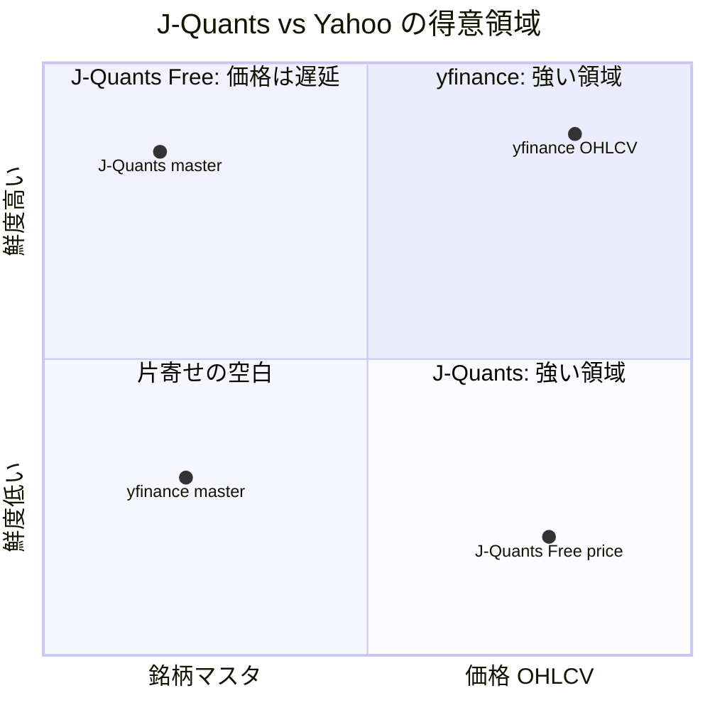
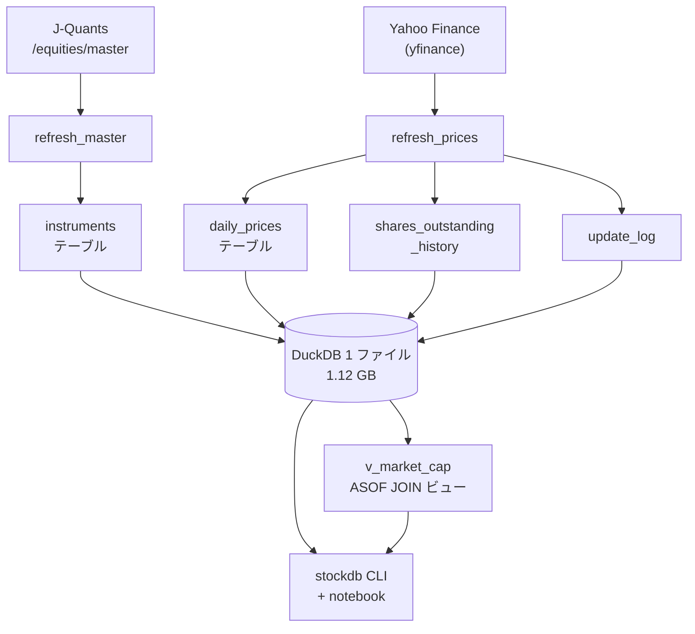
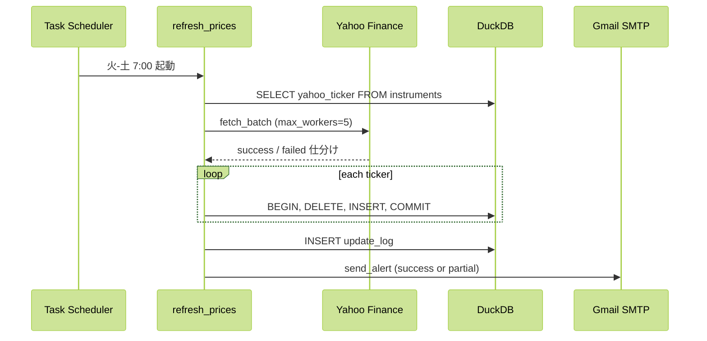
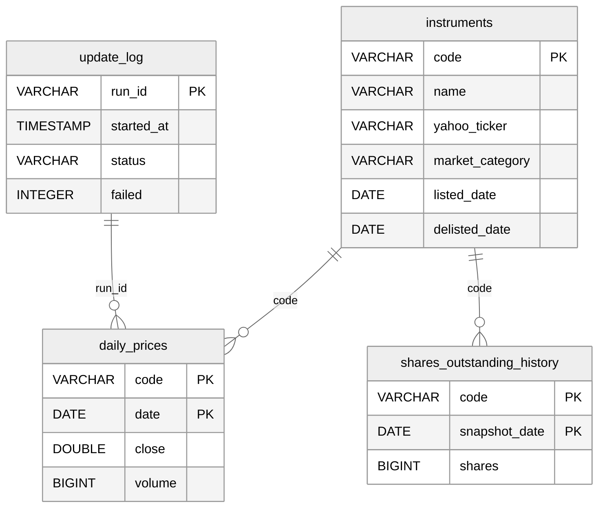
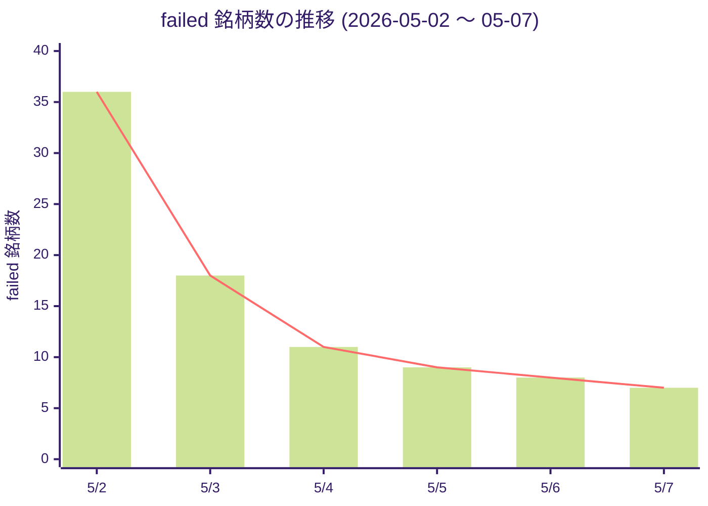

**yfinance だけでは届かない、J-Quants Free だけでも届かない — 両者を補完で組む話**です。

yfinance は価格 OHLCV は強いものの銘柄マスタを返さず、上場廃止銘柄は例外ではなく空 DataFrame で沈黙します。J-Quants Free は銘柄マスタを公式即時で返してくれますが、価格は 12 週遅延で日々のスクリーニングには間に合いません。両者を **役割分担** で組み合わせて 1 つの DuckDB に統合する補完設計に至りました。**マスタは J-Quants、価格は yfinance、互いの弱みを塞ぎ合う構成**。Python 3.12 + yfinance 0.2.40 + DuckDB 1.0 で書かれた自前株価 DB は、0 円・全上場銘柄 約 3800 × 10 年・1.12 GB が火-土 7:00 に自動更新され、failed は **2026-05-02 初回フル取得時 36 件 (0.95%) → 5/7 で 7 件 (0.18%)** に落ち着き、安定運用に入りました。

## 先に要点

- データソースを 1 つに寄せず、yfinance と J-Quants を役割分担で組み合わせる — 補完設計が 0 円で全上場銘柄 × 10 年を動かす自前株価 DB の判断軸です
- マスタは J-Quants (公式・即時更新)、価格は yfinance (10 年取得・auto_adjust)、互いの弱みを塞ぐ役割分担で 4 象限すべての穴が消えます
- DuckDB 1.12 GB 1 ファイル + 火-土 7:00 自動更新 + failed > 100 件・連続 2 回失敗だけ通知 — 手元に来れば約 3800 銘柄級スクリーニングが秒オーダーで返る基盤になります

## この記事で分かること

- yfinance と J-Quants の役割分担の判断軸 — 「片寄せ vs 比較表」の二項対立に陥らず補完で組む第三の道
- DuckDB 1 ファイルで約 3800 銘柄 × 10 年 OHLCV を 1.12 GB に収める設計、Postgres / SQLite / Parquet を棄却した理由
- yfinance の delisted 検出穴 (空 DataFrame の罠) を J-Quants 公式マスタで補正する実装パターン
- 火-土 7:00 自動更新 + failed > 100 件 / 連続 2 回失敗だけ Gmail 通知という運用堅牢化の閾値設計
- この基盤の上で「全上場銘柄横断スクリーニング」「他データパイプラインへの転用」など何ができるようになるかの拡張性

## yfinance と J-Quants を組み合わせる補完設計に至った経緯と判断軸

両ソースの仕様を並べて見ると、片方では届かない領域が早い段階で見えてきます。yfinance は `period='10y'` 一発で過去 10 年の OHLCV が `auto_adjust=True` の調整済み時系列で返り、料金もかからず `max_workers=5` の並列で投げても問題ありません。一方で**銘柄マスタを返す API がなく、上場廃止銘柄は例外ではなく空 DataFrame で沈黙する仕様**です。J-Quants Free は逆に `/equities/master` が約 4400 銘柄分のコード・名称・市場区分・業種コードを即時で返してくれますが、価格 OHLCV は 12 週遅延のため日々のスクリーニングには鮮度が足りません。

自前 DB が手元にあると、約 3800 銘柄から「**プライム + 時価総額 500 億超で 1 ヶ月リターン Top 20**」のようなクエリを 1 本の SQL で返せます。スクリーニング条件をそのまま JOIN・WHERE・ORDER BY に書き下せるので、思い付いた仮説を試す距離がぐっと近くなります。これは特定ツールの代替ではなく、データを横断して扱う**自分用の基盤**としての位置付けです。エンジニアやデータ系の業務に関わる方にとっては、GitHub に残しておけばデータパイプライン設計の実装パターンを 1 つ示せる材料にもなります。

既存記事を眺めると、この領域は「**yfinance を使わない選択**」と「**J-Quants v2 でデータを取る**」の二項対立に分かれていて、それぞれ筋の通った主張です。一方で、両者を**組み合わせて 1 つの DB に統合する設計**を主題にした記事は、検索範囲ではほぼ見つかりませんでした。空白地帯になっているこの第三の道に入ってみたら相性が良かった、というのが本記事の出発点になります。

先に結論を書きます。**データソースを 1 つに寄せず、yfinance と J-Quants を役割分担で組み合わせる — 補完設計が 0 円で全上場銘柄 × 10 年を動かす自前株価 DB の判断軸です**。マスタを J-Quants、価格を yfinance に振り分けて互いの弱みを塞ぎ合うと、Free プランの 12 週遅延も Yahoo の delisted 検出穴も両方が無効化されます。次章では、なぜこの役割分担に落ち着いたのか 4 象限で整理します。

## yfinance vs J-Quants の役割分担 — 価格は yfinance、銘柄マスタは J-Quants の補完設計

役割分担の中身は単純で、**yfinance を価格 OHLCV 専用線、J-Quants を銘柄マスタ専用線**と決め切る、これだけです。yfinance は 1 銘柄あたり過去 10 年の OHLCV を `period='10y'` 一発で取得でき、`auto_adjust=True` で株式分割と配当が反映済みの時系列が返ります。料金はかからず、`max_workers=5` の並列で投げても叱られません。一方で銘柄マスタを返す API がなく、上場廃止銘柄は例外ではなく**空 DataFrame で沈黙**するため、自前で銘柄リストを管理しないと delisted の取りこぼしに気づけません。

J-Quants は逆の特性です。Free プランの `/equities/master` は約 4400 銘柄分の銘柄コード・名称・市場区分・33 業種コード・17 業種コードを返してくれて、上場・廃止が即時に反映されます。月 1 回の更新で「真の上場リスト」として十分機能します。代わりに Free プランは 5 calls/分のレート制約があり、価格 OHLCV は 12 週遅延のため日々のスクリーニングには鮮度が足りません。本記事の構成では Free プランの価格は使わず、**マスタ専用線**として割り切っています。



4 象限で見ると、片方では届かない領域がはっきり浮かびます。J-Quants は鮮度の高いマスタ、yfinance は鮮度の高い価格で強く、互いの不得意領域を相手が埋めてくれる構造です。両方を組み合わせると、4 象限すべてに穴がない自前 DB になります。これが本記事の言う**補完設計**の中身で、次章で見る DuckDB の選択もこの構成を前提にしています。

## DuckDB を選んだ判断軸 — Postgres / SQLite / Parquet を棄却した理由と 1.12 GB 実測

ストレージは DuckDB 単一ファイルにしました。`data/stockdb.duckdb` 1 ファイルに約 3800 銘柄 × 10 年の日次 OHLCV (約 1100 万行) と銘柄マスタ・発行済株式数履歴・更新ログがすべて収まり、サイズは実測 1.12 GB です。GitHub Releases に置こうとも外付け SSD にコピーしようとも 1 ファイルで完結し、zero-config なのでサーバプロセスを立てずに `import duckdb` 一行で動きます。

代替案として **PostgreSQL** は手堅い選択ですが、手元の自前 DB のためにサーバプロセスを常駐させるのは過剰でした。**SQLite** は逆に軽すぎて、約 3800 銘柄横断の window function で OLAP 性能の限界が早めに来ます。**Parquet ファイル**だけの構成は、銘柄追加・削除のたびにファイルを書き直す必要があり、毎日の差分更新と相性が悪い判断でした。

DuckDB はカラムナストレージのため、約 1100 万行の `daily_prices` を絡めても `PARTITION BY code ORDER BY date` の window function が手元のノート PC で数秒で返ります。Parquet との相互変換も 1 行で済むので、バックアップや一部データ公開で Parquet を吐く運用も噛み合います。**サーバ不要 / OLAP 性能 / Parquet 互換**の 3 つが同時に欲しい用途では DuckDB が筋の良い選び方になりました。

## 補完設計の全体アーキテクチャ — Python 3 層分離 + DuckDB 4 テーブル + 1 ビュー

実装は **3 層に分離した Python パッケージ + DuckDB 1 ファイル**で構成しています。データ取得層 (`src/stockdb/sources/`) で外部 API のラッパー、オーケストレーション層 (`src/stockdb/pipelines/`) で取得結果を DB に書き込み、アクセス層 (`src/stockdb/screen/` と `cli.py`) で SQL と CLI を提供します。各層はインタフェースだけで結ばれていて、Yahoo を別ソースに差し替えても他層に影響しない構造です。



DuckDB 側は **4 テーブル + 1 ビュー**で、`instruments` / `daily_prices` / `shares_outstanding_history` / `update_log` と `v_market_cap` (時価総額ビュー) で構成しています。役割が分かれているので「失敗銘柄だけ retry したい」「過去のスクリーニング結果を再現したい」といった要望にもテーブル単位で答えやすい設計です。第 7 章で `erDiagram` 付きで詳細を見ます。

## 火-土 7:00 自動更新パイプライン — yfinance を max_workers=5 で並列取得する 30 分間のシーケンス

自動更新は Windows Task Scheduler に任せていて、火-土の 7:00 JST に `python -m stockdb.cli update --quiet --skip-if-recent 12h` が起動します。月曜が空くのは、日曜・月曜は前営業日のデータに動きがないためです。1 回の実行で 3790 銘柄分の 10 年 OHLCV を再取得し、`max_workers=5` の `ThreadPoolExecutor` で並列化しています。手元では 30〜60 分で終わります。



ここで効くのは「**銘柄ごとアトミック DELETE+INSERT**」の判断です。TRUNCATE して差し替える構成だと途中で失敗すると過去データごと消えますが、銘柄単位のトランザクションに分ければ失敗銘柄だけ前回値が温存されます。J-Quants 側は別系統で月 1 回 master を取りに行き、5 calls/分の制約とぶつからないよう `time.sleep(13)` を挟んでいます。次章で、このあたりのコードを 5 箇所、結論→理由→具体例で読みます。

## コード 5 箇所 — yfinance / J-Quants / DuckDB を結論→理由→具体例で読む

ここからはリポジトリで効いている 5 箇所を「**結論 → 理由 → 具体例 → 結論 (5 年後原則)**」の 4 段で読みます。

### (a) J-Quants Free 5 calls/分への構造的対処 — 13 秒 sleep

**結論**: J-Quants Free の 5 calls/分制約は 12 秒では境界条件で 429 を踏むので、ページ区切りごとに 13 秒 sleep する設計にしました (Python>=3.12, requests>=2.31.0)。

**理由**: 5 calls/分は「直近 60 秒で 5 リクエスト未満」の窓判定で、12 秒間隔だと境界条件で 6 リクエスト目が窓に乗ることがあります。1 秒の安全マージンを取った 13 秒で確実に回避します。`/equities/master` は内部でページ分割されて返るため、ページ間の sleep が効きます。

```python
# file: src/stockdb/sources/jquants.py:36-56
def _fetch_all_pages(
    endpoint: str, headers: dict, params: dict | None = None
) -> list[dict]:
    """Fetch all pages, sleeping 13s between calls to stay under 5 calls/min."""
    params = dict(params or {})
    rows: list[dict] = []
    status, body = _http_get(endpoint, headers, params)
    if status != 200 or not isinstance(body, dict):
        raise RuntimeError(
            f"J-Quants {endpoint} failed: status={status} body={body}"
        )
    rows.extend(body.get("data", []))
    while body.get("pagination_key"):
        time.sleep(13)
        params["pagination_key"] = body["pagination_key"]
        status, body = _http_get(endpoint, headers, params)
        if status != 200:
            raise RuntimeError(f"pagination failed: status={status}")
        rows.extend(body.get("data", []))
    return rows
```

環境構築は `pip install requests pyyaml`。**5 年後も生きる原則**: レート制限のある API は境界値ぴったりではなく安全マージンを乗せた値で回す方が長持ちします。

### (b) yfinance の delisted 検出 — 空 DataFrame の罠と backoff [1, 4, 16] × 3

**結論**: yfinance は上場廃止銘柄を例外で返さず、**空 DataFrame で沈黙**します。空判定で防御し、過渡的な失敗には backoff [1, 4, 16] 秒を 3 回試す構成にしました (yfinance>=0.2.40, pandas>=2.2.0)。

**理由**: スクレイピング系ラッパーは仕様変更耐性が低く、例外を投げるパスと空で返すパスが両方成立し得ます。例外だけを catch しても delisted を見落とします。空判定 + 指数バックオフで、過渡的な失敗と恒常的な失敗を分けて扱えます。

```python
# file: src/stockdb/sources/yahoo.py:30-66
def fetch_ohlcv(
    ticker: str, period: str = "10y", max_retries: int = 3
) -> pd.DataFrame:
    for attempt in range(max_retries):
        try:
            t = _yf_ticker(ticker)
            raw = t.history(period=period, auto_adjust=True)
            if raw.empty:
                return pd.DataFrame(
                    columns=["date", "open", "high", "low", "close", "volume"]
                )
            raw = raw.reset_index()
            # ... rename + return df
            return df
        except Exception as e:
            if attempt < max_retries - 1:
                time.sleep(_BACKOFF_SECONDS[min(attempt, len(_BACKOFF_SECONDS) - 1)])
                continue
            raise FetchError(f"yfinance failed for {ticker}: {e}") from e
```

環境構築は `pip install yfinance pandas`。**5 年後も生きる原則**: スクレイピング系 API は「空判定」と「指数バックオフ × 数回」の冗長設計を入れておくと、仕様変更があっても被害が局所化されます。

### (c) DuckDB 銘柄ごとアトミック DELETE+INSERT — 全 TRUNCATE を選ばなかった判断軸

**結論**: 全テーブル TRUNCATE と `INSERT OR REPLACE` を棄却し、**銘柄ごとに DELETE → register → INSERT を 1 トランザクション**で回す構成にしました (duckdb>=1.0.0, pandas>=2.2.0)。

**理由**: TRUNCATE 方式は途中で失敗すると過去データごと消失します。`INSERT OR REPLACE` は主キー単位の動作で複雑度が見合いません。銘柄単位のトランザクションに分けると、失敗銘柄は旧データが温存され ACID も担保されます。

```python
# file: src/stockdb/pipelines/refresh_prices.py:62-78
for yahoo_ticker, df in success_dfs.items():
    code = code_map[yahoo_ticker]
    df_out = df.copy()
    df_out["code"] = code
    df_out = df_out[
        ["code", "date", "open", "high", "low", "close", "volume"]
    ]
    with connection.transaction(write_con):
        write_con.execute(
            "DELETE FROM daily_prices WHERE code = ?", [code]
        )
        write_con.register("df_p", df_out)
        write_con.execute(
            "INSERT INTO daily_prices SELECT * FROM df_p"
        )
        write_con.unregister("df_p")
```

環境構築は `pip install duckdb pandas`。**5 年後も生きる原則**: バッチ更新の粒度は「全部 or 部分」ではなく**銘柄単位アトミック**に置くと、部分成功と ACID が両立します。

### (d) DuckDB スクリーニング SQL — CTE で window 計算を WHERE 前に逃がす

**結論**: DuckDB は `WHERE` 後に window function を計算できないため、**CTE で先に window を計算 → JOIN で絞り込む**形にしました (duckdb>=1.0.0)。

**理由**: 「直近 1 ヶ月の上昇率トップ 20」のようなスクリーニングは `LAG` window function が必要です。`WHERE` で先に絞ってから window を計算しようとすると partition 境界がずれます。CTE で全銘柄分の window を先に計算し、結果を `JOIN` で絞ります。

```python
# file: src/stockdb/screen/queries.py:71-92 (top_gainers)
sql = f"""
    WITH ret AS (
        SELECT code, date, close,
               (close / LAG(close, ?) OVER (PARTITION BY code ORDER BY date)) - 1 AS r
        FROM daily_prices
    ),
    latest AS (SELECT MAX(date) AS d FROM daily_prices)
    SELECT i.code, i.name, i.market_category, ret.close,
           ret.r AS return_pct, mc.market_cap
    FROM instruments i
    JOIN ret ON i.code = ret.code AND ret.date = (SELECT d FROM latest)
    LEFT JOIN v_market_cap mc ON i.code = mc.code AND ret.date = mc.date
    WHERE i.instrument_type = 'stock' AND ret.r IS NOT NULL
    {filt}
    ORDER BY ret.r DESC
    LIMIT ?
"""
```

呼び出し側は `stockdb.connect()` 1 行で読み取り専用接続が得られます。**5 年後も生きる原則**: DuckDB の window function は `WHERE` 前に CTE で計算しておくと partition 境界の事故が起きにくくなります。

### (e) メール通知の二軸閾値 — PARTIAL_FAILURE_THRESHOLD=100 / DEGRADED_AFTER_CONSECUTIVE=2

**結論**: 通知は「**1 回の失敗銘柄数 (100 件)**」と「**連続失敗回数 (2 回)**」の二軸で判定し、本当の障害だけ subject に警告タグを付けて届けます (smtplib は Python 標準)。

**理由**: 銘柄数だけだと Yahoo 側の一時的な不調で 200 件失敗した日のアラートが noise になります。連続失敗回数だけだと初回の大規模失敗を見逃します。両方を組み合わせると、通知が届いたときには「対応すべき何か」が確実にあります。

```python
# file: src/stockdb/pipelines/refresh_prices.py:116-147
cf = consecutive_failures()
if cf >= DEGRADED_AFTER_CONSECUTIVE:    # = 2
    set_degraded_flag(reason=f"consecutive failures = {cf}")
elif status == "success":
    clear_degraded_flag()

warn = ""
if len(failed_tickers) > PARTIAL_FAILURE_THRESHOLD:  # = 100
    warn += f" [HIGH-FAILURES {len(failed_tickers)}>{PARTIAL_FAILURE_THRESHOLD}]"
if cf >= DEGRADED_AFTER_CONSECUTIVE:
    warn += f" [DEGRADED cf={cf}]"

send_alert(
    subject=(
        f"[stockdb] {status} {started_at.date()} "
        f"{len(success_dfs)}/{len(tickers)} OK{warn}"
    ),
    body=...,
)
```

環境構築は `.env` に `SMTP_HOST` / `SMTP_USER` / `SMTP_PASSWORD` を書くだけです。**5 年後も生きる原則**: 通知は失敗率の絶対閾値と連続失敗回数の二軸で判定すると、過剰通知と見逃しの両方が抑えられます。

## DuckDB スキーマ 4 テーブル + 1 ビュー — ASOF JOIN で時価総額を引く設計

スキーマは 4 テーブル + 1 ビューの最低限構成です。`instruments` は銘柄マスタで `code` 主キー、`yahoo_ticker` カラムで yfinance との橋を作ります。`daily_prices` は `(code, date)` 複合主キー、`shares_outstanding_history` は `(code, snapshot_date)` 複合主キーで履歴を温存します。`update_log` は ULID の `run_id` を主キーに 1 実行 1 行で溜まります。



肝は `v_market_cap` ビューで、`daily_prices` と `shares_outstanding_history` を **ASOF LEFT JOIN** して時価総額 `close * shares` を任意の日付で引けるようにしてあります。発行済株式数は四半期に 1 回しか変わらないため、**差分検知 + ASOF JOIN** の組み合わせで「日次の時価総額」を再現します。書き込みは少なく、読み出しは柔軟という構成です。

## yfinance の空 DataFrame の罠 — failed 銘柄を「旧データ温存」する分岐と TRUNCATE 棄却

第 6 章 (c) の判断軸をもう少し掘ります。最初に検討したのは「テーブル全体を TRUNCATE してから当日取得分を一括 INSERT」する案でした。コードはシンプルですが、取得の途中で Yahoo 側が一時的に応答しなくなると、過去 10 年分のデータを丸ごと失う事故と隣り合わせになります。手元 DB であってもこのリスクは取らない判断にしました。

代替の `INSERT OR REPLACE` も、主キー単位の挙動とトランザクション境界の取り方が DuckDB のバージョン進化に依存しやすく、複雑度が見合いません。最終的に**銘柄ごとアトミック DELETE+INSERT** を採用し、第 6 章 (c) のコード 12 行で書き切れました。失敗銘柄は素直に DB に書き込まないので、前回の値が残り、翌日以降の更新で復活します。

ここで yfinance の特性が綺麗に効いてきます。delisted や一時的な欠損は `fetch_ohlcv` から空 DataFrame で返るため、`fetch_batch` 内で `df.empty` を `failed` 側に振り分ければ後続の書き込みループが触りません。書き込み対象に空が混ざる事故も、過去データを上書き削除する事故も、両方が空判定 1 行で塞がります。delisted を例外で返さない仕様は厄介に見えて、空判定で扱えるぶんむしろ素直な仕様だと感じています。

## 補完設計の強みと弱み — 片方が落ちても全滅しない冗長性 / J-Quants Free 12 週遅延

補完設計の強みは**片方が落ちても全滅しない冗長性**です。Yahoo 側で 429 が頻発する日でも銘柄マスタは J-Quants から取れて新規上場銘柄追加は止まりません。逆に J-Quants が応答しない日でも価格は yfinance から取れて日次スクリーニングは継続できます。失敗率は 2026-05-02 の初回フル取得時に 36/3790 (0.95%) でしたが、5 日後には 7/3790 (0.18%) まで落ち着いています。



落ち着いた要因は、初回 36 件のうち多くが Yahoo 側の一時的応答不良で翌日以降の自動 retry で success に戻ったこと、本当の delisted は J-Quants の `delisted_date` と突き合わせて instruments から外したこと、の 2 点です。銘柄ごとアトミックにしておくと再試行が個別銘柄の差分更新として回るので、運用通知も徐々に静かになります。

弱みは 2 つあります。1 つは **J-Quants Free の 12 週遅延**で、本記事の構成ではマスタ専用線として割り切っていますが、当日の四本値を J-Quants 側でクロスチェックしたいなら Standard 以上が必要です。もう 1 つは **yfinance のスクレイピング起源の脆さ**で、Yahoo の HTML 構造変更で `period='10y'` の挙動や空 DataFrame の出方が変わるリスクが残ります。ここは `yfinance` のバージョン更新を月 1 で確認し、テストで挙動を見る運用で抑えています。

## 自前株価 DB の運用 TCO と実務応用 — J-Quants Standard との 5 年比較と他データパイプラインへの転用

自前 DB の運用を**実務的価値**・**コスト**・**転用可能性**の 3 視点で整理します。

**a. 実務的価値**: 気になった銘柄群を即席 SQL で扱える環境が手元にあると、日常的な分析の距離が短くなります。データ系の業務でパイプラインを設計するときには、補完設計を 1 つ完走した経験が**自分の判断軸の物的証拠**になります。GitHub に置いておけば「補完設計の事例を 1 つ持っている」という厚みが添えられます。

**b. J-Quants Standard との 5 年 TCO**: 自前 DB は API 課金 0 円ですが、構築・運用の人的コストがかかります。J-Quants Standard は月 3,300 円 × 12 ヶ月 × 5 年 = 19.8 万円で、価格の遅延が解消されマスタ + 価格を片方に寄せられます。自前を選ぶ条件は「設計を細かくいじりたい / 他データソースと統合したい / 運用ログを手元に持っておきたい」のいずれかが当てはまる場合で、それ以外なら課金が筋の良い選び方になります。

**c. 他データパイプラインへの転用**: 補完設計の判断軸 — 役割分担 / 銘柄ごとアトミック DELETE+INSERT / failed 旧データ温存 / 通知の二軸閾値 — は、気象データ (気象庁 + 民間気象)、SNS データ (X + 第三者データセット)、センサー時系列 (デバイス直 + クラウド集約) など、ソースが 2 つ以上ある時系列データに同じ構成を当てられます。1 つの設計を扱えるようになると、関連領域に幅を広げる素材になります。気象・SNS・センサー時系列だけでなく、**AI 系の RAG パイプライン** (公式ドキュメント + 社内ナレッジの補完統合) や **LLM アプリのデータ基盤** (履歴ログ + 外部 API レスポンスの補完統合) にも同じ判断軸が応用できます。

## 自前株価 DB のまとめ — 5 年後も生きる補完設計 3 行 + GitHub に残る実装パターン

両ソースの仕様を見比べた結果として補完設計に至った話を 11 章で書きました。最後に、5 年後も腐らない判断軸として残しておきたい 3 行と、GitHub に置く README サンプルを置いておきます。

1. **データソースを 1 つに寄せず、役割分担で組み合わせる — 補完設計が 0 円運用の入口です**。J-Quants はマスタ専用線、yfinance は価格専用線、互いの弱みを塞ぎ合う構成。
2. **失敗銘柄は旧データ温存、銘柄ごとアトミック DELETE+INSERT で部分成功を許容する** — 5 年後も生きる判断軸は「全部 or 部分」ではなく「銘柄単位」です。
3. **自前株価 DB を作って GitHub に置いておくと、データ基盤系の話題で自分の判断軸を 1 行で説明できる材料になります** — 補完設計はそのまま気象や SNS など他のデータパイプラインにも応用できます。

```markdown
# 自前株価 DB — yfinance × J-Quants 補完設計

- 全上場銘柄 約 3800 × 10 年 / DuckDB 1.12 GB / 0 円運用
- 火-土 7:00 自動更新 / failed 0.18% 安定
- Python 3.12 + yfinance 0.2.40 + DuckDB 1.0
```

本記事の補完設計はこのシリーズの第 1 回です。次回以降、同じ「役割分担で 1 つの DB に統合」の判断軸を、別のドメインに転用していく予定です。

- **vol.2** (予定): 気象データ — 気象庁 + Open-Meteo の補完で全国観測点 × 10 年を 1 ファイルに
- **vol.3** (予定): SNS データ — X (旧 Twitter) + Reddit の補完でテーマ別投稿 × 1 年を時系列分析
- **vol.4** (予定): 地理空間データ — PLATEAU + OSM の補完で 23 区 × 建物属性を 3D で扱う

いずれも「片寄せでは届かない、補完で初めて成立する」設計の応用例として書く予定です。

普段は AI / データ基盤系の業務 (PoC 設計・LLM アプリ・データパイプライン) を扱っています。エンジニアとして個人で開発しつつ、データの「片寄せでは届かない領域」に補完設計を当てる仕事を中心に動いています。こういった補完設計や自動更新パイプラインの相談があれば、お気軽にお問い合わせください ([INVEST AITech](https://invest-aitech.com/))。
