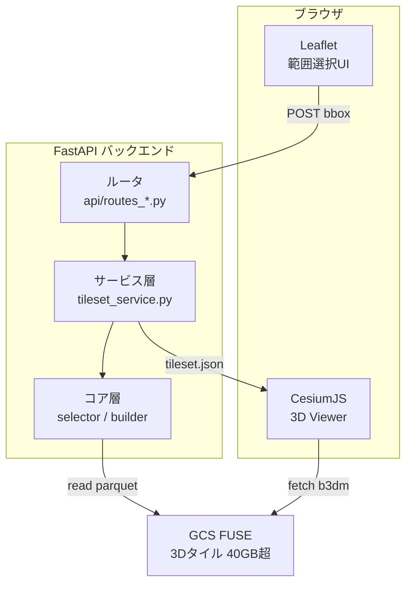
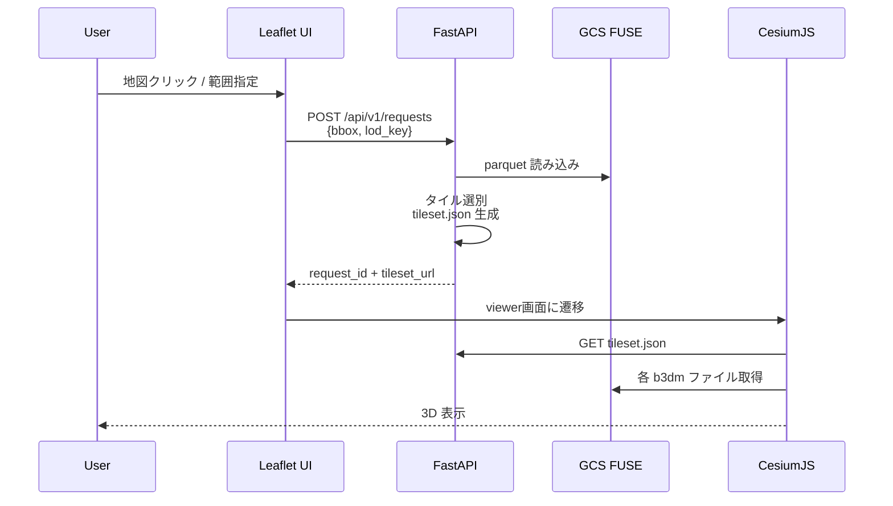
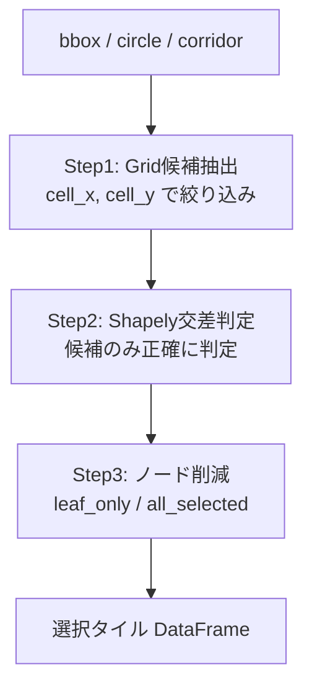
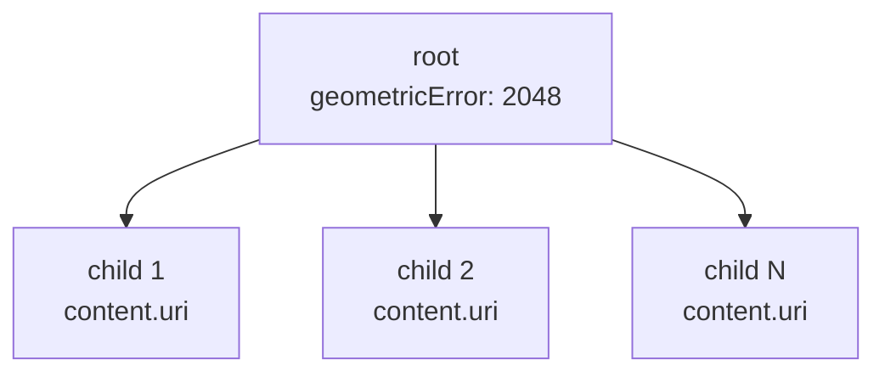
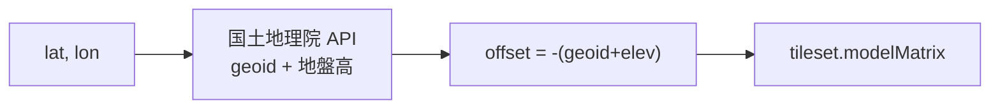

# 【PLATEAU×FastAPI×CesiumJS】地図で範囲を選んで3D都市モデルを見るWebアプリを、3層の責務分離で組み立てる

国土交通省のPLATEAU（3D都市モデル）は、Colabで可視化するところまでは既存記事（[前編](https://qiita.com/invest-aitech/items/bc93f91d869a7e80e236) / [後編](https://qiita.com/invest-aitech/items/6f45b9cf8375b8b8213a)）で扱ってきました。次の一歩は「Webアプリとして他人に触ってもらう」こと。本記事はその設計総論です。

## この記事で分かること

- PLATEAUの3Dタイルを「**地図で範囲を選んで、そこだけ3Dで見る**」Webアプリの全体設計
- 2D地図（Leaflet）と3Dビューア（CesiumJS）をなぜ分けるのか、という設計判断
- FastAPIで `bbox → tileset.json` を**動的生成**して返す実装パターン
- 3層（UI / API / Viewer）に責務を切ることの保守メリット

本番サイト: https://plateau-3d-app-tcus2zi5tq-an.a.run.app

## plateau-webappシリーズ（全3本）

| # | テーマ | 記事 |
|---|---|---|
| **1**（本記事） | **アーキテクチャ総論** | 3層の責務分離を俯瞰する |
| 2 | 配信層 | 40GB超の3Dタイルを GCS FUSE で配信する |
| 3 | API層 | FastAPIでタイル切り出しAPIを組む |

各記事は独立して読めますが、通しで読むと「アプリを組み上げる」までの全貌が繋がります。

## 1. このアプリが解く問題

PLATEAUは日本全国の建物を3Dタイル（3D Tiles規格、`tileset.json` + `b3dm` ファイル群）で配布しています。そのまま全国版をブラウザに読ませると数十GB級。実用には「**見たい範囲だけ切り出して返す**」仕組みがいります。

このアプリの骨格は次の3ステップ。

1. ユーザーが地図で範囲（円 or 廊下）を選ぶ
2. サーバーが該当タイルを選別し、`tileset.json` を動的に組み立てて返す
3. ブラウザ側の3Dビューアがその `tileset.json` をロードして描画

「3Dタイルは静的にホストする」が常識の世界に、**リクエストごとに tileset.json を組み立てる**という動的サーバを差し込むのが本作の肝です。

## 2. アーキテクチャ全景 — 3層の責務分離



この図が本記事の**地図**です。以降の章で各層の中身を掘っていきます。

全体の流れを時系列で追うと次の通り。



## 3. 層1 — Leafletで bbox を選ばせる

なぜ3DビューアのCesiumJS上ではなく、2D地図のLeafletで範囲を選ばせるのか。答えは単純で、**3D球面座標で矩形を描くのはUX的につらい**からです。Leafletはタイル地図を平面で見せるので、クリック1回で緯度経度を取るのが素直です。

初期化は標準的なOSM背景地図を使います。

```javascript
// src/app/static/js/form.js:30-34
const map = L.map(el.map).setView(DEFAULT_CENTER, DEFAULT_ZOOM);
L.tileLayer("https://tile.openstreetmap.org/{z}/{x}/{y}.png", {
  maxZoom: 19,
  attribution: "© OpenStreetMap contributors",
}).addTo(map);
```

`DEFAULT_CENTER = [35.681236, 139.767125]` は皇居周辺。起動直後に東京中心の地図が出る、という地味に重要なUX配慮です。

範囲選択は2モード用意されています。

- **circle**: 中心1点 + 半径メートル
- **corridor**: 複数点をつないだ経路 + バッファ半径

モードの切り替えは同じクリックハンドラが処理します。

```javascript
// src/app/static/js/form.js:162-175
map.on("click", (ev) => {
  const point = {
    lat: Number(ev.latlng.lat.toFixed(6)),
    lon: Number(ev.latlng.lng.toFixed(6)),
  };
  if (el.queryMode.value === "circle") {
    circleCenter = point;
    setStatus("中心を設定: " + point.lat + ", " + point.lon);
  } else {
    corridorPoints.push(point);
    setStatus("corridor 点を追加: " + corridorPoints.length + " 点");
  }
  redraw();
});
```

このコードの役割は「ユーザークリック → 内部状態に座標を蓄積 → Leafletオーバーレイを再描画」。3D側のピッキング（`scene.pick`）と比較すると、ブラウザ側で扱う座標系がシンプルに保たれます。最終的に `buildPayloadSafe()` がこの状態をJSONペイロードに変換し、`POST /api/v1/requests` に投げます。

## 4. 層2 — FastAPIで bbox から tileset.json を組み立てる

サーバ側の中心はPythonのタイル選別ロジックです。まず入力をPydanticで厳密化します。

```python
# src/app/core/models.py:14-34
class CircleQuery(BaseModel):
    mode: Literal["circle"]
    center_lat: float
    center_lon: float
    radius_m: float = Field(gt=0)


class CorridorQuery(BaseModel):
    mode: Literal["corridor"]
    points: list[QueryPoint]
    radius_m: float = Field(gt=0)

    @field_validator("points")
    @classmethod
    def validate_points(cls, value: list[QueryPoint]) -> list[QueryPoint]:
        if len(value) < 2:
            raise ValueError("corridor には 2 点以上必要です")
        return value


QuerySpec = Annotated[CircleQuery | CorridorQuery, Field(discriminator="mode")]
```

`discriminator="mode"` で Pydantic が自動的に `CircleQuery` と `CorridorQuery` を振り分けます。JavaScript側の `buildPayloadSafe()` が吐くJSONの形がそのまま型に落ちます。

選別は3段階のパイプラインです。



なぜ2段階に分けるのか。PLATEAUは全国規模で数百万タイルに及ぶため、全タイルに対してShapelyの交差判定をかけるとそれだけで数秒オーダーになります。そこで、先にグリッドセル座標（整数）で雑に候補を絞り、残った数百〜数千タイルだけを精密判定する——というのが常套句です。

精密判定側はこうなっています。

```python
# src/app/core/selector.py:38-49
def exact_select_tiles(query_geom: BaseGeometry, df_candidates: pd.DataFrame) -> pd.DataFrame:
    if df_candidates.empty:
        return df_candidates.copy()

    selected_flags: list[bool] = []
    for row in df_candidates.itertuples(index=False):
        geom_bbox = box(float(row.minx), float(row.miny), float(row.maxx), float(row.maxy))
        selected_flags.append(bool(query_geom.intersects(geom_bbox)))

    out_df = df_candidates.copy()
    out_df["intersects_query"] = pd.Series(selected_flags, index=out_df.index, dtype=bool)
    return out_df.loc[out_df["intersects_query"]].copy().reset_index(drop=True)
```

`query_geom` はユーザが指定した円や廊下をShapelyジオメトリに変換したもの。`df_candidates` の各タイルの最小外接矩形（`minx/miny/maxx/maxy`）と `intersects` を取り、交差したものだけを残します。pandas の `itertuples` + shapelyの組み合わせは、数千タイル規模なら十分速く動きます。

選ばれたタイルを**3D Tiles規格**に従う `tileset.json` に詰め直します。



`root.boundingVolume.region` で全体の範囲、各 `children.content.uri` で個別のb3dmファイルを指します。`geometricError` はCesium側での描画判断（遠いときに省略するか）に使われる数値です。これを `tileset_builder.py` が組み立て、`/runtime/requests/{request_id}/tileset.json` に書き出します。

ここで大事なのは、**このJSONを動的に作っている**こと。PLATEAU公式の配信サービスや Cesium ion にデータを置けば「静的ファイル読むだけ」で済みますが、本作は「リクエストに合わせて最小限のタイル集合だけを返す」ために自前でJSONを組んでいます。配信量もブラウザの負荷も抑えられます。

## 5. 層3 — CesiumJSで Tileset を描画する

ブラウザ側は CesiumJS をCDN読み込みし、Viewerを立ち上げてtilesetを足すだけです。

```javascript
// src/app/static/viewer/app.js:198-209
var tileset = await Cesium.Cesium3DTileset.fromUrl(meta.tileset_url, {
  maximumScreenSpaceError: 8.0
});
viewer.scene.primitives.add(tileset);

// Apply request-specific height offset to fix floating buildings
var requestHeightOffset =
  meta && typeof meta.height_offset_m === "number"
    ? meta.height_offset_m
    : DEFAULT_PLATEAU_HEIGHT_OFFSET;
applyHeightOffset(tileset, requestHeightOffset);
```

`Cesium3DTileset.fromUrl` が tileset.json をフェッチし、`viewer.scene.primitives.add` で描画対象に足す。あとは Cesium 側が地球儀のどこにどう並べるかを自動でやってくれます。

ところでPLATEAUの3D建物をそのまま置くと、**地面から40メートルくらい浮きます**。原因は測地系と標高体系の違い。そこで補正用のオフセットを計算してかけています。



```python
# src/app/services/height_offset_service.py:83-101
def estimate_height_offset(lat, lon, fallback_offset_m=-40.0):
    try:
        geoid_height_m = fetch_geoid_height(lat, lon)
        ground_elevation_m = fetch_ground_elevation(lat, lon)
        return HeightOffsetResult(
            offset_m=-(geoid_height_m + ground_elevation_m),
            geoid_height_m=geoid_height_m,
            ground_elevation_m=ground_elevation_m,
            source="gsi_geoid_plus_ground_elevation",
        )
    except Exception:
        return HeightOffsetResult(
            offset_m=float(fallback_offset_m),
            source="fallback_fixed_offset",
        )
```

国土地理院のWeb APIから「ジオイド高」と「地盤標高」を取得し、`-(geoid + elev)` を offset として採用。APIが落ちていても `-40.0` メートルで代替できるようになっています。Cesium側で `tileset.modelMatrix` に平行移動を入れて建物を地面まで下ろす、というシンプルな仕組みです。

CesiumJSの初期化自体は他記事に譲ります（[PLATEAU公式 TOPIC 6](https://www.mlit.go.jp/plateau/learning/tpc06-1/) や [CesiumJS入門](https://qiita.com/asahina820/items/e575b843cdf76c0cfcfa) が丁寧）。本記事で強調したいのは「Viewerはただ `tileset.json` を読むだけ」という**役割の単純化**です。複雑さをすべてサーバ側に押し込むことで、ブラウザ側のコードはリフレッシュ性高く保てます。

## 6. なぜ2Dと3Dを分けたか — 設計判断のコア

同じ画面にLeafletとCesiumJSを同居させる案もあります。実際、TerriaJSのような統合フレームワークはそうしています。本作がそれを避けた理由は3つ。

1. **UXの単純化** — 3D上で矩形や円を描くのはユーザーにも実装にも難しい。2Dで済む作業は2Dで
2. **描画コストの分離** — 範囲選択中は3D描画が必要ない。CesiumJSを起動しないぶん選択画面は軽量
3. **差し替えやすさ** — Leafletを MapLibre に替えたい、Cesiumを three.js に替えたい、という未来の要求が層間を跨がずに済む

Cesium の Clipping Polygons を使えば見た目だけ切り抜くこともできますが、それは「巨大な3Dモデルを全ロードしてから一部だけ見せる」発想。本作は「**必要なタイルだけサーバから返す**」発想で、転送量・起動時間の面で効いてきます。

## 7. 実装の強みと限界

### 強み

- **コンテナが軽い** — 40GB超のタイルをGCSに置き、FUSEマウントで透過アクセス。イメージサイズは100MB台に収まる（詳細は次回）
- **データセット差し替えが効く** — `dataset_id` で複数データセットを切り替え。`manifest.json` 仕様を守れば別都市・別年度のデータを同居できる
- **役割分離によるテスト容易性** — 選別ロジックは shapely + pandas の純関数に近く、Pydanticモデル単位でユニットテスト可能

### 限界

- **キャッシュがインスタンスローカル** — Cloud Run のインスタンスを跨ぐ共有キャッシュはない。tileset.json は都度生成（詳細は第3回で扱う）
- **認証・レート制限は未実装** — 公開デモとして運用中。業務用途にはゲート層を足す必要がある
- **3D側の UI がミニマル** — 選択レイヤーの比較や履歴参照は現状提供していない

## 8. まとめと次回予告

本記事は「plateau-3d-app」というWebアプリを **3層の責務分離（UI / API / Viewer）** の視点で俯瞰しました。

- **Leafletが範囲を取り**、**FastAPIがタイルを選んで tileset.json を組み立て**、**CesiumJSはそれを読むだけ** という割り切り
- 選別は「Grid候補抽出 → Shapely交差 → ノード削減」の3段パイプライン
- `tileset.json` を動的生成することで、静的配信では不可能な「必要範囲だけを返す」を実現

次回（plateau-webapp #2）は、40GB超の3Dタイルを **GCS FUSE** でCloud Run Gen2に透過マウントする配信層の話。コンテナに巨大データを同梱せず、イメージサイズと起動時間を小さく保つための実装詳細を扱います。

## 関連記事

- [【Python×PLATEAU】Google Colabで可視化してみた（前編）](https://qiita.com/invest-aitech/items/bc93f91d869a7e80e236)
- [【Python×PLATEAU】Google Colabで可視化してみた（後編）](https://qiita.com/invest-aitech/items/6f45b9cf8375b8b8213a)
- [【PLATEAU×Python】東京23区の建物DB構築（前編）](https://qiita.com/invest-aitech/items/a0da6f648e407b1ed8c9)
- [【PLATEAU×Python】東京23区の建物DB構築（後編）](https://qiita.com/invest-aitech/items/6f45b9cf8375b8b8213a)
- [PLATEAU公式 TOPIC 6｜Cesiumで活用する](https://www.mlit.go.jp/plateau/learning/tpc06-1/)
