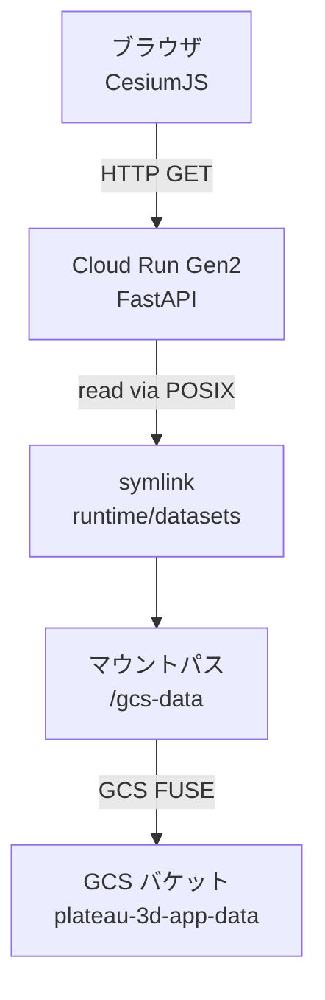
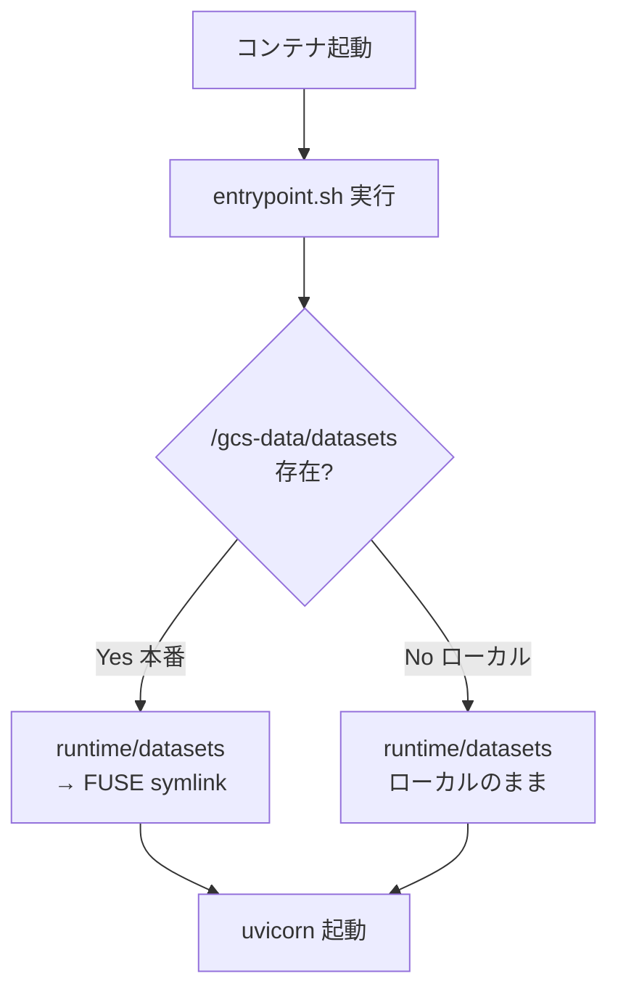
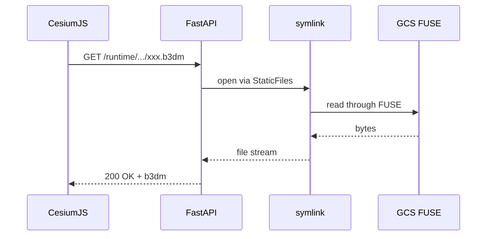
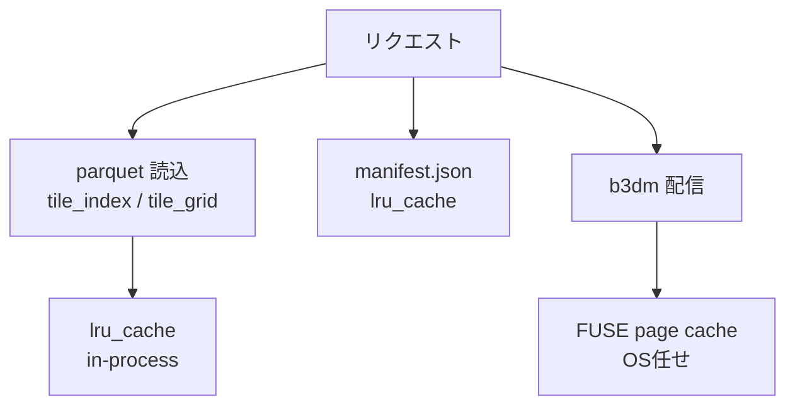
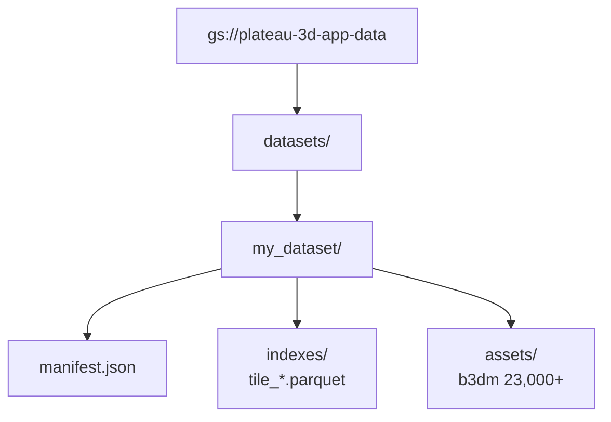

# 【PLATEAU × Cloud Run】41.9GiBの3DタイルをGCS FUSEで透過配信する — コンテナは薄く、データはGCSに

PLATEAU の3D都市モデル（東京23区分）を Cloud Run 上で動く Web アプリから配信しようとすると、まず「**41.9 GiB のタイル群をどこに置くか**」で詰まります。コンテナに同梱する? それは何十GBのイメージをビルドして Artifact Registry に押し込むことを意味します。本記事は、この `40GB 問題` を **Cloud Run Gen2 × GCS FUSE** で解いた実装の話です。

本番サイト: https://plateau-3d-app-tcus2zi5tq-an.a.run.app

## この記事で分かること

- **41.9 GiB / 23,793 オブジェクト** の3D タイル群を、どう Cloud Run から配信しているか
- コンテナ同梱 vs GCS FUSE vs CDN の選び分け判断基準
- Cloud Run Gen2 の `--add-volume` で GCS バケットを POSIX ファイルシステムとしてマウントする具体手順
- FastAPI `StaticFiles` + `follow_symlink=True` という小さな設定で透過配信を成立させるパターン
- parquet は `lru_cache` / b3dm は FUSE 任せ、という**二層キャッシュ**戦略

## plateau-webapp シリーズ（全3本）

| # | テーマ | 記事 |
|---|---|---|
| 1 | アーキテクチャ総論 | 3層の責務分離で組み立てる（公開済み） |
| **2**（本記事） | **配信層** | **40GB超の3Dタイルを GCS FUSE で配信する** |
| 3 | API層 | FastAPIでタイル切り出しAPIを組む（次回） |

通しで読むと「PLATEAU の3Dタイルを Web アプリとして世に出す」までの全貌が繋がります。

---

## 1. このアプリが抱える「40GB問題」

PLATEAU は国土交通省が整備する3D都市モデル群です。東京23区版の3D Tiles（`tileset.json` + `b3dm` 群）をそのまま収容すると、実測で:

- **23,793 オブジェクト**
- **41.9 GiB**（44,987,683,312 bytes）

このアプリは「地図で範囲を選ぶ → サーバがその範囲だけ切り出して `tileset.json` を動的生成 → Cesium が b3dm を読む」という構造（詳細はシリーズ#1 参照）。**b3dm 実ファイル**は最終的にブラウザが直接フェッチしにいくため、**サーバはそれを配れる状態にある必要がある**。

ここで問いが立ちます。**そのタイル群、どこに置くんだ?**

## 2. 選択肢の比較 — コンテナ同梱 vs GCS FUSE vs CDN

素直に考えると候補は3つ。

| 方式 | コンテナサイズ | 更新俊敏性 | 実装難度 | 向くケース |
|---|---|---|---|---|
| コンテナ同梱 | 40GB超 | 低（都度再ビルド） | 低 | データが数MBで固定 |
| **GCS FUSE** | **100MB台** | **高（GCS更新が即反映）** | 低〜中 | 大容量＋読取中心 |
| CDN 前段 | 100MB台 | 中（invalidate 必要） | 中〜高 | 高頻度・高並列配信 |

### コンテナ同梱の何が辛いか

- **イメージビルド時間**: 40GB の `COPY` に5〜10分
- **Artifact Registry への push**: さらに数分
- **Cloud Run のコールドスタート**: イメージ pull がそのぶん遅くなる
- **データ差し替え**: 新年度の PLATEAU データが出たら、コンテナを丸ごと再ビルド

「**配信だけしたいデータ**」をコンテナ（= コードと一緒に版管理される単位）に入れるのは、責務として不自然です。

### GCS FUSE を選んだ理由

- コンテナは常に100MB台で、デプロイが速い
- データ更新は `gsutil cp` だけ。アプリのデプロイは不要
- POSIX ファイルシステムとして見えるので、**アプリコードは普通のローカルファイル操作**で済む

CDN は「**さらに速くしたい**」となったときの上積み。まず GCS FUSE で素直に組んで、必要なら後段に CDN を差す、という順序にしました。

## 3. 全体アーキテクチャ



ここで読んで欲しいのは「**ブラウザから見れば普通の HTTP、FastAPI から見れば普通のファイル、FUSE 層が間の翻訳を全部やる**」という層構造です。

## 4. Cloud Run Gen2 マウントの実コマンド

マウント設定は GitHub Actions の deploy ワークフローにまとまっています。

```yaml
# .github/workflows/deploy.yml:41-58
- name: Deploy to Cloud Run
  run: |
    gcloud run deploy ${{ vars.CLOUD_RUN_SERVICE }} \
      --image=${{ env.IMG }} \
      --region=${{ vars.GCP_REGION }} \
      --project=${{ vars.GCP_PROJECT_ID }} \
      --allow-unauthenticated \
      --execution-environment=gen2 \
      --memory=1Gi \
      --cpu=1 \
      --concurrency=80 \
      --min-instances=0 \
      --max-instances=3 \
      --timeout=300 \
      --port=8080 \
      --set-env-vars=RUNTIME_ROOT=/app/runtime,GCS_DATASETS_PATH=/gcs-data/datasets \
      --add-volume=name=gcs-vol,type=cloud-storage,bucket=${{ vars.GCS_BUCKET }} \
      --add-volume-mount=volume=gcs-vol,mount-path=/gcs-data
```

押さえるべきはこの4行:

1. `--execution-environment=gen2` — Gen1 は FUSE 非対応。**これを忘れるとエラーにならずに機能が効かない**、という恐ろしい罠です
2. `--add-volume=name=gcs-vol,type=cloud-storage,bucket=...` — GCS バケットを「ボリューム」として Cloud Run に宣言
3. `--add-volume-mount=volume=gcs-vol,mount-path=/gcs-data` — 宣言したボリュームをコンテナ内パスにマウント
4. `GCS_DATASETS_PATH=/gcs-data/datasets` — アプリにマウント先を伝える環境変数

Runtime 側のサービスアカウントには `roles/storage.objectViewer` が必要です。読み取り専用で十分（本アプリは書き込まない）。

### コンテナに gcsfuse をインストールする必要は無い

2024年初頭以降、Cloud Run の「ネイティブ機能」として CSI 経由で Cloud Storage FUSE が提供されるようになりました。`Dockerfile` を見ても余計なものは入っていません。

```dockerfile
# Dockerfile:1-19（抜粋）
FROM python:3.11-slim

RUN apt-get update && apt-get install -y --no-install-recommends \
      curl \
      ca-certificates \
  && rm -rf /var/lib/apt/lists/*

WORKDIR /app

COPY src/requirements.txt ./requirements.txt
RUN pip install --no-cache-dir -r requirements.txt

COPY src/ /app/
```

`datasets/` を `COPY` する行はどこにもない。**データはランタイムで取り込む**、が徹底されています。

## 5. 起動時の symlink スイッチ

マウントさえ通れば、アプリ側は「`/gcs-data/datasets` を見に行くだけ」なのか。実はもう一段、**ローカル開発と Cloud Run で同じコードを動かす**ための仕掛けがあります。

```bash
# src/entrypoint.sh:1-21
#!/bin/bash
set -e

RUNTIME_ROOT="${RUNTIME_ROOT:-/app/runtime}"
mkdir -p "${RUNTIME_ROOT}/requests"

GCS_MOUNT="${GCS_DATASETS_PATH:-/gcs-data/datasets}"
if [ -d "${GCS_MOUNT}" ] && [ ! -d "${RUNTIME_ROOT}/datasets/my_dataset/assets" ]; then
    echo "GCS FUSE detected at ${GCS_MOUNT}"
    rm -rf "${RUNTIME_ROOT}/datasets"
    ln -sf "${GCS_MOUNT}" "${RUNTIME_ROOT}/datasets"
    echo "Linked: ${RUNTIME_ROOT}/datasets -> ${GCS_MOUNT}"
else
    echo "Using local datasets at ${RUNTIME_ROOT}/datasets"
fi

echo "Starting server on port ${PORT:-8080}"
exec python -m app.server
```

このスクリプトは Docker の `CMD` として起動時に走ります。



やっていることは2行でまとめられます。

- マウントが有れば `runtime/datasets` を **FUSE マウント先へのシンボリックリンク** にする
- マウントが無ければ `runtime/datasets` をそのまま使う（ローカル開発で `datasets/my_dataset/` を手で置ける）

アプリ本体（Python）は「`runtime/datasets` にデータがある」とだけ思っていて、**本番か否かを知る必要がない**。この分離が効きます。

## 6. FastAPI で FUSE を透過配信する

FUSE の次の関門は、**FastAPI の `StaticFiles` が symlink 越しにファイルを配れるか** です。

```python
# src/app/main.py:43-47
app.mount(
    "/runtime",
    StaticFiles(directory=str(settings.runtime_root), check_dir=False, follow_symlink=True),
    name="runtime",
)
```

目立たない1行ですが、**`follow_symlink=True` がこの配信層の心臓**です。

- `/app/runtime/datasets` は symlink（entrypoint.sh で張られた）
- Python の `StaticFiles` はデフォルトでは symlink を「安全のため」辿らない
- 明示的に `follow_symlink=True` を立てることで、`GET /runtime/datasets/my_dataset/assets/xxx.b3dm` が FUSE 越しに GCS の実ファイルを返す

ブラウザから見ると、これは単なる「**FastAPI が配っている静的ファイル**」。裏で何が起きているかは知らずに済みます。



この図の肝は、**F と G の間を結んでいるのが「普通のファイル open」**という事実です。Python 側には `google-cloud-storage` の import も `gcsfuse` の設定もありません。

## 7. 二層キャッシュ戦略 — parquet は in-process、b3dm は FUSE 任せ

41.9 GiB を毎回 GCS から読んだらパフォーマンスが立ち行きません。このアプリは**2つの層**でキャッシュしています。



### 層1: parquet と manifest は `lru_cache`

メタデータは Python プロセス内にメモリキャッシュします。

```python
# src/app/core/dataset_registry.py:60-70
@lru_cache(maxsize=64)
def _load_manifest(manifest_path: str) -> DatasetManifest:
    path = Path(manifest_path)
    return DatasetManifest.model_validate_json(path.read_text(encoding="utf-8"))


@lru_cache(maxsize=32)
def _load_frames(tile_index_path: str, tile_grid_path: str) -> tuple[pd.DataFrame, pd.DataFrame]:
    df_tile_index = pd.read_parquet(tile_index_path)
    df_tile_grid = pd.read_parquet(tile_grid_path)
    return df_tile_index, df_tile_grid
```

このコードは何をしているか。`tile_index.parquet` と `tile_grid.parquet` は「どのタイルがどこにあるか」を記述するインデックス（数百MB級）。初回のリクエスト時だけ FUSE 越しに読み、2回目以降は `pd.DataFrame` をそのまま返します。

**Cloud Run のインスタンスが生きている間は、parquet を再読しない**。これで、タイル選別処理の大半は純粋なメモリ上の pandas 演算になります。

### 層2: b3dm は FUSE の page cache に任せる

b3dm は**アプリ側ではキャッシュしません**。理由は単純で、23,000個以上のファイルを Python プロセスが抱えるのは無理があるから。かわりに:

- FUSE の stat cache（デフォルト 60秒 TTL、32 MiB まで）でファイル存在確認を軽くする
- OS の page cache が最近読んだ b3dm をメモリに留める
- 繰り返しアクセスされるタイルは自然と速くなる

**読み取り中心のワークロード**で、かつファイル単位のアクセスが偏る（よく見られる場所は繰り返し見られる）場合、この OS 任せのキャッシュが素直に効きます。

## 8. manifest.json によるデータセット抽象化

マウントされた GCS 側の階層はこう組まれています。



階層は `manifest.json` で定義されていて、アプリはこの JSON 経由で場所を知ります。

```python
# src/app/core/models.py:49-60
class DatasetManifest(BaseModel):
    dataset_id: str
    title: str | None = None
    description: str | None = None
    default_lod_key: str = "lod2"
    data_crs: str = "EPSG:32654"
    grid_size_m: int = Field(default=250, gt=0)
    indexes_dir: str = "indexes"
    assets_dir: str = "assets"
    tile_index_file: str = "tile_index.parquet"
    tile_grid_file: str = "tile_grid.parquet"
    path_rewrite_rules: list[PathRewriteRule] = Field(default_factory=list)
```

`data_crs`（元データの座標系）、`grid_size_m`（グリッドセルの一辺）、`assets_dir`（b3dm の置き場）などを manifest が握っているので、**別都市・別年度のデータセットを追加するときも、この manifest 規約を守れば同じコードで読める**。

「データをコードから分離する」という発想は、コンテナに同梱しないこととセットで効いてきます。

## 9. ハマりどころ（本番で実際に踏んだもの）

### 9.1 Git Bash の path conversion

ローカルから `gcloud run deploy` を叩くとき、Git Bash（MSYS）が `mount-path=/gcs-data` を Windows パスに勝手に変換して、マウントが壊れる現象に遭遇しました。

対処は `--flags-file=run-deploy-flags.yaml` 方式。YAML 経由なら path conversion が走りません。Git Bash ユーザーは最初からこの方式で書いておくと事故らない。

### 9.2 `--execution-environment=gen2` の抜け

Gen1 環境では `--add-volume ... type=cloud-storage` が無視されるのではなく**そもそもリクエストが通らない**ケースがあります。`deploy.yml:47` で明示しているのはそのため。

### 9.3 コールドスタート時の初回レイテンシ

`--min-instances=0` で運用している（アイドル時ゼロスケール）ので、無アクセス状態から復帰するときに:

1. コンテナ起動
2. GCS FUSE マウント
3. entrypoint.sh の symlink 作成
4. uvicorn 起動
5. 最初のリクエストで parquet を FUSE 経由で読み込む（数百MB）

この5ステップが直列で走るので、**初回だけ数秒の体感**が出ます。常時暖めたいなら `--min-instances=1` に上げる、が基本処方箋。

### 9.4 IAM の責務分離

- Runtime SA: `roles/storage.objectViewer` だけ
- Deploy SA: Workload Identity Federation で `Invest-AItech/plateau-3d-app` リポジトリに限定

**読むためのロールと、デプロイするためのロールを分ける**。Runtime SA にバケット書き込み権限を与えない、というのは大容量データを扱うときの基本ガードです（誤実装で上書き事故を防ぐ）。

## 10. 強みと限界

### 強み

- **コンテナが軽い** — イメージは100MB台。ビルド・デプロイが速い
- **データ更新が独立** — `gsutil cp` だけでタイルを差し替えられる
- **ローカル開発が楽** — entrypoint.sh の分岐で、FUSE 無しでも同じコードが動く
- **アプリコードが純粋** — `google-cloud-storage` の SDK 呼び出しがゼロ。ユニットテストもローカル file system で完結

### 限界

- **並行書き込み非対応** — GCS FUSE はファイルロックを提供しない（last write wins）。本アプリは読み取り専用なので無関係だが、書き込み用途では別戦略が必要
- **初回レイテンシ** — `min-instances=0` ではコールドスタート時に数秒の遅延
- **メモリ圧迫リスク** — 大量のファイルを同時にストリーミングすると FUSE 側のメモリが膨らむ（1.6GB ダウンロードで 3.7GB まで膨らんだ報告がある）。本アプリは b3dm 単位（MB級）なので現状は問題なし
- **CDN キャッシュ未導入** — 広告的に公開するなら Cloud CDN を前段に差す余地がある

## 11. まとめと次回予告

**41.9 GiB / 23,793 オブジェクトの3Dタイル群**を、40GB級のコンテナを作らずに Cloud Run から配信する。そのための具体手は3つでした。

1. **Cloud Run Gen2 + `--add-volume`** で GCS バケットを POSIX ファイルシステムとしてマウント
2. **entrypoint.sh の symlink スイッチ** でローカル / Cloud Run 両対応を同一コードで実現
3. **`StaticFiles(follow_symlink=True)`** という小さな設定が、FUSE 越しの透過配信を成立させる

「コンテナは薄く、データは GCS に」という分離が効くのは、**データとコードの更新サイクルが違う**から。PLATEAU の新年度データが出たときに、コードのデプロイは一切触らずに差し替えられる。これは運用に入ったときに効いてくる地味な美徳です。

次回（plateau-webapp #3）は、このマウントされたデータを材料に、FastAPI が `bbox` から `tileset.json` を動的生成する**API 層の実装詳細**を掘ります。Pydantic の discriminator、Shapely の交差判定、3D Tiles 仕様の組み立てまで、選別パイプラインの全貌を扱う予定です。

## 関連記事

- PLATEAU × FastAPI × CesiumJS（シリーズ#1）— 3層の責務分離を俯瞰する総論
- [Cloud Run と Cloud Storage FUSE (GCS FUSE) の基本](https://zenn.dev/google_cloud_jp/articles/cloudrun-gcs-fuse) — 公式寄りの基礎解説
- [Configure Cloud Storage volume mounts for Cloud Run services](https://cloud.google.com/run/docs/configuring/services/cloud-storage-volume-mounts) — Google Cloud 公式ドキュメント
- [【Python×PLATEAU】Google Colabで可視化してみた（前編）](https://qiita.com/invest-aitech/items/bc93f91d869a7e80e236)
- [【Python×PLATEAU】Google Colabで可視化してみた（後編）](https://qiita.com/invest-aitech/items/6f45b9cf8375b8b8213a)

