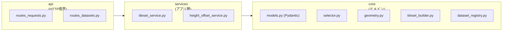
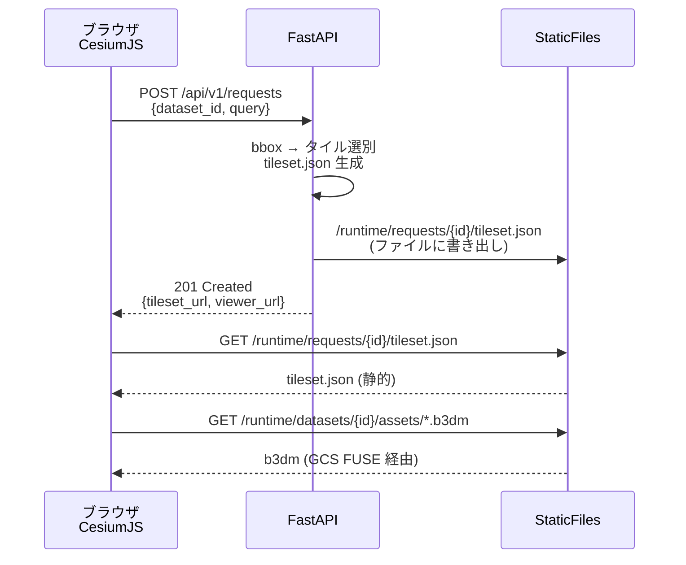
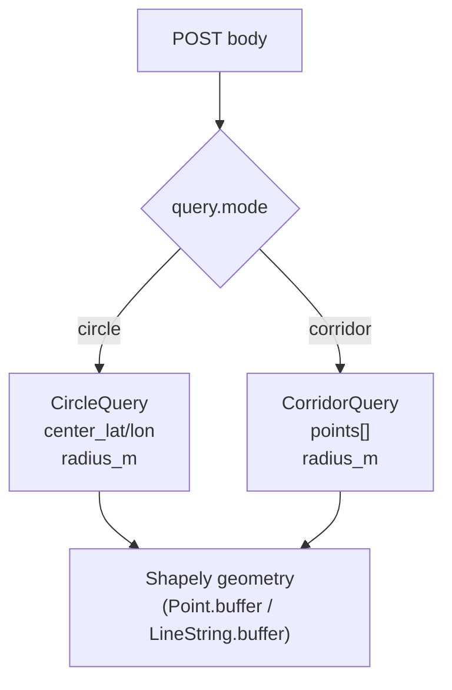
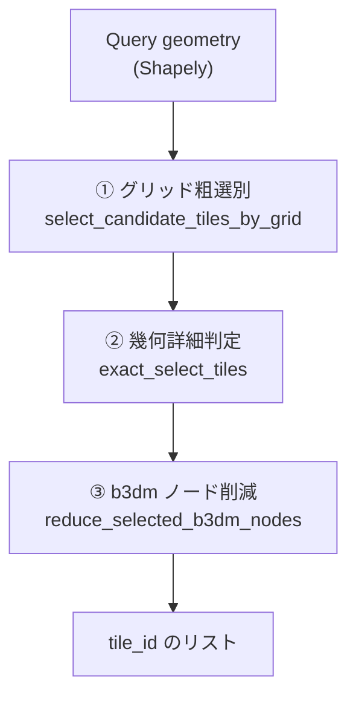
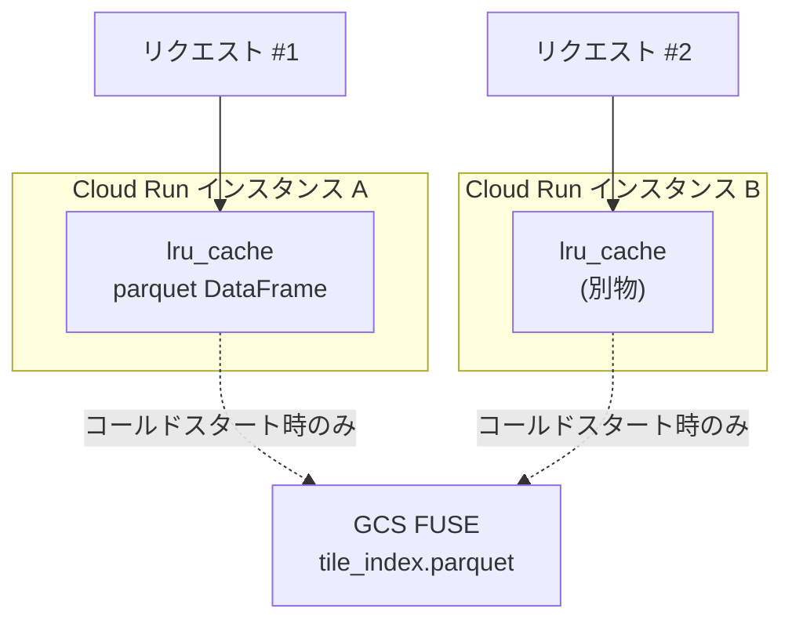

地図で範囲を選ぶと、その中の 3D 建物だけが返ってくる — というシンプルな体験の裏で、サーバーは何をしているのか。本記事はその **API 層** を実装コードレベルで解剖します。plateau-webapp シリーズ **完結編**（#3）です。

- [#1 アーキテクチャ総論](https://qiita.com/invest-aitech/items/93c775439fa851010a4d)
- [#2 41.9GiB の3DタイルをGCS FUSEで透過配信する](https://qiita.com/invest-aitech/items/dbe59cdb04a8093539cc)
- **#3（本記事）タイル配信APIを組む**

本番: https://plateau-3d-app-tcus2zi5tq-an.a.run.app

## この記事で分かること

- 緯度経度の **bbox → 該当 3D タイル群の選別** を Python でどう書くか（3段階の絞り込み）
- **Pydantic Discriminated Union** で「円クエリ / 廊下クエリ」を1つのエンドポイントに型安全に共存させる
- FastAPI の **StaticFiles / StreamingResponse / FileResponse の使い分け** を 3D Tiles 固有の観点で整理
- `functools.lru_cache` を **Cloud Run のステートレス環境**でどこまで信用できるか、限界の手当て
- シリーズ #1 / #2 と本記事をどう繋ぐか（総論 → 配信 → API）

## 1. この API が答える問い

#2 が「**41.9 GiB のタイル群をどこに置くか**」を解いた話だとすれば、#3 が解くのは次の1問です。

> **「ユーザーが地図で選んだ範囲に該当する 3D Tiles だけを、`tileset.json` として返せ」**

CesiumJS の 3D Tiles は `tileset.json`（ツリー定義）をまず読み、そこからリンクされた `.b3dm`（バイナリメッシュ）をブラウザが辿って取りに来る仕様です。つまり、**サーバが返すべき主プロダクトは「選別済みの動的 tileset.json」**で、`.b3dm` 本体は #2 で触れたとおり **StaticFiles + GCS FUSE** が淡々と配ります。

## 2. 全体像と責務分離

`src/app/` 配下はきれいに3層に割れています。



**core はドメイン計算**（pandas / shapely / pyproj）だけに依存し FastAPI に触れません。**services は生成フロー統合**、**api は I/O 境界**。この分離で、core 層は `pytest` からそのままテストできます。

## 3. ルーティング設計 — 動的 JSON は FastAPI、実ファイルは StaticFiles



ポイントは **「動的に生成する軽量 JSON」と「重いバイナリ」を FastAPI と StaticFiles に分担させている**こと。FastAPI は tileset.json をディスク（= GCS FUSE マウントの sibling ディレクトリ）に書き出し、以降の取り出しは全部 StaticFiles に任せます。

`src/app/api/routes_requests.py:18-29` のエンドポイントは驚くほど薄い:

```python
@router.post("", response_model=RequestCreatedResponse, status_code=201)
def create_request(payload: CreateRequestBody, request: Request) -> RequestCreatedResponse:
    try:
        return service.create_request(payload, base_url=str(request.base_url).rstrip("/"))
    except DatasetNotFoundError as exc:
        raise HTTPException(status_code=404, detail=str(exc)) from exc
    except TilesetSelectionEmptyError as exc:
        raise HTTPException(status_code=404, detail=str(exc)) from exc
    except FileNotFoundError as exc:
        raise HTTPException(status_code=500, detail=str(exc)) from exc
    except ValueError as exc:
        raise HTTPException(status_code=400, detail=str(exc)) from exc
```

**api 層がやっているのは「サービスに委譲 + 例外 → HTTP ステータスの翻訳」だけ**。薄さが保たれるのは、バリデーションが Pydantic に、ビジネスロジックが services/core に押し込まれているからです。

## 4. Pydantic Discriminated Union で空間クエリを型安全に

このアプリは「中心点 + 半径」の**円クエリ**と、「複数点を繋いだ経路 + 幅」の**廊下クエリ**を両方扱います。普通に書くとオプション乱立で汚くなるところを、**Discriminated Union** が綺麗に解決しています。`src/app/core/models.py:14-41`:

```python
class CircleQuery(BaseModel):
    mode: Literal["circle"]
    center_lat: float
    center_lon: float
    radius_m: float = Field(gt=0)


class CorridorQuery(BaseModel):
    mode: Literal["corridor"]
    points: list[QueryPoint]
    radius_m: float = Field(gt=0)

    @field_validator("points")
    @classmethod
    def validate_points(cls, value):
        if len(value) < 2:
            raise ValueError("corridor には 2 点以上必要です")
        return value


QuerySpec = Annotated[CircleQuery | CorridorQuery, Field(discriminator="mode")]


class CreateRequestBody(BaseModel):
    dataset_id: str = Field(min_length=1)
    lod_key: str | None = None
    b3dm_node_strategy: Literal["leaf_only", "all_selected"] = "leaf_only"
    query: QuerySpec
```



**効能**:
- `mode` を見て自動で正しい型にパースされる。`isinstance(query, CircleQuery)` で安全に分岐できる
- FastAPI が自動生成する OpenAPI にも oneOf が載る（`/docs` を見ると Swagger UI で切り替え表示される）
- 新しいクエリ種（例: `BBoxQuery`）を足しても、既存呼び出し側を壊さない

`mode: Literal["circle"]` がただの文字列ではなく「型の識別子」として機能しているのが肝です。

## 5. bbox → タイル選別の3段階

ここがシリーズ完結編の主役です。170 万棟から「ユーザーがクリックした円の中の建物」を取り出すのに、愚直にループを回したら終わりません。`src/app/core/selector.py` は **3段階の漏斗** で候補を絞ります。



### ステップ① グリッド粗選別

事前にタイルの AABB をグリッドセルに割り当てておいた `tile_grid.parquet` に対して、boolean インデックスを一発かけます。`selector.py:12-35`:

```python
def select_candidate_tiles_by_grid(
    tile_index_df, tile_grid_df, lod_key, query_geom, grid_size_m,
) -> tuple[pd.DataFrame, pd.DataFrame]:
    gx0, gy0, gx1, gy1 = bounds_to_grid_range(query_geom.bounds, grid_size_m)

    df_grid_hits = tile_grid_df[
        (tile_grid_df["lod_key"].astype(str) == str(lod_key))
        & (tile_grid_df["cell_x"] >= gx0)
        & (tile_grid_df["cell_x"] <= gx1)
        & (tile_grid_df["cell_y"] >= gy0)
        & (tile_grid_df["cell_y"] <= gy1)
    ].copy()

    candidate_ids = df_grid_hits["tile_id"].astype(str).drop_duplicates().tolist()
    df_candidates = tile_index_df[
        tile_index_df["tile_id"].astype(str).isin(candidate_ids)
    ].copy().reset_index(drop=True)
    return df_grid_hits.reset_index(drop=True), df_candidates
```

**事前計算した整数インデックスに対する boolean filter** なので、170 万件あってもミリ秒で終わります。pandas を軽量な列指向 DB として使っている、と読み替えられます。

### ステップ② 幾何詳細判定

グリッドセルは矩形なので、円クエリに対しては候補に false positive が混ざります。`selector.py:38-49` で Shapely の `intersects()` を使って正確に判定:

```python
def exact_select_tiles(query_geom: BaseGeometry, df_candidates: pd.DataFrame) -> pd.DataFrame:
    if df_candidates.empty:
        return df_candidates.copy()

    selected_flags: list[bool] = []
    for row in df_candidates.itertuples(index=False):
        geom_bbox = box(float(row.minx), float(row.miny), float(row.maxx), float(row.maxy))
        selected_flags.append(bool(query_geom.intersects(geom_bbox)))

    out_df = df_candidates.copy()
    out_df["intersects_query"] = pd.Series(selected_flags, index=out_df.index, dtype=bool)
    return out_df.loc[out_df["intersects_query"]].copy().reset_index(drop=True)
```

`itertuples()` で回しているのは、候補が既に絞り込まれていて数十〜数百件しかないからです。もしここがボトルネックになったら Shapely の `STRtree` で空間インデックスを張るのが次の一手（後述）。

### ステップ③ b3dm ノード削減

3D Tiles は階層構造を持つため、同じ領域が親ノードと子ノードで二重表現されます。クライアントは片方を取ればよい。`selector.py:58-82`:

```python
def reduce_selected_b3dm_nodes(
    df_selected_tiles: pd.DataFrame,
    strategy: Literal["leaf_only", "all_selected"],
) -> pd.DataFrame:
    if strategy == "all_selected":
        return df_selected_tiles.sort_values(by=["tile_id"]).reset_index(drop=True)

    if "has_children" in df_selected_tiles.columns:
        has_children = _normalize_bool_series(df_selected_tiles["has_children"])
        df_leaf = df_selected_tiles.loc[~has_children].copy().reset_index(drop=True)
        if not df_leaf.empty:
            return df_leaf.sort_values(by=["tile_id"]).reset_index(drop=True)

    if "depth" in df_selected_tiles.columns:
        depths = pd.to_numeric(df_selected_tiles["depth"], errors="coerce")
        max_depth = depths.max()
        if pd.notna(max_depth):
            return df_selected_tiles.loc[depths == max_depth].sort_values(by=["tile_id"])
    return df_selected_tiles.sort_values(by=["tile_id"])
```

デフォルトの `leaf_only` は葉ノードだけを返し、転送量とブラウザの重複描画を両方減らします。

## 6. 座標変換 — `pyproj` + `lru_cache`

3D Tiles の `boundingVolume.region` は **西経・南緯・東経・北緯・最小高・最大高の 6 要素、単位ラジアン**という独特のフォーマット。入力は WGS84（緯度経度 deg）、タイル内部座標は UTM 系。変換の橋渡しを `src/app/core/geometry.py:14-43` が担います:

```python
@lru_cache(maxsize=16)
def get_transformers(data_crs: str) -> tuple[Transformer, Transformer]:
    wgs84_to_local = Transformer.from_crs("EPSG:4326", data_crs, always_xy=True)
    local_to_wgs84 = Transformer.from_crs(data_crs, "EPSG:4326", always_xy=True)
    return wgs84_to_local, local_to_wgs84


def bbox_to_region_radians(
    minx, miny, maxx, maxy, data_crs, min_h=0.0, max_h=100.0,
) -> list[float]:
    _, to_wgs84 = get_transformers(data_crs)
    west_deg, south_deg = to_wgs84.transform(float(minx), float(miny))
    east_deg, north_deg = to_wgs84.transform(float(maxx), float(maxy))
    west = math.radians(min(west_deg, east_deg))
    south = math.radians(min(south_deg, north_deg))
    east = math.radians(max(west_deg, east_deg))
    north = math.radians(max(south_deg, north_deg))
    return [west, south, east, north, float(min_h), float(max_h)]
```

`Transformer.from_crs()` は内部で PROJ を初期化するので毎回呼ぶと遅い。`@lru_cache(maxsize=16)` で CRS 単位にシングルトン化しています。CRS の組は実質 1〜2 種類なのでサイズ 16 でも一生埋まりません。

## 7. ファイル配信戦略 — StaticFiles / StreamingResponse / FileResponse の使い分け

FastAPI でファイルを返す手段は 3 つあり、混同されがちです。3D Tiles 配信ではこう整理できます。

| 手段 | 対象 | メモリ | Range対応 | このアプリでの採用 |
|---|---|---|---|---|
| `StaticFiles` マウント | 大量の静的ファイルツリー | Starlette が chunked で流す | 自動（`Content-Range`）| **`.b3dm` / `tileset.json`** |
| `FileResponse` | 単一ファイル | ストリーム | 自動 | UI の HTML (`routes_ui.py:20-22`) |
| `StreamingResponse` | ジェネレータ / 動的生成 | ジェネレータ次第 | 手動実装 | **採用箇所なし** |

**なぜ `StreamingResponse` を使わないか**:
- b3dm は 1 ファイルあたり数百 KB 〜数 MB。`StaticFiles` で十分捌ける
- 動的に JSON を生成する局面では **ファイルに書き出してから StaticFiles に委譲**する設計。これにより再取得時はファイルキャッシュが効く
- `StreamingResponse` は「巨大 CSV をメモリに載せずに返す」「SSE」「動画」のような**生成するほどに流したい**シーンで使うもの

ここの選択は何気ないようで、**Cloud Run のメモリ上限（1GiB）を尊重する設計**として重要です。

### 未実装だが本番化する際は足したい

- **ETag / Cache-Control ヘッダ**: `fastapi-etag` を挟むか、ミドルウェアで `tileset.json` に `Cache-Control: public, max-age=60` を付ける
- **Range Request**: `StaticFiles` はすでに `206 Partial Content` を返せるので、モバイルブラウザの部分取得にも対応済み（設定不要）

## 8. キャッシュ設計 — `lru_cache` と Cloud Run の相性

このアプリは 4 箇所でメモリキャッシュを張っています。

| 箇所 | 何をキャッシュ | maxsize |
|---|---|---|
| `geometry.py:14-18` | `pyproj.Transformer` | 16 |
| `dataset_registry.py:60-63` | `DatasetManifest`（JSON パース） | 64 |
| `dataset_registry.py:66-70` | `tile_index.parquet` / `tile_grid.parquet` の DataFrame | 32 |
| `height_offset_service.py` | GSI 標高 API の結果 | 2048 |

特に 3 番目が効きます。parquet は数十 MB あり、毎リクエストで読むと GCS FUSE 経由のレイテンシがモロに乗ります。



### Cloud Run での「効く条件」と「限界」

**効く**:
- 同一インスタンス内の 2 回目以降のリクエスト（`concurrency=80` なので 1 コンテナ内で 80 並列が同じ DataFrame を共有）

**効かない**:
- インスタンス跨ぎ（別の Cloud Run コンテナでは別メモリ）
- コールドスタート直後（スケール 0 → 1 の初回は必ず parquet を読み直す）

### 本番での次の一手

- `--min-instances=1` を指定して**コールドスタートの parquet 読み込みを常温化**（コストとのトレードオフ）
- Memorystore (Redis) や Cloudflare 前段で、共有キャッシュを持つ
- 本当に高並列になるなら `tileset.json` の生成結果そのものを GCS に書いてキャッシュし、hash 一致なら再利用する

「**`lru_cache` は単一プロセス内のメモ化に留まる**」という前提を忘れると、「なぜかスケール直後に遅い」の原因が読めなくなります。

## 9. エラーハンドリングとステータスコード

`routes_requests.py` で 4 種の例外を HTTP に翻訳しています:

| 例外 | HTTP | 意味 |
|---|---|---|
| `DatasetNotFoundError` | 404 | データセット ID が未登録 |
| `TilesetSelectionEmptyError` | 404 | クエリ範囲にタイルが 1 枚も無い |
| `FileNotFoundError` | 500 | 本来あるべきファイルが無い（サーバ側の不整合） |
| `ValueError` | 400 | クエリの幾何が不正 |

**選別結果が空のときは 204 でも良いのでは**、という議論の余地はあります（ビジネス的な「無し」と「壊れている」は違う）。現在は両方 404 で返していますが、将来 UX を磨く段階で分けるかもしれません。

## 10. まとめ — シリーズ全体で何を見せたか

3 本通すと、「PLATEAU の 3D タイルを Web アプリに載せる」という題目が **配置・配信・選別の3層問題**に分解できることが見えます。

| # | 層 | 主役 |
|---|---|---|
| #1 | 全体像 | FastAPI + CesiumJS の 3 層責務分離 |
| #2 | 配信 | Cloud Run Gen2 + GCS FUSE + `StaticFiles` |
| **#3** | **API** | **Pydantic + 3 段階選別 + `lru_cache`** |

受託開発で「地図系プロダクト」の見積もりを出す場合、見積もり書には出ない**地味な設計判断**がここに並んでいます。Range Request を意識しているか、Pydantic の Discriminator を使えているか、CRS をどこで固定しているか — そういう「地味だが筋の良い実装」の集合体が、スケーラブルな地図 API の正体です。

## 関連シリーズへの導線

同じく実運用の Cloud Run アプリを解剖する連載として、**quakefire-sim（東京23区の地震火災シミュレータ）** も並行で書いています。

- [#1 延焼モデル設計](https://qiita.com/invest-aitech/items/30cc943a410080c57f22)
- [#2 170万棟を遅延読み込みで捌くデータパイプライン](https://qiita.com/invest-aitech/items/53dc67eee843a7e42f28)

本番: https://quakefire-sim-x6otnjvfsq-an.a.run.app

「地図と Python で本番 Web アプリを作る」という軸で興味があれば、ぜひ。
