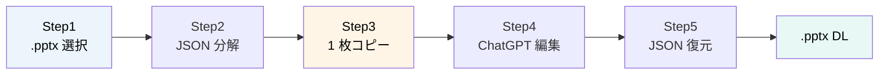
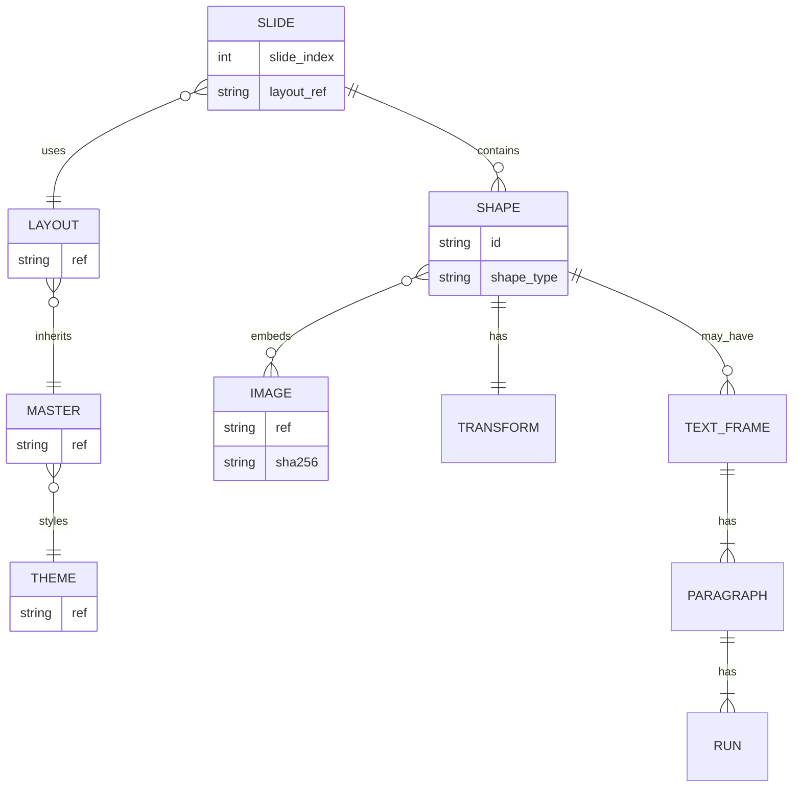
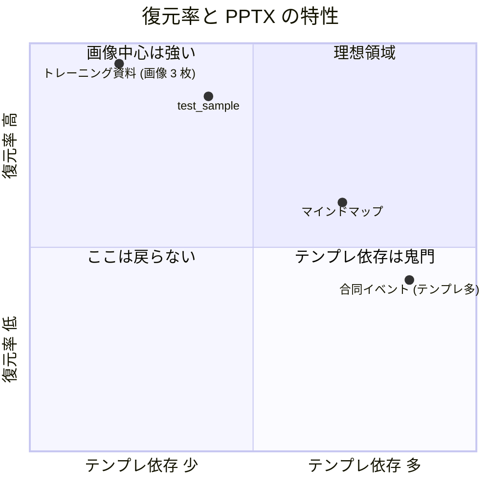
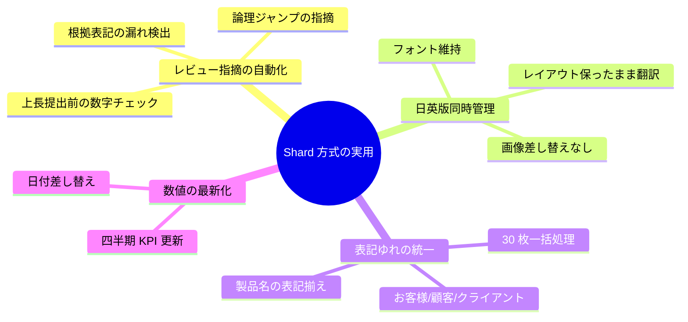
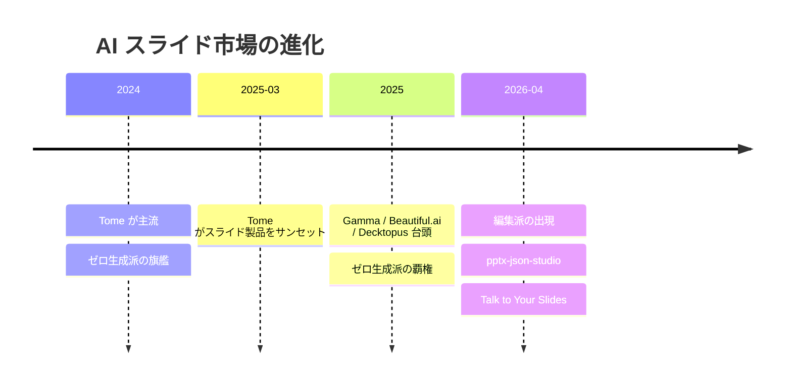

Gamma を社内で試したら社内テンプレが使えず諦めた、という声をよく聞く。同じ壁にぶつかったので、別の単位で解いた。

`pptx-json-studio` は、`.pptx` をスライド単位の JSON に分割し、編集したい 1 枚だけ ChatGPT に投げて、戻った JSON を元の bundle にマージして再構成する Web アプリだ。Cloud Run に置いて URL を踏むだけで触れる。本番デプロイ済 — `https://pptx-json-studio-bqe5v4lrsq-an.a.run.app`。読了 6 分。

## 先に要点

- 巨大 JSON を一括で LLM に渡す方式は、文脈窓・差し戻し・テンプレ尊重の 3 点で詰む
- 1 スライド = 1 JSON = 1 LLM 呼び出しの「Shard 方式」が現実解
- ラウンドトリップ復元の核は `dispatch_shape` の 25 行 (タグ優先 → placeholder → shape_type)

---

## 1. 巨大 JSON 一括は、なぜ詰むのか

PowerPoint × LLM のチャレンジ記事を読むと、共通して 3 つの壁に突き当たっている。Insight Edge の「LLM によるパワポ自動生成にチャレンジしてわかった課題」もその系譜だ。私の手元でも前編・後編で `analyze_pptx()` を作ったとき、同じ壁を踏んだ。

**壁 1: 文脈窓を超える。** 1 ファイルが 30 枚あると、テンプレ層 (theme / master / layout) と画像 base64 を含めた JSON は数 MB になる。Gemini 1.5 Pro の 200 万トークンを使っても、業務テンプレ込みの本格資料はあっさり満杯になる。

**壁 2: 差し戻しコストが暴発する。** LLM が 1 箇所間違えると JSON 全体が壊れる。Pydantic で型検査して reject、再生成して再 reject、を繰り返している間に Gemini Pro の単価が積み上がる。

**壁 3: テンプレを勝手に変えられる。** 巨大 JSON を投げると LLM は schema を「もっといいやり方がありますよ」と書き換えてくる。社内テンプレで作った資料を投げて、フォントや配色が別のものになって返ってきた経験は、たぶん多くの人にある。

これは個人の挫折ではない。AI スライド市場が二派に割れている兆候だ — 詳しくは最終章で書く。

読者の手元でも同じことが起きる。30 枚の四半期報告で「お客様」と「顧客」の混在を ChatGPT に統一させようと全 JSON を投げた瞬間、フォントが Yu Gothic から Arial に書き換わって戻ってくる。社内テンプレ管理者から苦情のチャットが 1 通入るまでが定型コースだ。コーポレートカラーが 5% ずれていることに気付くのは、印刷した取締役会の前夜になる。

ともあれ、3 つの壁を全部解くには「別の単位」で切るしかなかった。

---

## 2. 理屈より触る方が早い — 5 ステップで .pptx を Shard する

別の単位を実装したのが `pptx-json-studio` だ。理屈より触ったほうが早いので、本番 URL を先に渡す。

`https://pptx-json-studio-bqe5v4lrsq-an.a.run.app`

5 ステップで完結する。



> 5 ステップ。アップロードして、JSON にして、1 枚だけ取り出して、外部 LLM で書き換えて、戻して、ダウンロードする。

**Step 1: ランディング (`/`) からアプリを開く。** 「アプリを開く」CTA を押すと `/app` に遷移する。

**Step 2: `.pptx` を DropZone にドラッグ&ドロップ。** ファイルサイズは 50MB 上限、`.pptx` のみ対応。サーバー側はメモリ処理のみで永続化なしの Stateless 設計だ。`POST /api/convert` で変換が走り、Bundle データが返る。

**Step 3: 3 カラム UI で 1 枚だけ取り出す。** 左にスライド一覧、中央に JSON ビューアと画像タブ、右にダウンロード/コピーのアクションが並ぶ。編集したいスライドを選び、右の「このスライドだけコピー」を押すと、そのスライド分の JSON だけがクリップボードに乗る。

**Step 4: ChatGPT や Gemini に貼付。** 「タイトルをもっとキャッチーに」「数値だけ最新値に」「日本語版を英訳して」など、自然言語で指示する。LLM は受け取った JSON だけを見て、修正版 JSON を返す。

**Step 5: `/restore` で JSON を貼付し、`.pptx` をダウンロード。** 単一スライド JSON の場合は現在ロード中の bundle にマージされる (スライドインデックスで照合)。バックエンドが `POST /api/restore` で `.pptx` Blob を生成し、`{元ファイル名}-restored.pptx` で落ちてくる。

なお `/ai` 配下に AI 編集ドロワーの UI スケルトンがあるが、現状はバックエンド未実装で、本番運用は手動コピペ動線を想定している。Vertex AI Gemini との連携はフェーズ 2 の宿題だ。

---

## 3. JSON ビューアで何が見えるか — 入れ子の箱の解剖

前編で「PowerPoint は入れ子の箱だ」と書いた。読者から「実物を画面で見せてほしい」という反応が一番多かったので、JSON ビューアを作り込んだ。

中央カラムの「JSON ビューア」タブを開くと、Slide → Shape → TextFrame → Paragraph → Run の 5 層が、そのままツリーとして見える。クリックで展開・折りたたみ、リアルタイム検索 (キー名・値内容)、ノード単位のコピー、型別シンタックスハイライト (string=coral / number=blue / bool=purple / null=muted)、文字列値が 1000 字超なら `+N chars` で展開、と機能を詰めてある。`max-h-[70vh]` でスクロール可能だ。

「画像」タブに切り替えると、ImageGallery が base64 画像をグリッド表示する (初期 20 枚、「さらに表示」で +20 ずつ)。各画像は MIME type に応じて Blob 復元され、個別ダウンロードできる。

bundle の中身は階層的に参照しあっている。



> Slide が Layout を参照し、Layout が Master を継承し、Master が Theme で配色を取る。Shape は Image を `ref` で参照する。この参照関係が JSON ビューアでクリック可能な状態で見える。

前編で図に描いた「テーマ → マスター → レイアウト → プレースホルダー」の 3 層設計図が、画面で初めて目に見える。読者が手元の `.pptx` を投げて、自社テンプレの正体を直接覗ける場所になっている。

---

## 4. なぜ 1 枚ずつしか渡さないのか — Shard 方式と shape dispatcher

ここが本記事の核になる。設計判断と実装の核を一緒に書く。

### なぜ 1 枚ずつ — 文脈窓と差し戻し

第 1 章で挙げた 3 つの壁は、Shard 方式 (1 スライド = 1 JSON = 1 LLM 呼び出し) でほぼ全部解ける。

文脈窓は 1 スライド分しか乗らないので、画像 base64 込みでも数十 KB に収まる。差し戻しは 1 スライドに局所化されるので、再生成のコストが小さい。テンプレ層は LLM に渡さず bundle 側に保持しているので、勝手に書き換えられる余地がそもそもない。

「LLM 呼び出しの粒度を物理的に切る」という解き方だ。コンテキスト窓拡大に依存せず、LLM 側の進化を待たずに今すぐ動く。

### shape dispatcher の核 25 行

Shard 方式の下を支える実装核が、`dispatch_shape` の 25 行だ。これがラウンドトリップ復元の成否を決める。

> 出典: `backend/src/pptx_json_studio/processor/shapes/dispatch.py:21-63`

```python
def dispatch_shape(
    shape: Any,
    shape_id: str,
    media_map: dict[str, str],
    slide_rel_map: dict[str, str] | None = None,
) -> Shape:
    """Routes on the underlying OOXML element tag first, not is_placeholder."""
    elem_tag = etree.QName(shape._element).localname

    # <p:pic> — a picture (possibly sitting in a picture-placeholder slot).
    # Always route to PictureShape so the image blob survives the roundtrip.
    if elem_tag == "pic":
        return shape_to_picture(shape, shape_id, media_map)

    # <p:graphicFrame> — tables, charts, SmartArt. python-pptx can't
    # structure-edit all of these, so preserve the raw XML.
    if elem_tag == "graphicFrame":
        return _to_unknown_shape(shape, shape_id, slide_rel_map)

    # <p:sp> — regular shapes (placeholders, text boxes, auto-shapes).
    if shape.is_placeholder:
        return shape_to_placeholder(shape, shape_id)

    st = shape.shape_type
    if st == MSO_SHAPE_TYPE.TEXT_BOX:
        return shape_to_textbox(shape, shape_id)
    if st == MSO_SHAPE_TYPE.AUTO_SHAPE:
        return shape_to_autoshape(shape, shape_id)

    # Fallback: groups, connectors, freeforms.
    return _to_unknown_shape(shape, shape_id, slide_rel_map)
```

最初は `shape.is_placeholder` を先に判定していた。すると `<p:pic>` の picture-placeholder が `shape_type = PLACEHOLDER` で返ってきて、画像ごと消えた。元 PowerPoint の picture-placeholder は復元時に空欄になり、復元率が 3% に落ちた。タグ (`elem_tag`) を先に見ることで `<p:pic>` を確実に PictureShape に振り分け、復元率 95% を取り戻した経緯がある (詳細は第 4 編で書く)。

設計を言い換えると、**タグ優先 → placeholder → shape_type の 3 段ディスパッチ**。`<p:graphicFrame>` (table / chart / SmartArt) は `_to_unknown_shape` で raw OOXML を保持してロスレス復元する。Pydantic で表現できないものは XML のまま base64 で抱える、という pragmatic な折衷だ。これがラウンドトリップの核になる。

他の枝 (`auto_shape.py` / `picture.py` / `placeholder.py` / `text_box.py`) の中身と Schema 設計、ラウンドトリップ復元の検証フローは第 4 編で詳述する。

### 学術側でも同方向 — Talk to Your Slides

Shard 方式は私の発明ではない。arXiv 2505.11604 "Talk to Your Slides" は、LLM が編集計画を立てて Python が PowerPoint オブジェクトを直接操作する設計を 2025 年 5 月に提案している。学術側でも「丸ごと投げない」方向だ。

本作はこれをブラウザに降ろした実用差別化。論文のアプローチを URL 一つで触れるようにしたところに価値を置いている。

---

## 5. 戻った PPTX、戻らなかった PPTX — 復元率 95% / 60%

正直に書く。復元率はファイル特性で大きく分かれる。



> 画像中心の資料は 95% 戻る、テンプレ依存が強い資料は 42-60% に沈む。ユースケース選定の指針はこの図のとおり。

実測値はこうなった。

- トレーニング資料 (11.8 MB / JPG 3 枚): 元の 95.0% (11.2 MB) が戻る
- test_sample.pptx (155 KB): 86.9%
- マインドマップ.pptx (265 KB): 60.9%
- 合同イベント.pptx (785 KB / 背景・ロゴが重い): 42.2%

画像中心のレポート系・トレーニング資料系は使い物になる。テンプレで作り込んだ提案資料系は、まだ宿題が残っている。

戻らない 5-58% の主犯は 2 つ。**SVG コンパニオン画像** が `<a:asvgBlip>` 拡張で配信されているケースで、現在の実装では SVG 側が `shape.image.blob` から取得できず欠ける。**layout / master 側の媒体 rels** が、テンプレ全体を差し替えるとき参照切れを起こす。マインドマップと合同イベントが 60% 以下に沈む主因はこちらだ。

なお、最初のリリースでは復元率が **3%** だった。直したのは 2 行ではなく 2 つの設計判断。詳細は第 4 編で書く。

---

## 6. 月次の表記ゆれ統一が 1 リクエストで終わる — 3 つの使い道

「触れた後」の話を具体的にする。



> Shard 方式が直接効く 3 種類の業務 (+ 数値更新)。職場の月次・週次の作業がほぼ全部入る。

**レビュー指摘の自動化。** 上長に提出する前に「ここの数字根拠は?」「この主張の論理ジャンプは大丈夫?」と ChatGPT に先回りで指摘させる。1 枚ずつ JSON を投げて、論点だけ返してもらう。

**日英版同時管理。** 日本語版から英語版を作る際、画像とレイアウトを保ったまま本文だけ翻訳する。Shard 方式なら `runs[].text` だけを書き換えて返してもらえばいいので、レイアウトが死なない。

**表記ゆれの統一。** 全 30 枚の「お客様 / 顧客 / クライアント」の混在を、1 度の指示で「顧客」に統一する。スライドごとに JSON を投げて、戻ったものを復元するだけ。

おまけで 4 つ目、**数値の最新化。** 四半期 KPI が変わったら全枚の該当 Run だけ書き換える。これは Shard 方式の本領だ。

---

## 7. 一言で言うと — AI スライド市場は二派に割れた

第 1 章の伏線を回収する。



> ゼロ生成派 (Gamma 系) と編集派 (本作系) の二派に割れた、というのが 2026-04 時点の私の認識。

AI スライド市場はここ 2 年で大きく動いた。2024 年は Tome が主流、2025 年 3 月に Tome がスライド製品をサンセットして Gamma / Beautiful.ai / Decktopus が覇権を取った。これは「**ゼロから生成して新しいスライドを作る**」派だ。

2026 年に入って、もう一つの派が見えてきた。「**既存テンプレを保ったまま中身だけ書き換える**」派。Talk to Your Slides の論文と、本作の `pptx-json-studio` がそれにあたる。社内テンプレや会社規程デザインがある現場では、この派しか選べない場面がある。

前編・後編で語った理屈の実体は、この**編集派**の少数派の一実装だ。新規生成ではなく、既存編集。

---

## 8. まとめ

- テンプレを壊したくないなら、巨大 JSON でなく **1 スライド = 1 JSON** で AI に渡す
- ラウンドトリップ復元の核は「**タグ優先ディスパッチ**」 — 25 行で書ける
- 編集派の実物が `https://pptx-json-studio-bqe5v4lrsq-an.a.run.app` で触れる

---

第 4 編では、`shape dispatcher` の他枝・JSON Schema 設計・復元率 3% → 95% の 2 バグ修正談・Cloud Run 単一コンテナ構成を扱う。

---

## このシリーズ全 4 話

| # | タイトル | リンク |
|---|---|---|
| 前編 | PowerPoint の中身は「入れ子の箱」だった | [Qiita](https://qiita.com/invest-aitech/items/450163ab642f5acbefa4) / [Zenn](https://zenn.dev/investaitech/articles/16d21fdd32e730) |
| 後編 | PowerPoint を JSON に変換して LLM に読ませる | [Qiita](https://qiita.com/invest-aitech/items/a460b55c03a9ef5a85c6) / [Zenn](https://zenn.dev/investaitech/articles/2d4613ed796b90) |
| 第 3 編 | 社内テンプレ壊さず 1 スライドずつ AI 編集する pptx-json-studio | (本記事) |
| 第 4 編 | python-pptx を諦めた日 — 復元率 3% → 95% の 2 つの設計判断 | <!-- TODO: 公開後に URL を埋める --> |
