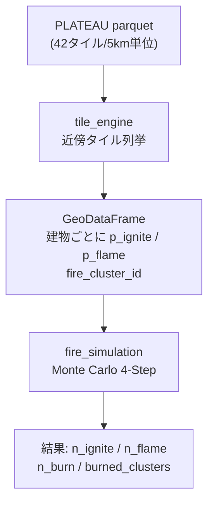
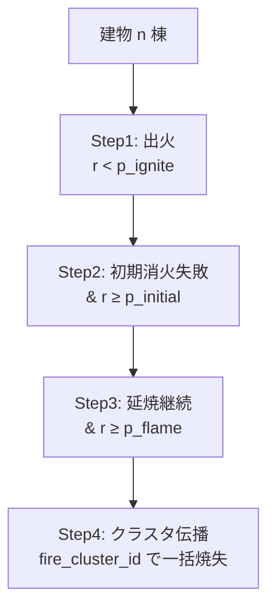
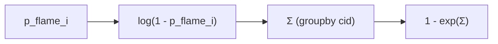
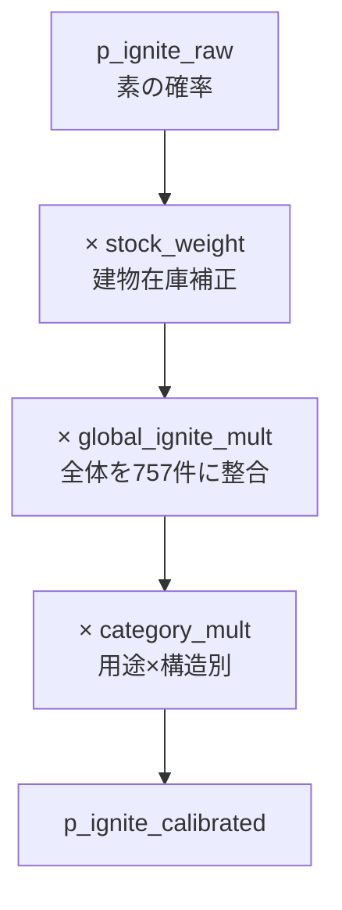

# 【Python×防災】東京23区の地震火災シミュレータを建物1棟単位で設計する — モデル・確率補正・JSON凍結まで

東京23区の建物を1棟ずつ対象に、地震発生時の延焼リスクを計算するWebアプリ「QuakeFireSim」を作りました。本記事はそのシリーズ第1弾として、**延焼モデルそのものの設計**を解剖します。「100%予測できる」などと言うつもりはありません。公的モデル（消防研究センター・国総研）は別格にあり、本作は**個人開発者が手元で動かせる軽量モデル**の教材・PoC用実装という立ち位置です。

本番: https://quakefire-sim-x6otnjvfsq-an.a.run.app

## この記事で分かること

- 建物単位の延焼モデルを **4-step Monte Carlo** で組む設計
- 確率の独立積を**対数空間**で安定計算するテクニック
- モデル係数を **JSONで凍結**して再現性を担保する設計
- 「公的モデルと何が違うか」の正直な位置取り

## quakefire-sim シリーズ（初弾5本、続巻予定あり）

| # | テーマ |
|---|---|
| **1**（本記事） | **延焼シミュレーションモデルの設計** |
| 2 | GeoPandas + PyArrow + 5kmタイルでの空間データパイプライン |
| 3 | Folium × FastAPI のインタラクティブ防災ダッシュボード |
| 4 | 区比較ベースライン（プリ集計 vs オンデマンド）の使い分け |
| 5 | 防災Webアプリの導線設計（ランディング〜オンボーディング） |

本シリーズは非完結で、開発進捗に応じて続きを書きます。

## 1. 本シリーズの動機

2024年1月1日の能登半島地震では、輪島朝市通りで大規模な市街地火災が発生しました。[消防庁の火災原因調査報告書](https://www.fdma.go.jp/singi_kento/kento/items/post-149/02/shiryou1.pdf) や [J-STAGE 掲載の学術調査](https://www.jstage.jst.go.jp/article/jndsj/43/3/43_709/_article/-char/ja) が詳細を残しています。

東京都の想定では、23区で震度6強・冬18時の条件下での出火件数は757件（東京都公式）。この数字をどうモデルに落とすか、というのが本シリーズの出発点です。

## 2. 延焼モデルが答える問い

このアプリが計算するのは次の1問です。

> **「震度6強・冬18時の発災時、この建物（棟）は燃える確率はどれくらいか」**

粒度は**建物1棟単位**。23区にある約170万棟分を一つ一つ処理します。メッシュ単位の集計ではなく、PLATEAUから来る建物ポリゴン1枚ごとに確率を張る、というのが本作の性格です。

## 3. 入出力データの全体像

処理の外観は次の通り。



タイルは5km格子で事前に分割。ユーザークリック地点を中心に近傍タイルだけを読み、その中の建物を対象にシミュレートします。全国を常にメモリに載せる発想ではありません。

タイルID生成は緯度経度を単純にグリッド化する作りです。

```python
# app/tile_engine.py:18-33
def tile_id_from_latlon(lat: float, lon: float) -> str:
    """Convert a single lat/lon to a tile ID string like '3571029_13976712'."""
    lat_a = np.asarray(lat, dtype=np.float64)
    lon_a = np.asarray(lon, dtype=np.float64)

    tx = np.floor(lon_a / lon_step).astype(np.int64)
    ty = np.floor(lat_a / lat_step).astype(np.int64)

    lat_c = (ty.astype(np.float64) + 0.5) * lat_step
    lon_c = (tx.astype(np.float64) + 0.5) * lon_step

    lat_e5 = np.round(lat_c * SCALE).astype(np.int64)
    lon_e5 = np.round(lon_c * SCALE).astype(np.int64)

    tid = lat_e5.astype(str) + "_" + lon_e5.astype(str)
    return str(tid) if np.ndim(tid) == 0 else tid
```

`lat_step` と `lon_step` は参照緯度（35.71°）での5km相当に換算した度数。タイルIDは中心点の緯度経度を1e-5度でエンコードした文字列（例: `"3571029_13976712"`）。一意で衝突せず、文字列ソートで地理順にも近くなる、軽量な工夫です。

## 4. Monte Carlo 4-Step — モデルの心臓部

延焼のモデル化は4段階に分けています。



- Step 1〜3は**建物単位の独立な確率判定**
- Step 4だけは**決定的**。同じ延焼クラスタに1棟でも残存火災があれば、そのクラスタ全体が燃える扱い

「独立事象の3連ガチャ → 当たった建物が属するクラスタを全部焼く」という二層構造が肝です。

```python
# app/fire_simulation.py:31-79
def run_fire_simulation_once(gdf: gpd.GeoDataFrame, seed: int | None = 42) -> dict:
    rng = np.random.default_rng(seed)
    n = len(gdf)

    p_ignite = pd.to_numeric(gdf["p_ignite_sim"], errors="coerce").fillna(0.0).to_numpy(dtype=float)
    p_initial = pd.to_numeric(gdf["p_initial_sim"], errors="coerce").fillna(0.0).to_numpy(dtype=float)
    p_flame = pd.to_numeric(gdf["p_flame_sim"], errors="coerce").fillna(0.0).to_numpy(dtype=float)
    cluster_id = pd.to_numeric(gdf["fire_cluster_id"], errors="coerce").fillna(0).astype("int64").to_numpy()

    # Step 1: Ignition
    ignite_mask = rng.random(n) < p_ignite
    # Step 2: Initial extinguishing failure → flame
    flame_mask = ignite_mask & (rng.random(n) >= p_initial)
    # Step 3: Fire spread failure → residual fire
    residual_mask = flame_mask & (rng.random(n) >= p_flame)

    # Step 4: Cluster propagation
    resid_clusters = set(cluster_id[residual_mask])
    resid_clusters.discard(0)
    if len(resid_clusters) > 0:
        burn_mask = np.isin(cluster_id, list(resid_clusters))
    else:
        burn_mask = np.zeros(n, dtype=bool)
    ...
```

1棟ごとの `p_ignite_sim` / `p_initial_sim` / `p_flame_sim` はGeoDataFrameにあらかじめ列として持っています。計算はすべてnumpy配列の演算で、17万棟でも数百ミリ秒で1試行分が回ります。

`seed` を明示しているのは重要で、「同じ入力・同じseedなら同じ結果」を保証するためです。再現可能性は防災系モデルにとって交渉の余地がありません。

## 5. クラスタ焼失確率 — 対数空間の確率積

Step 4の「クラスタ内の誰か1人でも燃え残ったら全焼」という素朴な挙動は、確率で書くと**独立事象の否定の積の否定**になります。

```
P_cluster_burn = 1 - Π_i (1 - p_flame_i)
```

これを素直に積の形で計算すると、1つのクラスタに数百棟あるとき `(1 - 0.9)` のような値を数百回掛けることになり、浮動小数点の桁落ちで 0 に沈みます。そこで対数空間に移します。



実装はこうです。

```python
# app/fire_simulation.py:141-165 抜粋
def compute_cluster_burn_stats(gdf, cluster_col="fire_cluster_id"):
    cid = pd.to_numeric(gdf[cluster_col], errors="coerce").fillna(-1).astype("int64")
    p_flame = pd.to_numeric(gdf["p_flame_sim"], errors="coerce").fillna(0.0).clip(0, 0.999999)
    valid = (cid > 0) & (p_flame > 0)

    log_vals = np.log(1.0 - p_flame.loc[valid].values)
    cid_valid = cid.loc[valid].values

    df_tmp = pd.DataFrame({"cid": cid_valid, "log_v": log_vals})
    log_prod = df_tmp.groupby("cid")["log_v"].sum()
    P_cluster_burn = 1.0 - np.exp(log_prod)
```

`p_flame.clip(0, 0.999999)` がさりげなく大事。`1 - p_flame = 0` になると `log(0) = -inf` で計算が壊れるので、上限を1未満に抑えています。

期待焼失棟数は確率×焼失率×クラスタサイズ。

```python
# app/fire_simulation.py:177-181
burn_frac_base = 0.30
burn_frac_wood_coef = 0.50
result["burn_frac"] = (burn_frac_base + burn_frac_wood_coef * result["wood_ratio"]).clip(0.10, 0.95)
result["expected_burned"] = result["P_cluster_burn"] * result["burn_frac"] * result["size"]
```

`burn_frac = 0.30 + 0.50 × wood_ratio` は木造率で線形補正。木造クラスタは延焼してから全焼しやすい、という経験則を式に落としています。

## 6. 確率補正の3段カスケード

素のモデル（`p_ignite_raw`）だけだと、23区全体の出火件数は東京都公式の757件とはズレます。そこで3段階の補正を入れます。



- **stock_weight**: 建物在庫（どれだけ建っているか）で1棟あたりの確率を補正
- **global_ignite_multiplier**: 3.08倍。「23区全体の期待値を757件に合わせる」ための一律スカラ
- **category_multiplier**: 用途×構造の組み合わせ別（例: 工場は3.99倍、住宅木造は0.25倍）

この3段カスケードの数式は `frozen_model_spec.json` に文字列として書き込まれていて、コード側の実装と仕様が1:1で対応する設計になっています。

```json
"final_formula": {
  "p_ignite_stock": "p_ignite_raw * stock_weight_clipped",
  "p_ignite_uniform": "p_ignite_stock * global_ignite_multiplier",
  "p_ignite_calibrated": "p_ignite_uniform * category_multiplier",
  "p_flare_calibrated": "p_ignite_calibrated * (1 - p_init_extinguish_raw)"
}
```

「数式を文字列で保存する」のは一見冗長ですが、将来モデル式を変更したときに **JSONを見るだけで何が変わったか分かる** という監査性の担保になります。

## 7. モデル仕様を JSON で凍結する

延焼モデルはパラメータ地獄です。閾値、補正係数、用途マッピング、シナリオ設定……。これらをコードに埋め込むと、「このバージョンで動かした実験は再現できるか」が曖昧になります。

本作では `frozen_model_spec.json` に全パラメータを外出しにしました。主要キーを抜粋します。

```json
{
  "model_version": "quake_fire_model_v1_20260322",
  "frozen_at": "2026-03-27 10:34:31 JST",
  "scenario": {
    "SCENARIO_SHINDO": "6強",
    "SCENARIO_TIME": "冬18時"
  },
  "stock_rule": { ... },
  "probability_adjustment": {
    "global_ignite_multiplier": 3.0837508822091424,
    "category_multiplier_min": 0.25,
    "category_multiplier_max": 4.0,
    ...
  },
  "summary_metrics": { ... }
}
```

- `model_version` — 文字列でのバージョン番号。ファイル名ではなく内容側に持たせる
- `frozen_at` — いつ確定したか
- `scenario` — 震度と時間帯（公式想定のどれに合わせたか）
- `probability_adjustment` — 3段カスケードの係数

このJSONが更新されたら、**新しい `model_version` を発番してから**既存のベースライン集計を再計算する、というフローです。アプリコードは `global_ignite_multiplier` という具体数値を知らず、JSONから読むだけ。モデルとコードの関心の分離です。

## 8. 公的モデルとの棲み分け

念のため強調しておくと、本作は**実務運用を置き換えるものではありません**。市街地延焼の国内標準は、消防研究センター や [国総研のモデル](https://www.mlit.go.jp/plateau/use-case/uc23-26/) です。2025年度の PLATEAU UC25-08 では公的モデルの[OSS化も進行](https://www.mlit.go.jp/plateau/use-case/uc25-08/)しています。

本作の位置付けは次の通り。

| 用途 | 推奨 |
|---|---|
| 自治体・消防の警防計画 | 公的モデル（国総研・消防研究センター） |
| BCP策定の一次検討 | 公的モデルをベースに、本作は補助参考 |
| **教材・ハッカソン・PoC・社内勉強会** | **本作が扱う範囲** |
| 個人で23区の建物単位に触って挙動を掴む | 本作 |

「物理ベースで厳密にモデル化したい」なら国総研。「個人の手元で動いて、再現できて、読める」なら本作、という棲み分けです。

## 9. 設計の強みと限界

### 強み

- **1棟単位の粒度** — メッシュ平均ではなく個別建物に確率が張られる
- **再現性** — `frozen_model_spec.json` + `seed` で同じ結果が何度でも出る
- **軽量** — 5kmタイル単位で近傍だけロード。全国を常駐させない
- **補正の透明性** — 係数の意味と式が JSON に文字列で残る

### 限界

- **確率モデルであり、物理ベースではない** — 熱流束・輻射・風速の明示式は扱っていない
- **建物属性データの粒度に依存** — PLATEAUと東京被害想定メッシュの解像度が天井
- **延焼クラスタは事前計算** — 動的に道路閉塞などを反映するには別途処理が必要

## 10. まとめと次回予告

本記事は QuakeFireSim の中核にある延焼モデルの設計を整理しました。

- 建物1棟単位の **4-step Monte Carlo**（ignite → 初期消火 → 延焼継続 → クラスタ伝播）
- クラスタ焼失確率は **対数空間での独立積**で数値安定に計算
- 補正は **3段カスケード**（stock_weight → global × 3.08 → category）
- すべての係数は **`frozen_model_spec.json` に凍結**、コードとの関心を分離

次回（quakefire-sim #2）は、この延焼モデルに流し込むデータをどう作るか、つまり GeoPandas + PyArrow + 5kmタイル分割の**空間データパイプライン**を扱います。23区全建物を Parquet で抱えつつ、クエリに応答する実装です。

## 関連資料

### 一次資料（本記事で引用）

- [令和6年能登半島地震 消防庁長官火災原因調査報告書（輪島市大規模火災）](https://www.fdma.go.jp/singi_kento/kento/items/post-149/02/shiryou1.pdf)
- [令和6年能登半島地震 輪島朝市通り付近市街地火災の建物被害調査（J-STAGE）](https://www.jstage.jst.go.jp/article/jndsj/43/3/43_709/_article/-char/ja)

### 公的モデル

- [消防研究センター 大規模地震同時多発火災対応研究](https://nrifd.fdma.go.jp/research/seika/kasai_ensyou/daikibo/index.html)
- [PLATEAU UC23-26 3D都市モデルを活用した延焼シミュレーターの高度化](https://www.mlit.go.jp/plateau/use-case/uc23-26/)
- [PLATEAU UC25-08 火災延焼シミュレーションシステムの開発](https://www.mlit.go.jp/plateau/use-case/uc25-08/)
- [東京消防庁 延焼シミュレーションの概要](https://www.tfd.metro.tokyo.lg.jp/learning/elib/enshoukiken/chapter04.html)
