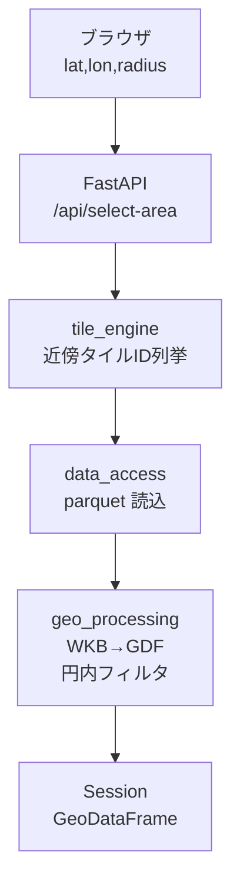
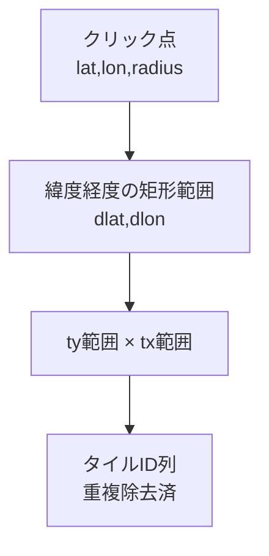
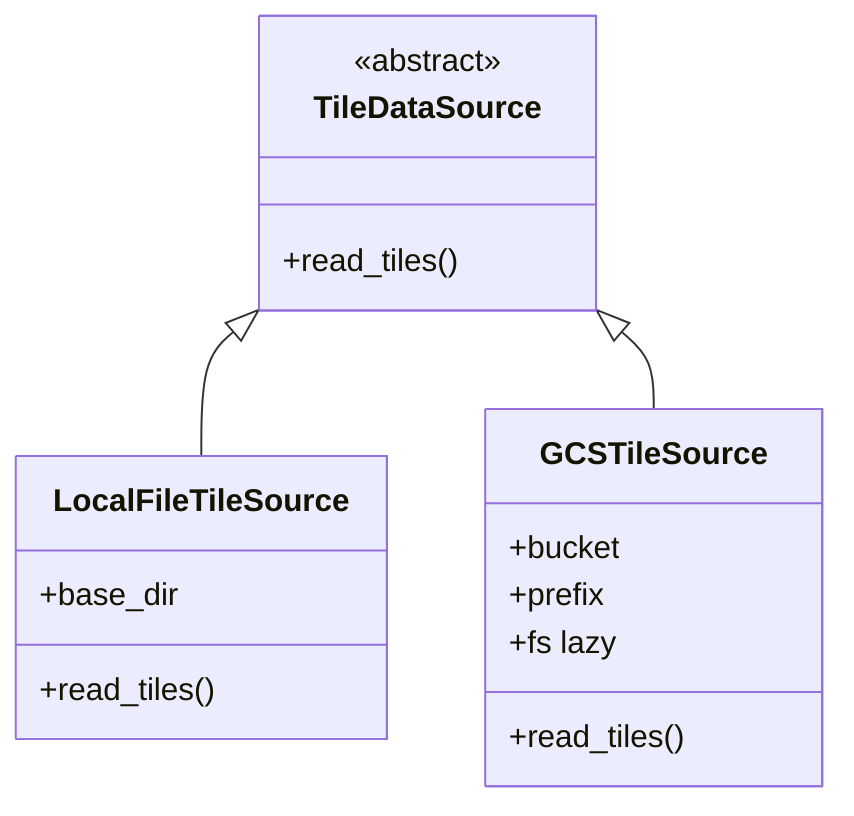
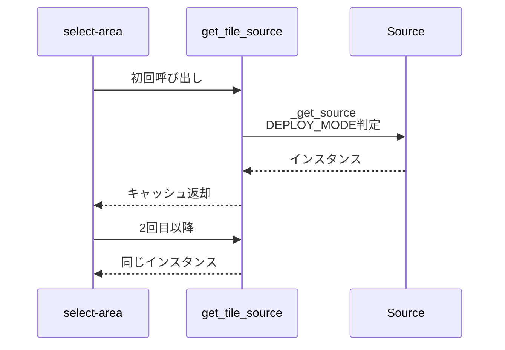
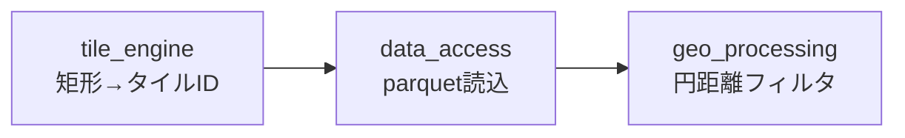
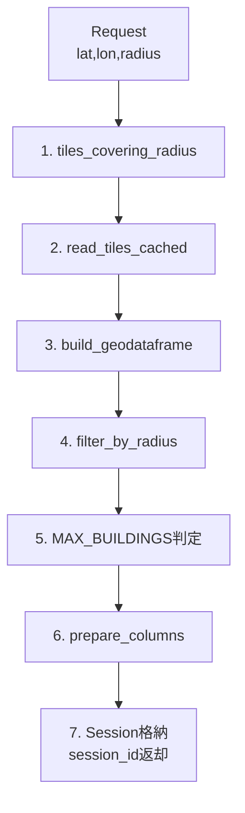

# 170万棟の建物を遅延読み込みで捌く — GeoPandas×PyArrow×5kmタイル×GCSの空間データパイプライン

東京23区の建物、およそ170万棟。これを1枚の parquet で扱わず、**5kmタイル42本に切ってクリックされた近傍だけ Cloud Run 上に読み込む**という遅延読み込みで捌いています。QuakeFireSim シリーズ #2 は、この「データ層」の設計を解剖します。

[前回（#1）](../01_fire-spread-model/article.md) は延焼モデル本体の話でした。今回はその**モデルに流し込むデータをどう作るか**の話です。

本番: https://quakefire-sim-x6otnjvfsq-an.a.run.app

## この記事で分かること

- 170万棟を1枚で扱わず **5kmタイル42本** に切る設計判断
- **GeoPandas + PyArrow** で parquet を「必要な列だけ・実在する列だけ」読む実装パターン
- **Local / GCS を同一インターフェースで抽象化**し、`DEPLOY_MODE` 1行で切り替える書き方
- **2段フィルタ**（矩形タイル → 正確な円距離）で読込量とクエリ精度を両立する設計
- `pyarrow.fs.GcsFileSystem` + `lru_cache` によるファイルシステムのシングルトン化

## quakefire-sim シリーズ（初弾5本、続巻予定あり）

| # | テーマ |
|---|---|
| 1 | [延焼シミュレーションモデルの設計](../01_fire-spread-model/article.md) |
| **2**（本記事） | **GeoPandas + PyArrow + 5kmタイル 空間データパイプライン** |
| 3 | Folium × FastAPI のインタラクティブ防災ダッシュボード |
| 4 | 区比較ベースライン（プリ集計 vs オンデマンド） |
| 5 | 防災Webアプリの導線設計 |

## 1. このパイプラインが答える問い

前回の延焼モデルが食うのは「ユーザーがクリックした円の中の全建物の GeoDataFrame」です。つまりこのデータ層が答えるべきなのは次の1問。

> **「中心 (lat, lon) と半径 radius_m が来た。その円の中の建物を高速に GeoDataFrame で返せ」**

23区全建物（~170万棟）を毎回読むのは論外。そこで「タイルで切って近傍だけ読む」という遅延読み込みに落とします。

## 2. 全体アーキテクチャ



データ層を構成するのは `app/tile_engine.py` / `app/data_access.py` / `app/geo_processing.py` の3つ。役割がきれいに分離されています。以降、この3モジュールを順に見ていきます。

## 3. なぜ 5km タイルに切るのか

170万棟を1枚の parquet にまとめるとサイズは数百MB規模になります。これをクエリごとに読むのは無理筋です。一方、**空間的に近い建物は空間的に近いところでしか使わない**というローカリティがあります。だったら格子で切って近傍だけ読めばよい。

| 観点 | 効果 |
|---|---|
| **メモリ効率** | 近傍タイルだけ読むので Cloud Run の 2GiB 枠で収まる |
| **I/O 削減** | GCS 転送量が「総量 → 関心領域のみ」に |
| **並列性** | `to_table(use_threads=True)` で複数タイルを並列デコード |

5km という粒度は、半径200-500m程度のクエリに対して**多くても9タイル程度で済む**サイズ感として選ばれています。これより小さいと管理ファイル数が膨れ、大きいと無駄な建物を読みます。23区 ≒ 627km² は 42 タイル（1タイル 25km²）で覆えます。`tiles/out_latlon_5km/*.parquet` が 42 本ある理由はこれです。

## 4. 5km タイルは標準メッシュではない

日本には「標準地域メッシュ」という公式規格があります（1次=80km, 2次=10km, 3次=1km）。ところが、このアプリは**標準メッシュを使っていません**。独自の「参照緯度で cos 補正した等距離5km格子」を使います。

理由は単純で、**等距離の格子が欲しかった**から。標準メッシュ系は緯度によって実距離が変動するので、「1タイルの物理サイズがだいたい一定」という性質を優先しました。

### タイルサイズ定数

```python
# app/tile_engine.py:10-15
SCALE = 100_000
REFERENCE_LAT = 35.71029438450884
TILE_SIZE_M = TILE_KM * 1000.0

lat_step = TILE_SIZE_M / 111_320.0
lon_step = TILE_SIZE_M / (111_320.0 * np.cos(np.deg2rad(REFERENCE_LAT)))
```

- 緯度方向は定数（1度 ≒ 111.32km）
- 経度方向は cos(lat_ref) で補正
- 参照緯度は 35.71° = 東京中央付近。23区以外では歪むが、対象が23区限定なので許容

### タイルID生成

```python
# app/tile_engine.py:18-33
def tile_id_from_latlon(lat: float, lon: float) -> str:
    lat_a = np.asarray(lat, dtype=np.float64)
    lon_a = np.asarray(lon, dtype=np.float64)

    tx = np.floor(lon_a / lon_step).astype(np.int64)
    ty = np.floor(lat_a / lat_step).astype(np.int64)

    lat_c = (ty.astype(np.float64) + 0.5) * lat_step
    lon_c = (tx.astype(np.float64) + 0.5) * lon_step

    lat_e5 = np.round(lat_c * SCALE).astype(np.int64)
    lon_e5 = np.round(lon_c * SCALE).astype(np.int64)

    tid = lat_e5.astype(str) + "_" + lon_e5.astype(str)
    return str(tid) if np.ndim(tid) == 0 else tid
```

- `np.floor(lon/lon_step)` でタイルのx-index、同様にy-index
- 中心点の緯度経度を 1e-5 度単位で整数化して `"<lat_e5>_<lon_e5>"` を ID にする
- 例: `"3571029_13976712"`（35.71029°, 139.76712°）

文字列IDなのは「人間が読める」「ファイル名にそのまま使える」「文字列ソートしてもほぼ地理順になる」の3拍子が揃うから。

### 半径カバレッジ（矩形）

```python
# app/tile_engine.py:45-63
def tiles_covering_radius(lat: float, lon: float, radius_m: float) -> list[str]:
    dlat = radius_m / 111_320.0
    dlon = radius_m / (111_320.0 * np.cos(np.deg2rad(lat)))

    lat_min, lat_max = lat - dlat, lat + dlat
    lon_min, lon_max = lon - dlon, lon + dlon

    ty_min = int(np.floor(lat_min / lat_step))
    ty_max = int(np.floor(lat_max / lat_step))
    tx_min = int(np.floor(lon_min / lon_step))
    tx_max = int(np.floor(lon_max / lon_step))

    tile_ids = []
    for ty in range(ty_min, ty_max + 1):
        for tx in range(tx_min, tx_max + 1):
            tile_ids.append(tile_id_from_index(ty, tx))

    return sorted(set(tile_ids))
```

- 円を囲む**矩形**を算出 → ty × tx の直積でタイル一覧
- **円の四隅側は余計に1タイル読むことがある**
- 精度より簡潔さを優先。正確な円内判定は後段でやる（2段フィルタ）



円そのものではなく**矩形**でタイルを拾うのが tile_engine の仕事。

## 5. parquet は「必要な列だけ」「実在する列だけ」

parquet は**列指向**フォーマット。26列あるテーブルから5列だけ欲しければ、ディスクからも5列分しか読みません。これが可能なのは、各列が独立に圧縮ブロック化されているから。

本アプリは `USE_COLS` で26列を明示列挙します。

```python
# app/data_access.py:18-37 (抜粋)
USE_COLS = [
    "city_name", "住所",
    "建物区分", "建物用途",
    "建物構造コード_補完",
    "耐火構造種別",
    "高さ", "階数(推測含む)", "_area_m2",
    # ...中略
    "p_ignite_sim", "p_flame_sim", "p_initial_sim",
    # ...
    "centroid_lat", "centroid_lon", "_zmin", "geom_wkb",
    "gml_id",
    "path",
]
```

地味に効くのは、この列リストが**「parquet に必ず全列が揃っている保証はない」ことを前提にしている**点です。

```python
# app/data_access.py:62-67 (LocalFileTileSource)
dataset = ds.dataset(existing, format="parquet")
available = set(dataset.schema.names)
actual_cols = [c for c in cols if c in available]

table = dataset.to_table(columns=actual_cols, use_threads=True)
return table.to_pandas()
```

- `ds.dataset(...)` で複数 parquet を**仮想的に1つのデータセット**にする
- `dataset.schema.names` で実在列を取得
- `USE_COLS ∩ 実在列` にフィルタしてから `to_table(columns=..., use_threads=True)`

**スキーマドリフトに耐える**設計です。タイルを再生成したときに列が増減しても、アプリ側は動き続ける。実運用でこの防衛策は効きます。

## 6. Local / GCS を同じインターフェースで扱う

このアプリは Colab / ローカル / Cloud Run の3箇所で動きます。parquet の置き場所はそれぞれ:

- Colab → Google Drive のマウントパス
- ローカル → 任意のローカルディレクトリ
- Cloud Run → GCS バケット

これを**環境変数 `DEPLOY_MODE` 一つ**で切り替える仕組みが data_access 層です。

### 抽象基底クラス

```python
# app/data_access.py:40-44
class TileDataSource(ABC):
    @abstractmethod
    def read_tiles(self, tile_ids: list[str], columns: list[str] | None = None) -> pd.DataFrame:
        ...
```

契約は `read_tiles(tile_ids, columns) -> DataFrame` の1つだけ。

### 2つの実装



Local 実装は `.exists()` でファイル存在を確認し、GCS 実装は `pyarrow.fs.GcsFileSystem` を遅延生成します。

```python
# app/data_access.py:78-101 (GCSTileSource 抜粋)
@property
def fs(self):
    if self._fs is None:
        from pyarrow.fs import GcsFileSystem
        self._fs = GcsFileSystem()
    return self._fs

def read_tiles(self, tile_ids: list[str], columns: list[str] | None = None) -> pd.DataFrame:
    cols = columns or USE_COLS
    paths = [self._tile_path(tid) for tid in tile_ids]

    try:
        dataset = ds.dataset(paths, format="parquet", filesystem=self.fs)
    except Exception:
        return pd.DataFrame()
    ...
```

- `from pyarrow.fs import GcsFileSystem` を**関数ローカル import** にして、ローカル起動時は GCS ライブラリを引かずに済ませる
- `fs` プロパティで初回アクセス時のみ `GcsFileSystem()` 生成（ADC — Application Default Credentials 経由で認証）
- Cloud Run ならサービスアカウントの権限で自動認証される

### 切替ロジック

```python
# app/data_access.py:109-117
def _get_source() -> TileDataSource:
    if DEPLOY_MODE == "cloudrun" and GCS_BUCKET:
        return GCSTileSource(GCS_BUCKET, GCS_TILE_PREFIX)
    return LocalFileTileSource(TILE_DB_PATH)

@functools.lru_cache(maxsize=1)
def get_tile_source() -> TileDataSource:
    return _get_source()
```

- `DEPLOY_MODE == "cloudrun"` かつ `GCS_BUCKET` 設定があれば GCS、それ以外はローカル
- `@functools.lru_cache(maxsize=1)` で**シングルトン化**。`GcsFileSystem` は生成コストがあるので、毎回作らないのが正解



`.env.example` にも切替パターンが明記されています。

```bash
# Colab development
DEPLOY_MODE=colab
TILE_DB_PATH=/content/drive/...

# Cloud Run production
# DEPLOY_MODE=cloudrun
# GCS_BUCKET=your-bucket-name
# GCS_TILE_PREFIX=data/out_latlon_5km/
```

アプリコードを1行も変えずに配置先を変えられる、これが抽象化のご利益です。

## 7. WKB を素の parquet に入れて shapely で復元

地理空間 parquet には **GeoParquet** という OGC 規格があり、`geopandas.read_parquet` / `to_parquet` で扱えます。ただ本アプリは GeoParquet を使わず、**素の parquet に WKB（Well-Known Binary）を bytes 列で入れる**戦略です。

```python
# app/geo_processing.py:16-30
def build_geodataframe(df: pd.DataFrame) -> gpd.GeoDataFrame:
    if df.empty:
        return gpd.GeoDataFrame(df, geometry=[], crs="EPSG:4326")

    if "geom_wkb" not in df.columns:
        raise KeyError(f"geom_wkb column not found. Available: {list(df.columns)[:20]}")

    geom = from_wkb(df["geom_wkb"].to_numpy())
    gdf = gpd.GeoDataFrame(
        df.drop(columns=["geom_wkb"]),
        geometry=geom,
        crs="EPSG:4326",
    )
    return gdf
```

`shapely.from_wkb` は numpy ベクトル化が効くので、数万件規模でも現実的な時間でデコードできます（実測は環境依存）。

なぜ GeoParquet を使わないか。理由は3つ。

1. **pyarrow で素直に読める** — GeoParquet は `geopandas.read_parquet` 経由が基本で、pyarrow 単体では扱いにくい。本アプリは pyarrow.dataset ベースの読込を採用しているので相性の問題が出る
2. **スキーマの可搬性** — WKB bytes は単なるバイナリ列。どんなツールでも読める
3. **ライブラリバージョン依存の排除** — GeoParquet は仕様が動いており、読み側の GeoPandas バージョンに縛られる

素直に pyarrow.dataset を使いたい、かつシンプルな列構成を保ちたい、という方針が効いています。

## 8. 2段フィルタ — 矩形タイル → 正確な円距離

tile_engine が返すのは「円を囲む矩形に入るタイル」まで。ここから**実際に円の内側にある建物**を絞るのが geo_processing の仕事です。



この2段フィルタは「読込量」と「クエリ精度」のトレードオフを解消する古典的な GIS パターンです。

### 投影してから距離計算

```python
# app/geo_processing.py:33-68 (抜粋)
def filter_by_radius(gdf, center_latlon, radius_m):
    gs_m = gpd.GeoSeries(gdf.geometry.values, crs="EPSG:4326").to_crs(6677)

    lat, lon = float(center_latlon[0]), float(center_latlon[1])
    tf = Transformer.from_crs("EPSG:4326", "EPSG:6677", always_xy=True)
    x, y = tf.transform(lon, lat)
    pt_m = Point(x, y)

    try:
        from shapely import distance as _shp_distance
        dist_m = _shp_distance(gs_m.values, pt_m)
    except Exception:
        dist_m = gs_m.distance(pt_m).to_numpy()

    mask = dist_m <= float(radius_m)

    result = gdf.loc[mask].copy()
    result["dist_m"] = dist_m[mask]
    return result
```

- **EPSG:4326 → EPSG:6677** に投影変換（日本平面直角9系、単位メートル）
- クリック点も同じ座標系に変換してから `Point`
- `shapely.distance` のベクトル化版で一括計算
- `dist_m <= radius_m` で mask、通過した建物のみ返却

緯度経度のまま距離を計算すると、1度が場所によって異なる距離になるので正確ではありません。**メートル系に落とす**のが空間クエリの作法です。EPSG:6677 を選ぶのは対象が関東一円（東日本）だから。23区限定なら実用上問題ありません。

## 9. 全体フロー — /api/select-area の7ステップ

ここまでの部品を FastAPI のエンドポイントで繋いだものが `/api/select-area` です。



実装は`app/main.py:137-185`。これが本アプリの遅延読み込みの本体です。ユーザーが地図をクリックするたびにこの7ステップが走り、**該当タイルだけが GCS から Cloud Run 上にメモリ展開される**。

```python
# app/main.py:143-164 (抜粋)
tile_ids = tiles_covering_radius(lat, lon, radius_m)

df = read_tiles_cached(tile_ids)
if df.empty:
    raise HTTPException(status_code=404, detail=f"No tile data found ...")

gdf = build_geodataframe(df)
gdf = filter_by_radius(gdf, (lat, lon), radius_m)

if len(gdf) > MAX_BUILDINGS:
    raise HTTPException(status_code=400, detail=f"Too many buildings ...")

gdf = prepare_columns(gdf)
```

`MAX_BUILDINGS = 15000` は Cloud Run のメモリ枠（`--memory 2Gi`）と Folium の描画負荷から来る上限。超えたら「半径を小さくしてください」と返します。

## 10. タイルキャッシュの設計

毎回 GCS から読んでいては遅いので、プロセス内にタイルをキャッシュします。

```python
# app/data_access.py:104-135
_tile_cache: dict[str, pd.DataFrame] = {}
_MAX_CACHE = 20

def read_tiles_cached(tile_ids: list[str], columns: list[str] | None = None) -> pd.DataFrame:
    source = get_tile_source()
    key = "|".join(sorted(tile_ids))

    if key in _tile_cache:
        return _tile_cache[key]

    df = source.read_tiles(tile_ids, columns)

    if len(_tile_cache) >= _MAX_CACHE:
        oldest = next(iter(_tile_cache))
        del _tile_cache[oldest]

    _tile_cache[key] = df
    return df
```

- キーは tile_ids をソートして `|` 連結した文字列
- dict の insertion order を使った**FIFO 近似**（厳密な LRU ではない）
- `_MAX_CACHE = 20` を超えたら最古を1つ捨てる

この雑実装で済むのは、**Cloud Run を `max-instances=1` で運用**しているから。スケールアウトするなら Memorystore (Redis) 等に外出しが必要です。セッションもインメモリなので、現行運用はシングルインスタンス前提です。

## 11. 設計の強みと弱み

| 観点 | 本実装の選択 |
|---|---|
| **読込粒度** | 5kmタイル42本。近傍のみ読込 |
| **列読込** | USE_COLS + `dataset.to_table(columns=...)` で列プルーニング |
| **geometry** | 素の parquet に WKB bytes。GeoParquet 非依存 |
| **Local/GCS** | 抽象基底 + DEPLOY_MODE、`lru_cache(maxsize=1)` |
| **距離計算** | EPSG:6677 で投影してから shapely.distance |
| **キャッシュ** | プロセス内 FIFO 20枠、max-instances=1 前提 |

### 強み

- **抽象化の切れ味**。DEPLOY_MODE 1つでローカル検証 → Cloud Run 本番
- **列プルーニング + スキーマ吸収**で parquet の再生成に強い
- **2段フィルタ**で読込量とクエリ精度の両立
- **ADC + GcsFileSystem + lru_cache** で Cloud Run に載せやすい

### 弱み

- キャッシュは厳密な LRU ではなく FIFO 近似
- セッションと同様、インスタンス間で共有されない
- 矩形カバレッジは円の四隅で過剰にタイルを拾う可能性
- EPSG:6677 は東日本限定。対象域を広げるには座標系を動的に選ぶ必要あり

## 12. 一言で言うと何者か

> **「Cloud Run の 1 インスタンスに、170万棟の parquet を必要最小限だけ呼び寄せる空間キャッシュ」**

GeoParquet という流行りの仕様には乗らない代わりに、**pyarrow.dataset + WKB bytes + ABC 抽象化** というシンプルな部品の組み合わせで、Local / GCS を跨いで動くデータ層を作っています。

## 13. まとめと次回予告

- 170万棟を **5kmタイル42本** に切り、近傍だけ読む遅延読み込み
- **GeoPandas + PyArrow** で列プルーニング & スキーマドリフト吸収
- **Local / GCS 抽象化** を `DEPLOY_MODE` 1 つで切替、`lru_cache(maxsize=1)` でシングルトン
- **WKB bytes 戦略**で GeoParquet 非依存
- **2段フィルタ**（矩形 → 円距離）で遅延読み込みを成立

次回（#3）は、このデータ層の上に乗る **Folium × FastAPI** の地図ダッシュボードを扱います。サーバ側で地図 HTML を丸ごと生成してブラウザに返す構成、という少し変わった設計を読み解きます。

## 参考リンク

### 本記事で引用したコード

- QuakeFireSim 本番: https://quakefire-sim-x6otnjvfsq-an.a.run.app

### 一次資料

- [GeoParquet — Cloud-Native Geospatial Formats Guide](https://guide.cloudnativegeo.org/geoparquet/)
- [pyarrow.fs.GcsFileSystem 公式ドキュメント](https://arrow.apache.org/docs/python/generated/pyarrow.fs.GcsFileSystem.html)
- [pyogrio（参考: use_arrow=True で追加高速化）](https://github.com/geopandas/pyogrio)

### 参考記事

- [Qiita: pyogrio で1000万レコードを10秒読込](https://qiita.com/nokonoko_1203/items/70080d539eae083e9ca7)
- [Qiita: GeoParquet vs FlatGeobuf](https://qiita.com/nokonoko_1203/items/a01168096c2d4c2d6914)
- [Zenn: Apache Parquet と Apache Arrow の比較](https://zenn.dev/t_nishimura/articles/604bf060f429ef)
