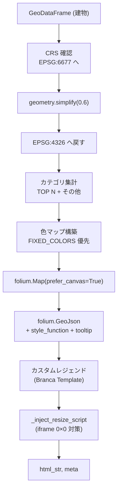
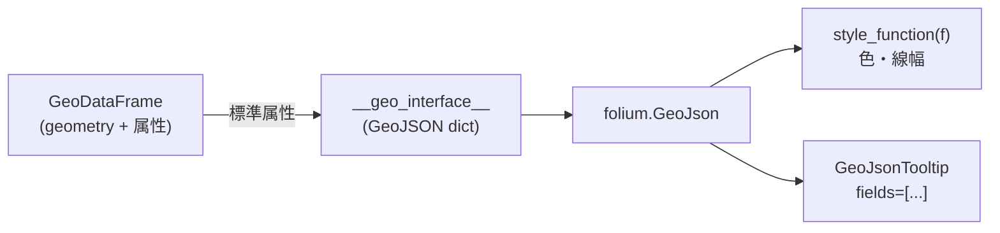
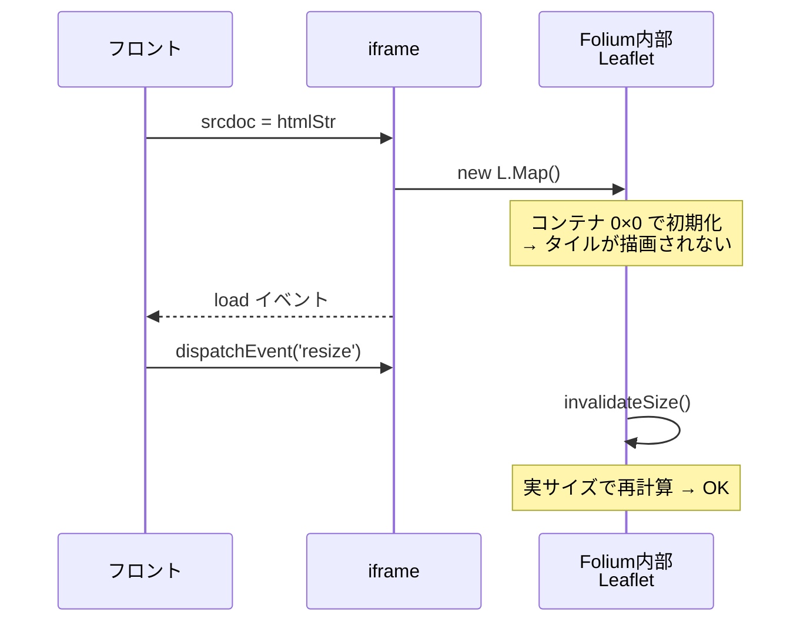
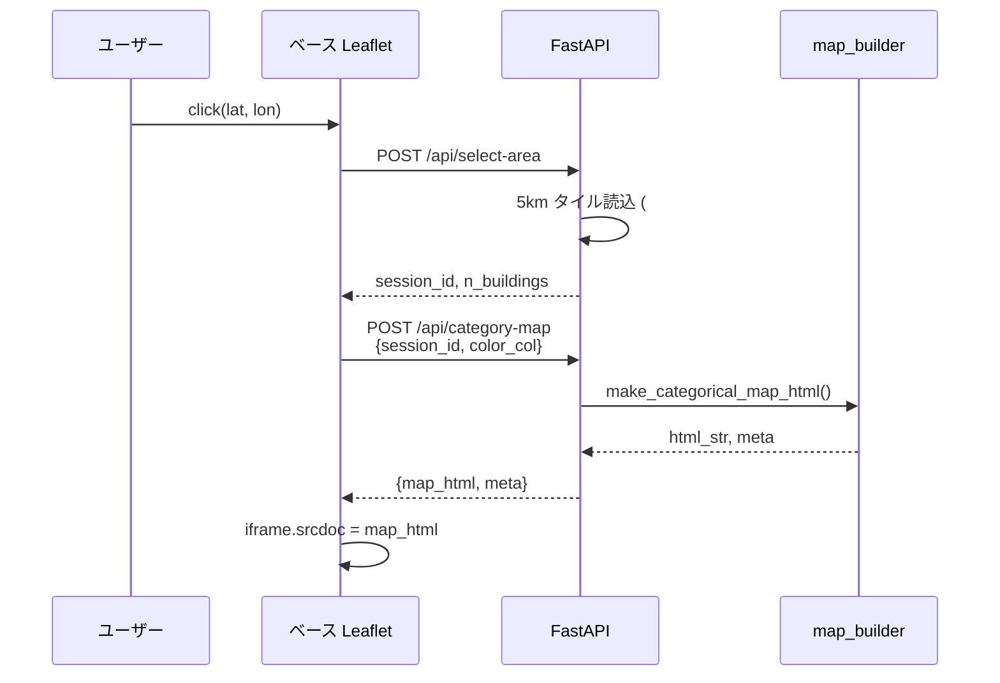

Python だけでインタラクティブな地図 Web アプリは作れるのか。Folium は静的 HTML を吐くだけのライブラリだし、Streamlit だと本番運用が重い。そこで使ったのが **「FastAPI + 生の Leaflet で選択 UI、Folium は結果地図を HTML 文字列として返して iframe に流し込む」**という構成です。quakefire-sim シリーズ #3 は、この **可視化層** を解剖します。

- [#1 延焼モデル設計](https://qiita.com/invest-aitech/items/30cc943a410080c57f22)
- [#2 170万棟を遅延読み込みで捌くデータパイプライン](https://qiita.com/invest-aitech/items/53dc67eee843a7e42f28)
- **#3（本記事）Folium × FastAPI ダッシュボード**

本番: https://quakefire-sim-x6otnjvfsq-an.a.run.app

## この記事で分かること

- **Folium を FastAPI に載せる** ときに迷う「`HTMLResponse` で直接返す vs `map_html` を JSON で返す」の設計判断
- **`GeoDataFrame.__geo_interface__` + `folium.GeoJson` + `style_function`** という Folium 実戦の定番パターン
- カテゴリが 30 種類以上ある属性で色が破綻しないための **TOP N + 固定色辞書**
- **iframe に Folium HTML を突っ込むと 0×0 で描画されない**バグと、スクリプト注入で直す実戦ノウハウ
- **クリック → バックエンドで再生成 → iframe 差し替え**という Python 主体のインタラクション設計

## quakefire-sim シリーズ

| # | テーマ |
|---|---|
| 1 | [延焼モデル設計](https://qiita.com/invest-aitech/items/30cc943a410080c57f22) |
| 2 | [170 万棟の遅延読み込み](https://qiita.com/invest-aitech/items/53dc67eee843a7e42f28) |
| **3**（本記事） | **Folium × FastAPI ダッシュボード** |
| 4 | 区比較ベースライン（予定） |
| 5 | 防災 Web アプリの導線設計（予定） |

## 1. この UI が答える問い

#1 が「延焼モデルをどう計算するか」、#2 が「170 万棟のデータをどう出し入れするか」を解いたとすれば、#3 が解くのはユーザー体験の1行です。

> **「東京 23 区の地図をクリックすると、その周辺の建物が耐火構造で色分けされた地図が即返ってくる」**

これを `streamlit-folium` に逃げずに、**FastAPI + 素の Leaflet + Folium (HTML 文字列) + iframe** の組み合わせで実装します。理由は、Cloud Run で薄いコンテナとして動かしたい・レスポンスは JSON で構造化しておきたい・将来 Next.js フロントに差し替えてもバックエンド契約を壊したくない、の 3 点です。

## 2. 全体構成 — ベース地図 × 結果地図の二層

```mermaid
flowchart LR
  subgraph B["ブラウザ"]
    LB["ベース地図<br/>生 Leaflet"]
    IF["結果地図<br/>iframe srcdoc"]
  end
  subgraph S["FastAPI"]
    API1["/api/select-area"]
    API2["/api/category-map"]
    MB["map_builder.py<br/>Folium"]
  end
  LB -->|click (lat,lon)| API1
  API1 -->|session_id| LB
  LB -->|session_id, color_col| API2
  API2 --> MB
  MB -->|html_str| API2
  API2 -->|map_html| IF
```

**ベース地図は生の Leaflet**（`static/js/map-controller.js`）。クリック検出だけを担う軽い UI。**結果地図は Folium が毎回新しく生成した HTML 文字列**を `iframe.srcdoc` に流し込む。サーバで重い計算（色付け・ツールチップ）を済ませて、ブラウザは受け取ったものをそのまま貼るだけ、という分担です。

Folium ではなく生 Leaflet をベースに使う理由は2つ。

1. **クリックイベントの JavaScript を自力で書く必要がある**。Folium はサーバ側で HTML を吐くだけなので、ランタイムの双方向イベント処理には向かない
2. **地図タイルの切替（OpenStreetMap / CartoDB Dark）** を即時反映したい。Folium のマップを丸ごと再生成するより軽い

## 3. FastAPI 側のルーティング — なぜ `map_html` を JSON で返すか

Folium の HTML をどう返すかには 2 つの流派があります。

| 流派 | FastAPI 側 | フロント側 | 向くケース |
|---|---|---|---|
| A: `HTMLResponse` で直返し | `@app.get(..., response_class=HTMLResponse)` | `<iframe src="/api/map">` | 地図単体ページ |
| B: **`map_html` を JSON に詰める** | `return CategoryMapResponse(map_html=..., meta=...)` | `iframe.srcdoc = res.map_html` | **本アプリ** |

本アプリが B を選ぶ理由:

- **地図以外のメタ情報（凡例の色マップ、カテゴリ件数）を同じレスポンスに同梱できる**
- バックエンド契約が **JSON で一貫**し、将来フロントを Next.js に載せ替えても影響が API レイヤに閉じる
- ブラウザキャッシュ戦略を細かく調整しやすい（レスポンス全体に `Cache-Control` を付けられる）

実装は `app/main.py:188-230`:

```python
@app.post("/api/category-map", response_model=CategoryMapResponse)
async def category_map(req: CategoryMapRequest):
    sess = _get_session(req.session_id)
    gdf = sess["gdf"]
    center = sess["center_latlon"]
    radius = sess["radius_m"]

    col_aliases = {
        "耐火構造種別": "耐火構造種別",
        "建物構造コード": "建物構造コード_補完",
        "建物用途": "建物用途",
        ...
    }
    color_col = col_aliases.get(req.color_col, req.color_col)

    tooltip_cols = [color_col]
    for c in ["高さ", "_area_m2", "延床面積(補正)", "住所"]:
        if c in gdf.columns:
            tooltip_cols.append(c)

    html_str, meta = make_categorical_map_html(
        gdf, center, radius, color_col,
        legend_title=req.color_col,
        tooltip_cols=tooltip_cols,
        fixed_color_map=FIXED_COLORS,
        tiles=req.tiles,
    )

    meta_clean = {k: v for k, v in meta.items() if k != "counts"}
    meta_clean["counts"] = {str(k): int(v) for k, v in meta.get("counts", {}).items()}

    return CategoryMapResponse(map_html=html_str, meta=meta_clean)
```

**セッション ID で GeoDataFrame を引き、色分け列を決めて Folium に生成させ、HTML 文字列と集計 `counts` を同じレスポンスに詰める**。Pydantic の `response_model` で型が保証されるので、フロント側は `res.map_html` と `res.meta.counts` を型安全に受け取れます。

## 4. Folium 地図生成の流れ — `make_categorical_map_html()` の解剖

本記事の主役、`app/map_builder.py:73-319`。長めですが、処理ごとに役割がはっきりしています。



### 4-1. ジオメトリ簡略化

170 万棟のうちクリック半径内に入る数千棟をそのまま SVG/Canvas で描くとブラウザが重くなる。`simplify_m=0.6` で**建物ポリゴンの頂点を 60cm 以下の精度にダウンサンプル**してから描画します。`map_builder.py:103-109`:

```python
if simplify_m and simplify_m > 0:
    gdf_proj = gdf_src.to_crs("EPSG:6677") if is_geo else gdf_src
    gdf_proj = gdf_proj.copy()
    gdf_proj["geometry"] = gdf_proj.geometry.simplify(
        float(simplify_m), preserve_topology=True
    )
    gdf_map = gdf_proj.to_crs("EPSG:4326")
```

**EPSG:6677（平面直角）に投影してから simplify、終わったら WGS84 に戻す**のがポイント。緯度経度のまま simplify すると誤差がメートル単位でブレます。

### 4-2. Folium Map 初期化で `prefer_canvas=True`

`map_builder.py:136-145`:

```python
m = folium.Map(
    location=[lat, lon],
    zoom_start=15,
    control_scale=True,
    tiles=tiles,
    width="100%",
    height="100%",
    prefer_canvas=True,
)
```

Leaflet のデフォルト SVG レンダラは 1 要素 = 1 DOM ノード。**数千ポリゴンで DOM が爆発してスクロールが止まる**。`prefer_canvas=True` で Canvas レンダリングに切り替え、数千〜数万オブジェクトでも滑らかに動きます。副作用として `RegularPolygonMarker` 等は Canvas 非対応なので、ポリゴンと `CircleMarker` 中心の設計にしています（Folium GitHub Issue #1373 参照）。

## 5. GeoDataFrame → Folium レイヤーの標準パターン

Folium 実戦で最も使うのがこれです。`map_builder.py:168-183`:

```python
folium.GeoJson(
    data=gdf_map[data_cols].__geo_interface__,
    style_function=lambda f: {
        "color": f["properties"].get(color_key, other_color),
        "weight": 0.9,
        "fillColor": f["properties"].get(color_key, other_color),
        "fillOpacity": 0.65,
        "opacity": 0.85,
    },
    highlight_function=lambda f: {
        "weight": 2.4,
        "fillOpacity": 0.85,
    },
    tooltip=tooltip,
    name=f"{legend_title or color_col}",
).add_to(m)
```



### なぜ `__geo_interface__` なのか

- GeoPandas のオブジェクトを **GeoJSON 辞書にシリアライズする Python 公式プロトコル**（PEP-level ではないが事実上の標準）
- `to_json()` だと文字列になり、Folium 側で再パースが走る。辞書のまま渡す方が速い

### `style_function` は毎 feature 呼ばれる

ポリゴン 1 つごとに呼ばれるので、**ここで重い処理を書くとスケールしません**。本アプリは「色はサーバ側で事前に計算して properties に入れておき、style_function は参照するだけ」という設計。`gdf_map[color_key] = gdf_map[label_col].map(color_map)` で、描画前に色を焼き込んでいます。

### ツールチップは `GeoJsonTooltip` で宣言的に

```python
tooltip = folium.GeoJsonTooltip(
    fields=["耐火構造種別", "高さ", "_area_m2", "延床面積(補正)", "住所"],
    sticky=False,
    labels=True,
    localize=True,
)
```

**フィールド名は日本語のままで動く**のが GeoJsonTooltip の良いところ。`localize=True` で数値をカンマ区切り表示してくれます。

## 6. カテゴリ爆発対策 — TOP N + 固定色辞書

多くの Folium 入門記事は「5〜10 カテゴリ」を前提にしていますが、建物用途や耐火構造コードは実データで**30〜100 種類**に跳ねます。そのまま palette を 1 色ずつ割り当てると、レジェンドが読めなくなる・色の区別がつかない、という事故が起きます。

対策は 2 段構え。**上位 TOP N に集約、残りは「その他」へ**、そして**意味のあるカテゴリ（耐火・木造）には固定色を当てる**。`map_builder.py:52-70`:

```python
FIXED_COLORS = {
    "耐火構造": "#1B5E20",       # 濃い緑 = 強い
    "耐火構造(推)": "#1B5E20",
    "準防火造": "#66BB6A",
    "準防火造(推)": "#66BB6A",
    "防火造": "#F9A825",        # 黄
    "防火造(推)": "#F9A825",
    "木造": "#E64A19",          # オレンジ = 弱い
    "木造(推)": "#E64A19",
    "不明": "#9E9E9E",
    ...
}
```

集約と色決定は `map_builder.py:111-131`:

```python
gdf_map[label_col] = gdf_map[color_col].astype("string").fillna("不明")
vc = gdf_map[label_col].value_counts(dropna=False)

top_labels = vc.index[:int(top_n)].tolist()
keep_labels = set(top_labels) | (set(fixed_color_map.keys()) & set(vc.index.tolist()))
gdf_map[label_col] = gdf_map[label_col].where(
    gdf_map[label_col].isin(keep_labels), other_label
)

color_map = {}
pi = 0
for lab in vc2.index.tolist():
    if lab == other_label:
        color_map[lab] = fixed_color_map.get(lab, other_color)
    elif lab in fixed_color_map:
        color_map[lab] = fixed_color_map[lab]
    else:
        color_map[lab] = palette[pi % len(palette)]
        pi += 1
```

**優先順位は「固定色辞書 > TOP N の palette > その他」**。耐火構造を示す緑系は何があっても緑、というセマンティクスを色で保ちます。これをやらないと、再生成のたびに「今日の木造は青だった」という絶望に出会います。

## 7. iframe 0×0 バグと、スクリプト注入での回復

Folium を `iframe.srcdoc` に流し込むと、**内部 Leaflet が 0×0 のサイズで初期化される**バグがあります。Folium の内部マップは `_repr_html_` 時に「コンテナのサイズに合わせてレイアウト」する前提ですが、srcdoc への書き込み直後は iframe のサイズが確定していない瞬間があり、Leaflet が「自分の表示領域は 0×0 だ」と誤認するのが原因です（Folium Issue #1277 周辺）。



本アプリは**2 段階で防御**しています。

### 7-1. サーバ側: スクリプト注入

`map_builder.py:19-43`:

```python
def _inject_resize_script(html_str: str) -> str:
    script = """
<script>
(function(){
  function fixSize() {
    var maps = [];
    for (var k in window) {
      if (window[k] && typeof window[k].invalidateSize === 'function') {
        maps.push(window[k]);
      }
    }
    if (maps.length === 0) { setTimeout(fixSize, 100); return; }
    maps.forEach(function(m){ m.invalidateSize(); });
  }
  window.addEventListener('resize', fixSize);
  window.addEventListener('load', function(){ setTimeout(fixSize, 200); });
  setTimeout(fixSize, 500);
})();
</script>
"""
    return html_str.replace("</body>", script + "</body>")
```

**`window` オブジェクトを走査して `invalidateSize` を持つもの（= Leaflet マップインスタンス）を全部叩く**、という力技。Folium が付けるマップ変数名（`map_xxxx`）が実行時にしか分からないので、こうしました。

### 7-2. フロント側: iframe 表示順の制御

`static/js/ui-components.js:41-62`:

```javascript
showFoliumMap(htmlStr) {
    const mapEl = document.getElementById('map');
    const overlay = document.getElementById('folium-overlay');
    const iframe = document.getElementById('folium-iframe');

    // 1. Hide the base Leaflet map entirely to avoid z-index conflicts
    mapEl.style.display = 'none';

    // 2. Show the overlay FIRST so the iframe has real dimensions
    overlay.style.display = 'block';

    // 3. When iframe loads, trigger a resize so its internal Leaflet map
    //    recalculates its container size
    iframe.onload = function () {
      try {
        iframe.contentWindow.dispatchEvent(new Event('resize'));
      } catch (e) { /* cross-origin fallback */ }
    };

    // 4. Now set content — iframe will load with proper dimensions
    iframe.srcdoc = htmlStr;
},
```

**コメント番号で書いた順序が決定的**。オーバーレイを先に出して iframe のサイズを確定させ、その後に `srcdoc` を設定。load イベントで `resize` を dispatch。ここで順序を間違えると、サーバ側のスクリプト注入だけでは救えないケースに陥ります。

## 8. インタラクションループ — クリックから地図差し替えまで



`app/main.py:137-185` の `select_area` は

1. タイル ID 列挙 → parquet 読込（#2 のパイプライン）
2. 円内フィルタで絞り込み
3. `_sessions[session_id]` に GeoDataFrame を保持（TTL 60 分）

と進みます。セッションはメモリ保持なので **インスタンス跨ぎでは共有されない**点は注意。本番では `concurrency=80, min-instances=0〜1` で問題は顕在化していませんが、大規模運用で複数インスタンスが必要になったら Memorystore (Redis) に移す想定です。

## 9. 170 万棟スケールで折り合いをつける 3 つのチューニング

`prefer_canvas=True` と `simplify(0.6)` 以外にも、スケールさせるために効いた判断が 2 つあります。

- **`MAX_BUILDINGS` で物理的に上限を設ける** — `app/main.py:157-161` で建物数が設定値を超えたら 400 を返す。半径を小さくするよう UX 側で促す
- **必要な列だけ GeoJSON に載せる** — `data_cols = [label_col, color_key, "geometry"] + tooltip_fields` で明示。建物テーブル全列を流すと payload が肥大する

結果、**半径 500m 程度（数千棟）**ならレスポンス〜描画が体感 1 秒台に収まります。

## 10. 未実装と、次回に向けて

- **セッション永続化**: 現状はプロセスメモリ。Cloud Run のスケール状況次第で Memorystore に移す
- **クライアントキャッシュ**: `Cache-Control` ヘッダは未指定。同じ (lat, lon, radius, color_col) で叩かれた場合のキャッシュは課題
- **Vector Tiles 化**: `map_html` は 1〜数 MB になる。半径をさらに拡げたいなら Mapbox Vector Tiles 配信に切り替える検討

**次回 #4 は「区比較ベースラインの設計 — プリ集計 vs オンデマンド」** を書く予定です。延焼シミュレーションは確率モデルなので、23 区全域を一気に比較するには事前計算（ベースライン）が要ります。その線引きをどこに引いたか、の話。

## 関連シリーズへの導線

同じく本番 Cloud Run アプリを解剖する連載として **plateau-webapp（3D 都市モデルの Web 配信）**もあります。

- [#1 アーキテクチャ総論](https://qiita.com/invest-aitech/items/93c775439fa851010a4d)
- [#2 41.9GiB を GCS FUSE で配信](https://qiita.com/invest-aitech/items/dbe59cdb04a8093539cc)
- #3 タイル配信 API 設計（本記事と同時期公開）

「Python + 地図 + FastAPI で本番 Web アプリを作る」というテーマに興味があれば併せて。
