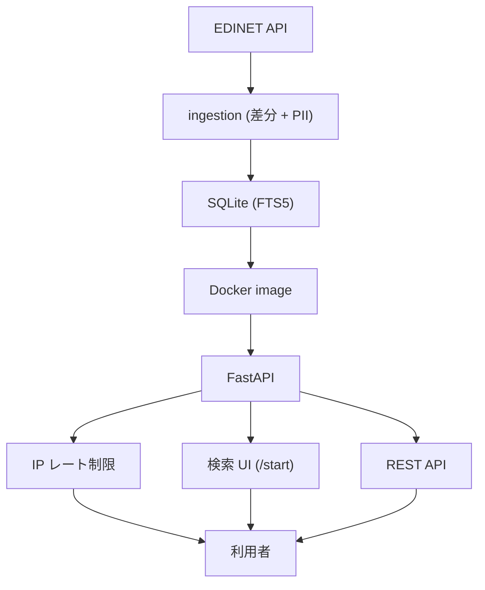
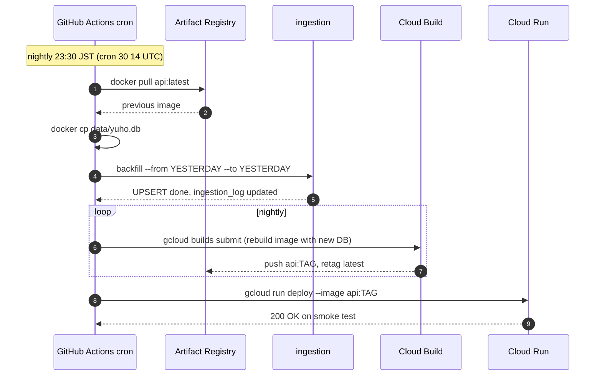
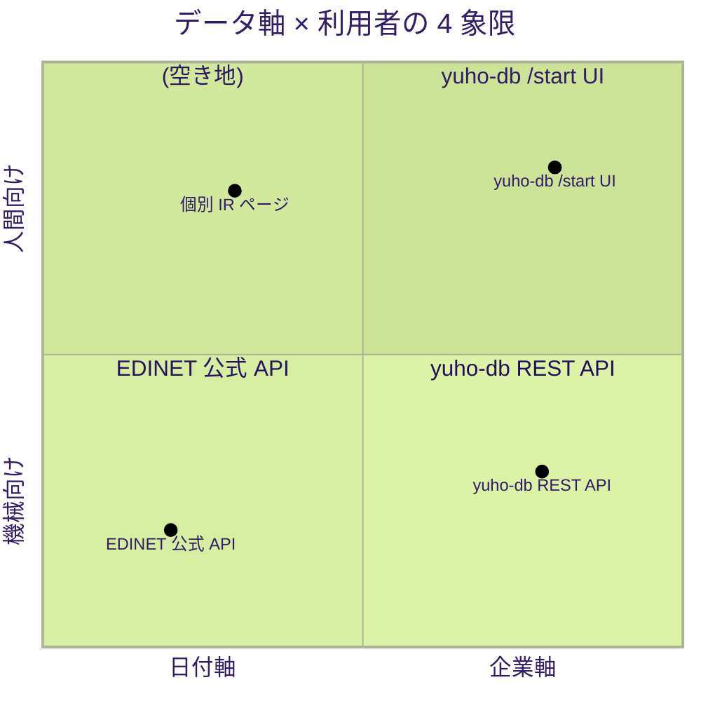
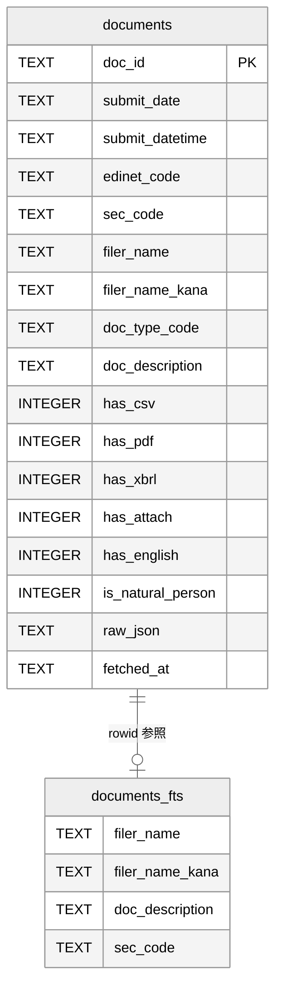
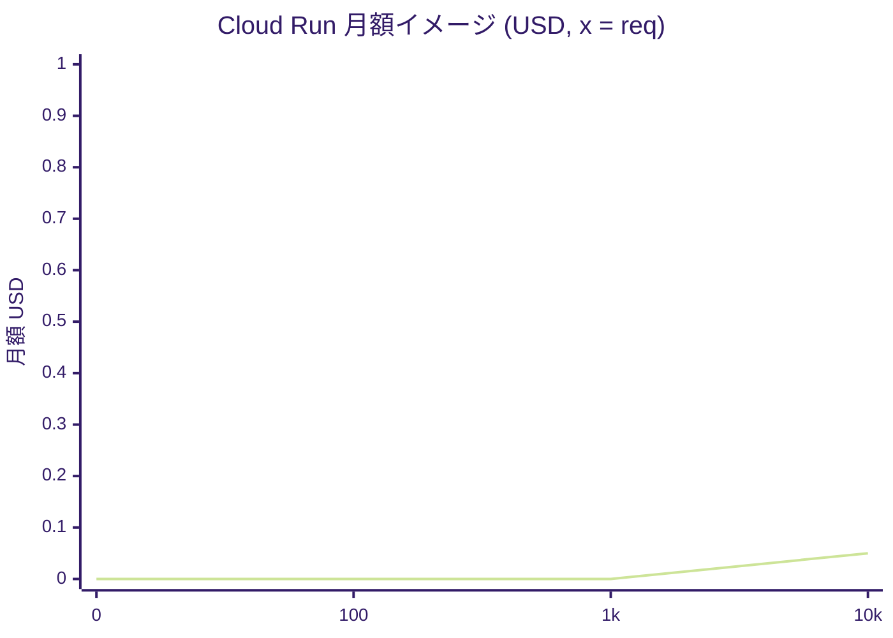

トヨタの過去 10 年分の有報を集めるのに、EDINET 公式 API では 2,500 営業日分のリクエストを順番に投げる必要があり、レート制限で詰まると 1 時間以上待つことになります。1 日 1 秒スリープで最短 42 分、長いときは遅いネットワーク越しに何度もリトライ。これを 1 SQL で答える自前 DB を作りました — 87 万件 × 10 年 × 月額ほぼ $0 で、毎晩 23:30 JST に自動更新です。

## なぜ今これを書くか

公的データは「整備されているのに届いていない」状態が一番もったいない。EDINET メタデータは商用利用も含めて公的に許諾されている貴重な基盤ですが、API 設計が日付軸である以上、**個人投資家や財務分析を始めたい一般層** にとっては「自分の追っている銘柄の過去 N 年分を 1 ヶ所で見る」という最も自然な問いに、すぐには答えてくれません。あなたが手元で同じ困りごとに当たっているなら、**橋を 1 本架けるだけで社会資本になる距離** にあることを、実装と数字で示したいのが本稿です。

## 先に要点

- 公的データを使えるかどうかは、API 設計と利用ユースケースの間に **「再インデックスの 1 段」** を入れるだけで決まる
- Cloud Run min=0 + GitHub Actions cron で SQLite を **コンテナに焼き込む第 3 のパターン** なら、月額ほぼ $0 で 10 年フルを毎晩自動更新できる
- 公開データの再利用は、**出典明示 + ライセンス遵守 + 公式サイト動線優先** の 3 点を守れば「模範ケース」として組み立てられる

## この記事で分かること

- 公的データ API (日付軸) を **企業軸に再パッケージ** する判断軸が分かる
- SQLite を **Cloud Run コンテナに焼き込む** 運用パターン (Litestream / GCS Mount を棄却した理由つき) が分かる
- FTS5 trigram + **2 文字以下 LIKE フォールバック** の素朴実装が分かる
- **PII 自然人 16,776 件 (1.88%) を 2 段判定で除外** する設計と、過剰除外を避けるロジックが分かる
- **Workload Identity Federation で SA key 不要** の GitHub Actions → Cloud Run 自動デプロイ構成が分かる

---

## 1. トヨタの過去 10 年分有報を 1 クエリで返す仕組み

あなたが「ホンダの過去 5 年分の四半期報告書を、PDF 込みで横並びに見たい」と思った場面を想像してください。EDINET 公式 API は日付軸で組まれているので、5 年なら約 1,250 営業日分のメタデータを順に取得して、自分でフィルタしないと欲しい一覧にたどり着きません。1 リクエスト/秒のレート制限を守ると、ざっくり 20 分強。これを毎四半期繰り返すのは、現実的ではないと感じる読者が多いはずです。

yuho-db の中核ユースケースはきわめて単純です。会社名や銘柄コードを 1 つ入れて、その企業の有価証券報告書・四半期報告書・大量保有報告書を **過去 N 年分 1 リスト** で並べ、PDF や CSV にワンクリックで飛べる。検索 UI は `/start` (Cloud Run) で配信していて、サービス本体は <https://invest-aitech-yuho-db.web.app/> から開けます。

実態としてはメタデータの再パッケージです。本体ファイル (PDF / XBRL) は EDINET 公式に置かれたまま、yuho-db は「ドック ID + 提出日 + 提出者 + 種別」だけを持ち、書類本体はその場で公式 API へストリーム転送します。これによって 374 MB の SQLite に **約 87 万件・10 年フル** が収まり、API 経由で `?sec_code=7203&period=10y` の 1 クエリから「企業 × 期間」のリストが返るようになりました。

想定読者は、企業財務に興味のある **個人投資家・財務分析を始めたい一般層**、それから「データ系の業務に関わる方」と「エンジニア向け」の 2 軸です。EDINET API キーを発行して自分で叩くほどではないけれど、四半期ごとに自分の追っている銘柄の開示を 1 ヶ所で見たい — そんな解像度に揃えることが目的でした。

**ポイントは**、公式 API が悪いのではなく、**API の軸 (日付) と読者の問い (企業) が直交している** という構造的なギャップに、橋を 1 本架けたという話です。

## 2. 公式 API の日付軸を企業軸に再パッケージするという発想

EDINET v2 API は **日付軸** で組まれています。`https://api.edinet-fsa.go.jp/api/v2/documents.json?date=YYYY-MM-DD&type=2` のように特定日のメタデータを取りに行く設計で、API キーがあれば商用利用も含めて公的に許諾されている (PDL1.0 / CC BY 4.0 互換)、貴重なデータ基盤です。日々追加される開示を網羅的に追える点ではこの設計が最も素直で、毎日 1 リクエストで「その日に出た全社の開示」を捕まえられます。

一方で、**あなたが個人投資家として** 「自分の追っているプライム銘柄 10 社の過去 5 年分を時系列で読みたい」とするユースケースは、完全に **企業軸** です。日付軸の API でこれを実現するには、N 年 ÷ 1 日のループでメタデータを全部取ってからローカルに再インデックスし直す必要があり、誰もが手元でやれる作業ではありません。日付軸が悪いという話ではなく、**API の設計軸とユースケースの軸が直交している** という構造的な特性です。

このギャップを埋めるのに必要なのは、**「再インデックス 1 段」だけ** です。日付軸で取り込んだメタデータを `(sec_code, submit_date)` などの企業軸インデックスに張り直して SQLite に詰め、3-gram 全文検索を被せる。この 1 段が公式と利用者の間に挟まれば、利用者は「日付軸 → 企業軸」の橋を意識せずに、自然な企業軸の問いを SQL 1 本で投げられます。yuho-db はこの 1 段だけを引き受けるサービスとして設計しました。

**結論として**、公式 API の設計を否定する必要はなく、**読者と公式の間に「軸の翻訳機」を 1 つ挟む** だけで実用解像度は一段上がります。

## 3. 自家用に作っていた DB を公開した判断 (Big Idea の Why)

このインデックスは元々、自分の投資判断のために手元で動かしていた SQLite でした。最初は **Litestream を試しました**。SQLite を S3 互換ストレージに継続レプリケーションする定番ツールで、Cloud Run の揮発ファイルシステム問題を回避する第一候補です。しかし実際に組んでみると、リクエスト 0 件のアイドル時間でも GCS への PUT が走り、月額がじわじわ積み上がる構造に気づいて **棄却しました**。続けて **Cloud Run の GCS FUSE Mount も検討** しましたが、cold start にマウント時間が乗って体感がさらに重くなる。これも捨てました。

迷いました。3 つ目に選んだのが「**SQLite ファイルを Docker image に焼き込む**」第 3 のパターンです。具体的には、Cloud Run を `min-instances=0` で運用すると、リクエストが来ない時間帯のインスタンス費用は完全に無料になります。データは `data/yuho.db` を Docker image に焼き込み済みで、外部ストレージのアタッチや Litestream のような同期も使っていません。Firebase Hosting の無料枠でランディングを配り、GitHub Actions の無料分で毎晩 ingest と redeploy を回す。トラフィックがゼロなら出ていく金額もゼロに近く、トラフィックが増えても Cloud Run の無料枠 (200 万リクエスト/月) の範囲で済む見立てです。

ローカルで動かしていたものを公開するときに発生する追加コストが「月額ほぼ $0」だと判明した瞬間、**一人で抱える理由がなくなりました**。同じ困りごと (企業軸での横串検索) を持つ人がいるはずで、自分用の DB をもう少しだけ整えれば届く距離にあった。Big Idea を 1 行で書くと、「**公的に整備されたデータ基盤は、日付軸から企業軸へ「再パッケージ」するだけで、誰もが手元で使える社会資本になる**」になります。これは「片寄せをやめろ」型の主張ではなく、「日付軸だけでは届かない読者層に、企業軸で橋を架ける」という補完の判断です。

**まとめると**、棄却した 2 案 (Litestream / GCS Mount) の経緯を含めて公開判断の理由を書くと、「公開コストが手元コストとほぼ同じだと気づいた」一点に収束します。

## 4. 全体アーキテクチャ — EDINET → 焼き込み SQLite → FastAPI

夜中の 23:30 JST、東京の家で誰も起きていない時間に、GitHub Actions が静かに前回 image を引き取り、新しい日付分を UPSERT し、image を rebuild して Artifact Registry に push する。あなたが朝コーヒーを淹れる頃には、Cloud Run には前夜分まで反映された SQLite が焼き込まれた最新リビジョンが立ち上がっています。

全体像を 1 枚で示します。EDINET 公式 API から ingestion パイプラインがメタデータを取り込み、PII 判定を通したうえで SQLite に UPSERT します。SQLite はそのまま Docker image に焼き込まれ、Cloud Run へデプロイ。FastAPI が `immutable=1` の read-only で開いて検索し、書類本体のダウンロード要求が来たら EDINET 公式 API へストリーム転送する、という流れです。



ノードはあえて短くし、具体値 (FTS5 trigram、差分 UPSERT、IP レート制限 60/分・600/時・3000/日 など) は本文と後段の図で補います。「なぜこの形にしたか」を一言で言うと、**書き込みが必要な層を 1 日 1 回の ingest だけに切り離した** からです。読み取り側 (Cloud Run の API) は完全に read-only でよく、SQLite を `immutable=1` で開けるためロックも WAL も要りません。書き込みは GitHub Actions cron が前回 image から DB を救出 → 増分 UPSERT → image rebuild の流れで完結するので、Cloud Run 側は読み込み専用に最適化されたまま月額 $0 級でアイドルさせられます。

**結論として**、書き込みと読み取りを 1 日 1 回の境界で完全に切る判断が、月額 $0 級の運用と単純な read-only API を同時に成立させた核心です。

## 5. 重要コード 5 箇所 — 設計判断の証拠

設計判断を 5 つのコード断片で示します。それぞれ「何 / 入出力 / 全体での位置 / なぜ重要か」の 4 点を添えています。あなたが手元で同種の SQLite + Cloud Run 構成を組むときに、そのまま流用できる粒度に揃えました。

### (a) FTS5 trigram + 2 文字以下 LIKE フォールバック

**出典: `api/routes/documents.py:77-86` ([GitHub](https://github.com/Invest-AItech/yuho-db) — public 化後にリンク)**

```python
# api/routes/documents.py:77-86
if len(q_clean) < 3:
    wheres.append(
        "(d.filer_name LIKE ? OR d.sec_code = ? OR d.filer_name_kana LIKE ?)"
    )
    params.extend([f"%{q_clean}%", q_clean, f"%{q_clean}%"])
else:
    wheres.append(
        "d.rowid IN (SELECT rowid FROM documents_fts WHERE documents_fts MATCH ?)"
    )
    params.append(q_clean)
```

**4 点解説**:

- **何**: FTS5 trigram + 2 文字以下 LIKE フォールバックの分岐。
- **入出力**: 検索クエリ `q` (str) → 3 文字以上なら `documents_fts MATCH q`、2 文字以下なら `(filer_name LIKE '%q%' OR sec_code = q OR filer_name_kana LIKE '%q%')` の OR 3 列。
- **位置**: `_build_where()` の中、PII フィルタ (WHERE 句先頭) の直後に配置される検索本体ロジック。
- **なぜ重要か**: 「日産」(2 文字) や「KDDI」のような短社名のときに UX を落とさないための実用判断です。FTS5 の vocab トリックで 2-gram を擬似的に通す高度な実装もありますが、ここでは **3 列 OR で割り切る素朴な分岐** を選びました。読者が手元の SQLite に持ち込んでもそのまま動きます。

### (b) PII 自然人 2 段判定

**出典: `ingestion/classify_pii.py:18,76-102` ([GitHub](https://github.com/Invest-AItech/yuho-db) — public 化後にリンク)**

```python
# ingestion/classify_pii.py:18 (定数), 76-102 (本体)
LARGE_HOLDER_TYPES = {"220", "230", "240", "350", "360"}
# ... (法人サフィックス 50+ パターンと判定ヘルパは省略)

def is_natural_person(filer_name, doc_type_code, sec_code) -> int:
    if not filer_name:
        return 0
    name = filer_name.strip()
    is_large_holder_no_seccode = (
        (doc_type_code or "") in LARGE_HOLDER_TYPES and not (sec_code or "").strip()
    )
    if not is_large_holder_no_seccode:
        return 0
    if _has_corporate_marker(name):
        return 0
    if _has_natural_marker(name):
        return 1
    if _looks_like_japanese_personal_name(name):
        return 1
    return 0
```

**4 点解説**:

- **何**: 大量保有報告書の自然人提出者を 2 段判定で抽出するロジック。
- **入出力**: `filer_name` + `doc_type_code` + `sec_code` → `is_natural_person` (0/1)。
- **位置**: ingestion パイプラインの UPSERT 直前、`fetch_day.py` から呼ばれて DB カラム `is_natural_person` に格納されます。
- **なぜ重要か**: 過剰除外を避けつつ、個人情報保護法の保護対象を取りこぼさないための設計です。**大量保有 5 種 + sec_code NULL** が必要条件、そこから法人サフィックス 50+ パターン (株式会社 / Ltd / Trust / Fund / ...) を排除し、最終的に R1 (末尾「氏」or「（個人）」) または R2 (全角スペース 12 文字以内の日本人名) のいずれかが該当したものだけを 1 にします。実測で 893,257 件中 16,776 件 (1.88%) を除外、API レスポンスからは完全に消えます。

### (c) Cloud Run min=0 + image 焼き込みデプロイ

**出典: `scripts/deploy_cloudrun.sh:38-63` ([GitHub](https://github.com/Invest-AItech/yuho-db) — public 化後にリンク)**

```bash
# scripts/deploy_cloudrun.sh:38-63
ENV_FILE=$(mktemp -t envvars.XXXXXX.yaml)
trap 'rm -f "$ENV_FILE"' EXIT
cat > "$ENV_FILE" <<'EOF'
YUHO_DB_PATH: /app/data/yuho.db
RATELIMIT_PER_MINUTE: "60"
RATELIMIT_PER_HOUR: "600"
RATELIMIT_PER_DAY: "3000"
EOF

gcloud run deploy "$SERVICE" \
    --image="$IMAGE" \
    --region="$REGION" \
    --project="$PROJECT_ID" \
    --platform=managed \
    --allow-unauthenticated \
    --port=8080 \
    --cpu=1 \
    --memory=512Mi \
    --min-instances=0 \
    --max-instances=2 \
    --concurrency=40 \
    --timeout=30s \
    --env-vars-file="$ENV_FILE" \
    --set-secrets="EDINET_API_KEY=EDINET_API_KEY:latest" \
    --execution-environment=gen2
```

**4 点解説**:

- **何**: SQLite を Cloud Run コンテナに焼き込み、Artifact Registry 経由でデプロイする本番デプロイスクリプト。
- **入出力**: built image (`data/yuho.db` 同梱) → Cloud Run service revision (min=0 / max=2 / 512Mi / concurrency=40 / timeout=30s)。
- **位置**: GitHub Actions `daily-ingest.yml` の最終ステップから呼ばれます。
- **なぜ重要か**: **月額ほぼ $0** の核心です。Litestream / GCS Mount を使わず、毎晩 image を rebuild して DB ごと焼き直す第 3 のパターン。`min-instances=0` でアイドル時間は完全無料、バックアップは Artifact Registry に積み上がる image 履歴がそのまま担うので、別途バックアップ運用も発生しません。`--env-vars-file` の yaml 経由は **Git Bash の MSYS パス変換** (`/app/...` が `C:/Program Files/Git/app/...` に化ける) を回避するための判断で、ターミナルの前で 2 時間ハマって気づきました。

### (d) GitHub Actions cron + Workload Identity Federation

**出典: `.github/workflows/daily-ingest.yml:34-83` ([GitHub](https://github.com/Invest-AItech/yuho-db) — public 化後にリンク)**

```yaml
# .github/workflows/daily-ingest.yml:34-83 (一部抜粋)
- name: Pull previous DB from latest image
  run: |
    gcloud auth configure-docker ${{ secrets.GCP_REGION }}-docker.pkg.dev --quiet
    IMAGE="${{ secrets.GCP_REGION }}-docker.pkg.dev/${{ secrets.GCP_PROJECT_ID }}/yuho-db-api/api:latest"
    if docker pull "$IMAGE" 2>/dev/null; then
      CONTAINER=$(docker create "$IMAGE")
      docker cp "$CONTAINER:/app/data/yuho.db" data/yuho.db || true
      docker rm "$CONTAINER" || true
    else
      echo "no previous image, fresh start"
    fi

- name: Ingest yesterday
  env:
    EDINET_API_KEY: ${{ secrets.EDINET_API_KEY }}
  run: |
    YESTERDAY=$(date -u -d '1 day ago' +%Y-%m-%d)
    uv run python -m ingestion.backfill --from "$YESTERDAY" --to "$YESTERDAY"

- name: Build & push container via Cloud Build
  id: build
  run: |
    TAG=$(date +%Y%m%d-%H%M%S)
    IMAGE="${{ secrets.GCP_REGION }}-docker.pkg.dev/${{ secrets.GCP_PROJECT_ID }}/yuho-db-api/api:$TAG"
    gcloud builds submit --tag "$IMAGE" --project "${{ secrets.GCP_PROJECT_ID }}" .
```

**4 点解説**:

- **何**: 毎晩 23:30 JST (cron `30 14 * * *` UTC) に走る ingest → image rebuild → Cloud Run redeploy の一気通貫ワークフロー。
- **入出力**: スケジュール起動 → 翌朝、最新の DB が焼き込まれた Cloud Run リビジョン。
- **位置**: 運用パイプライン全体の自動化エントリポイントで、`auth@v2` で Workload Identity Federation を経由し、`gcloud builds submit` が Cloud Build を駆動します。
- **なぜ重要か**: **Workload Identity Federation で SA key 不要** が現実的な運用条件でした。組織方針で SA key の作成が禁止されている環境でも、`projects/<n>/locations/global/workloadIdentityPools/github-actions/providers/github` に `attribute_condition: assertion.repository_owner=='Invest-AItech'` を付けたプロバイダを使うことで、GitHub Actions から Cloud Run へ安全にデプロイできます。`docker pull` → `docker cp` で **前回 image から DB を救出する** 設計に気づいた瞬間が発見の核でした。それまでは「外部ストレージか自前バックアップか」の二択だと思い込んでいました。

### (e) EDINET ダウンロードプロキシ + 出典ヘッダ

**出典: `api/routes/documents.py:316-377` ([GitHub](https://github.com/Invest-AItech/yuho-db) — public 化後にリンク)**

```python
# api/routes/documents.py:316-377
DOWNLOAD_TYPE_MAP: dict[str, tuple[int, str, str]] = {
    "main":    (1, "application/zip",      "zip"),
    "pdf":     (2, "application/pdf",      "pdf"),
    "attach":  (3, "application/zip",      "attach.zip"),
    "english": (4, "application/zip",      "english.zip"),
    "csv":     (5, "application/zip",      "csv.zip"),
}

@router.get("/{doc_id}/download", include_in_schema=True)
def download_document(doc_id, settings, type="pdf"):
    # ... PII チェック (SQL レベル + API レイヤの二重)
    upstream = "https://api.edinet-fsa.go.jp/api/v2/documents"
    params = {"type": edinet_type, "Subscription-Key": settings.edinet_api_key}

    def stream():
        with httpx.stream("GET", f"{upstream}/{doc_id}", params=params, timeout=60.0) as r:
            if r.status_code != 200:
                raise HTTPException(r.status_code, ...)
            yield from r.iter_bytes()

    return StreamingResponse(
        stream(),
        media_type=media_type,
        headers={
            "Content-Disposition": f'attachment; filename="{doc_id}.{ext}"',
            "Cache-Control": "no-store",
            "X-EDINET-Source": "yuho-db proxy (PDL1.0 / non-official)",
        },
    )
```

**4 点解説**:

- **何**: 公式 EDINET API へストリーム転送するダウンロードプロキシと、PDL1.0 準拠の出典ヘッダ。
- **入出力**: `doc_id` + `type` (pdf/csv/main/attach/english) → PDF/CSV/zip ストリーム + `X-EDINET-Source` ヘッダ。
- **位置**: API レイヤの最終出力。ユーザがブラウザで「PDF↓」を押した瞬間に呼ばれるラストワンマイル。
- **なぜ重要か**: EDINET の Web ビューワー URL `WZEK0040.aspx` は session 必須で直リンクが組めません。ブラウザに直接置けないので、**API キーを持つサーバが取得 → ストリーム転送する** 設計が必要でした。出典ヘッダで PDL1.0 / non-official を明示することで、公開データ再利用の **模範ケース** として組み立てています。

#### Daily ingest シーケンス (補助図)

参考までに、上の (d) と (c) を時系列で並べると次のようになります。



> 図の `loop nightly` ラベルや `Note over` の日本語ラベルは、Mermaid の sequenceDiagram でラベル位置に空白・カンマ問題が出ないように分けて配置しています。

**つまり**、5 つのコード断片を貫く設計思想は「**書き込みは 1 日 1 回 / 読み取りは完全 read-only / 書類本体は持たない**」という 3 つの境界の引き方に集約されます。

## 6. 公開データを再利用するときの境界線 (PDL1.0・出典明示)

EDINET メタデータの利用条件は **PDL1.0 (CC BY 4.0 互換)** で、商用利用も含めて公的に許諾されています。yuho-db はこのライセンスに沿って 3 つの取り決めを置きました。

1. ダウンロードプロキシのレスポンスに `X-EDINET-Source: yuho-db proxy (PDL1.0 / non-official)` ヘッダを必ず付ける。
2. UI / README / ランディングに「**本サービスは EDINET の非公式サービスです**」を明記し、書類本体は EDINET 公式へリンクで誘導する。
3. 直リンクできない `WZEK0040.aspx` (session 必須) はブラウザに置かず、API キー保有のサーバが取得してストリーム転送する。

メタデータが「事実情報」であり著作物に当たらないこと、書類本体は自前で再配布せずプロキシ転送のみであること — この 2 点を組み合わせると、**データ軸 (日付/企業) × 利用者 (機械/人間)** の象限がきれいに整理されます。EDINET 公式 API は「日付 × 機械」に最適、yuho-db は「企業 × 人間」に最適、という関係です。



公式と非公式が **競合する関係ではなく、軸の役割分担** に整理できることが、再パッケージの前提として大事でした。

**要するに**、出典明示 + ライセンス遵守 + 動線優先の 3 点を守ると、公開データの再利用は「ぶつかる」ものではなく「補完する」ものとして組み立てられます。

## 7. スキーマと PII フィルタ — SQL レベル強制 + 二重チェック

DB は中核 1 表 + FTS5 仮想テーブル 1 表のシンプルな 2 表構造です。`documents` が doc_id 主キー + 25 列前後で、外部 content モードの `documents_fts` が rowid で参照しながら trigram で 4 列 (filer_name / filer_name_kana / doc_description / sec_code) を全文インデックス化します。AI/AD/AU トリガで自動同期されるので、本体への INSERT/UPDATE/DELETE だけ気にすれば OK です。



PII 自然人の取り扱いは「SQL レベルで強制 + API レイヤで二重チェック」の構成です。検索系クエリの `_build_where()` は **WHERE 句先頭に `d.is_natural_person = 0` を常時注入** し、単一書類取得 (`/api/v1/documents/{doc_id}`) と書類ダウンロード (`/api/v1/documents/{doc_id}/download`) でも同じ条件を SQL に書いています。実測 16,776 件 (1.88%) は DB に保存はされていますが API からは一切見えません。バックフィルの実績は **2026-05-08 時点で 2h11m (1.5 秒 throttle 付きの 10 年フル)**、テストは **53 件 全パス** です。

時間軸でいうと、初回バックフィルが 2 時間ちょっとで完走し、毎晩 23:30 JST に差分 ingest が回り、`raw_json` カラムが将来の API 拡張を吸収する — この三層の時間軸が SQLite 1 ファイルの中で整理されています。

**核心は**、PII 除外を「アプリ層のフィルタ」ではなく「SQL の WHERE 句先頭に注入する」位置に置いたこと。アプリ側でフィルタを忘れる事故が原理的に起きません。

## 8. この設計の強み — 公的データを社会資本に変える

強みを 3 つに絞ると、**コスト・配布・準拠** の 3 軸です。

- **コスト**: Cloud Run min=0 でアイドル時間は完全無料、Firebase Hosting も無料枠内 (10GB/月) で収まる構成です。リクエストが増えても Cloud Run の無料枠 (200 万リクエスト/月) を超えるまでは課金が発生しません。
- **配布**: 認証不要の REST API + IP 単位レート制限 (60/分・600/時・3000/日) で、開発者は API キーなしで叩けます。UI 用途であれば 1 ユーザの操作頻度を十分に超える設定値です。
- **準拠**: 出典ヘッダ + UI 表示 + 公式サイト動線優先で PDL1.0 を明示。書類本体は自前で再配布せず、メタデータだけを再パッケージする。

コスト構造を 4 ポイントで可視化すると、リクエスト 0 件のとき完全 $0、100 件 / 1,000 件 / 10,000 件と増えても無料枠内に収まる範囲が広いことがわかります (横軸はリクエスト数 req)。



公開データを再利用するときに「お金がかかるから止めた」「ライセンスが分からないから止めた」「配布が重いから止めた」になりがちな部分を、3 軸で 1 つずつ潰した結果、**個人開発の延長線上で社会資本になる** 構成に近づきました。

**ポイントは**、3 軸 (コスト / 配布 / 準拠) のどれか 1 つでも詰まると個人開発からの公開化が止まる、ということ。3 軸並列で潰せたから「月額ほぼ $0」が成立しました。

## 9. 弱み・注意点 — 数字で正直に書く

弱みも 3 つに絞って、なるべく数字で書きます。あなたが手元で同じ構成を真似する場合、ここを最初に確認してください。

- **公式 API のスキーマ変更には追随が必要**: EDINET v2 API の将来フィールド追加に対しては、`raw_json` カラムで forward compatibility を確保する設計です。実際 `has_pdf` / `has_attach` / `has_english` は後追い ALTER + `json_extract(raw_json, '$.pdfFlag')` で再ハイドレートして対応した経験があります (`ingestion/schema.py:101-122`)。スキーマが大きく変わると DDL 側の作業が必要になります。
- **FTS5 trigram は 3-gram 必須**: 「日産」(2 文字) や「KB」のような短いクエリは LIKE フォールバックに切り替わるため、FTS5 のリレバンス順序とは別の挙動になります。3 列 OR で割り切る代わりに、ヒット数が増えすぎた場合のソートは `submit_date_desc` を既定にしました。
- **業務利用は EDINET 公式 API を直接叩くべき**: yuho-db は UI / 探索用の解像度を狙ったサービスで、機械学習用にメタデータを大量取得するような用途では本家 API を直接叩くほうが筋が良いと考えます。レート制限 (60/分・600/時・3000/日) と IP 単位の制御は人間操作の頻度を想定した値です。

数字としては、**PII 除外 16,776 件 (1.88%)・最終バックフィル 2h11m・テスト 53 件 全パス・DB 374 MB・期間 10 年フル** が現状のスナップショットになります。

**教訓は**、弱みを数字で正直に書くことが、読者があなた自身の判断軸を持って真似できるかどうかを決める、ということです。

## 10. 一言で言うと

**公的に整備された EDINET メタデータを企業軸で再インデックスし、誰もが手元で使える解像度に揃えた non-official な自前 DB です。**

## 11. まとめ — 明日から使える 3 行

1. **公的データの API 設計と実用ユースケースの間に橋を架ける**: 日付軸 → 企業軸の再インデックスは、それだけで実用解像度を一段上げる。
2. **月額ほぼ $0 で 10 年フル運用は実装可能**: Cloud Run min=0 + GitHub Actions cron + Firebase Hosting + Workload Identity Federation の組み合わせで「個人開発の延長線上」に収まる。
3. **公開データの再利用は出典明示 + ライセンス遵守 + 公式サイト動線優先**: PDL1.0 / CC BY 4.0 互換を踏まえれば「模範ケース」として組み立てられる。

公的データは「整備されているのに届いていない」状態が一番もったいない。橋を 1 本架けるだけで、社会資本になる。

---

普段は AI / データ系の業務 (PoC 設計・LLM アプリ・データ基盤) を扱っています。こういった公的データの再パッケージや、月額 $0 級の運用設計の相談があれば、お気軽にお問い合わせください ([invest-aitech.com/contact](https://invest-aitech.com/contact))。

サービス本体: <https://invest-aitech-yuho-db.web.app/>
