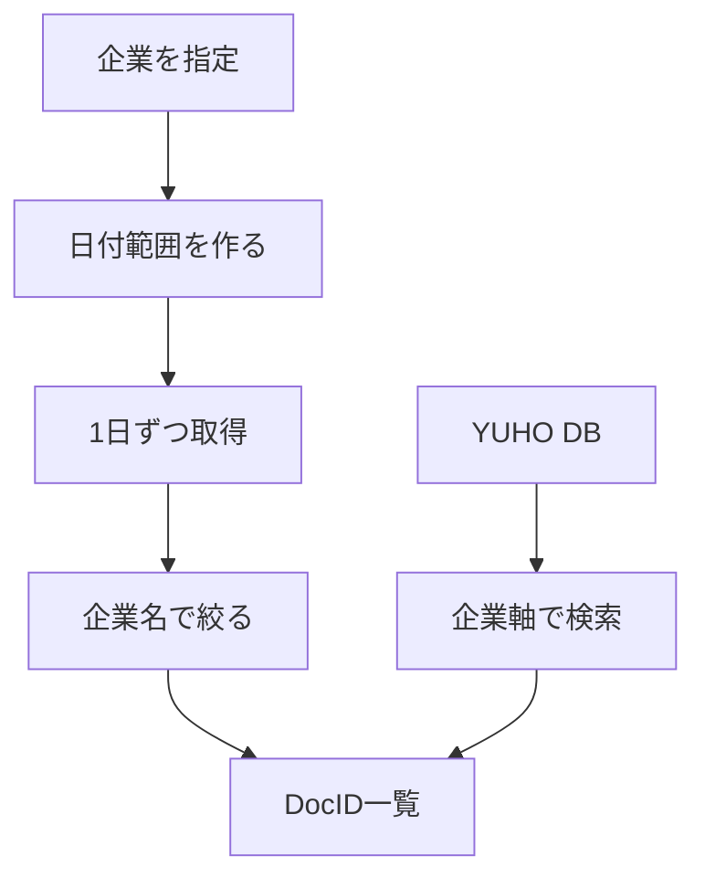
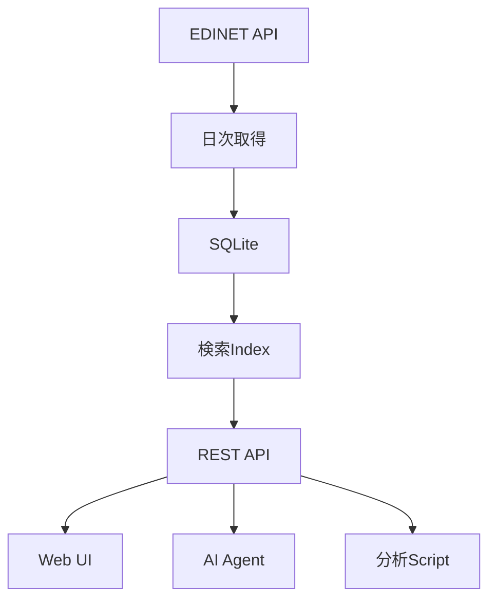
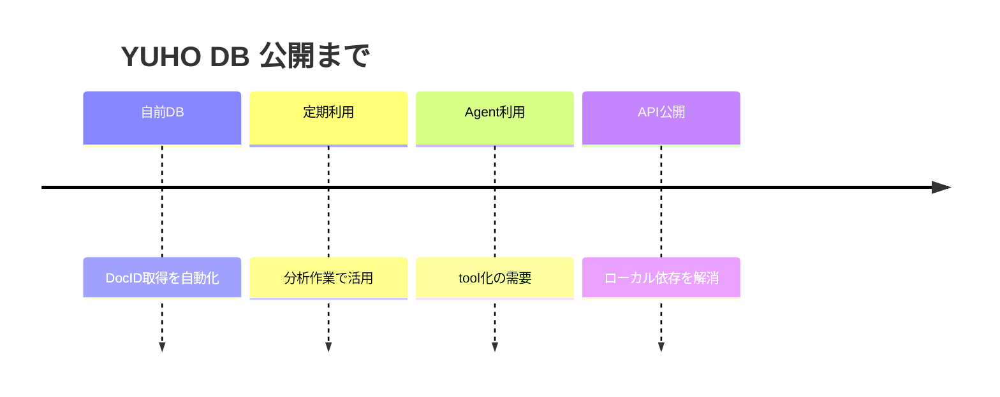
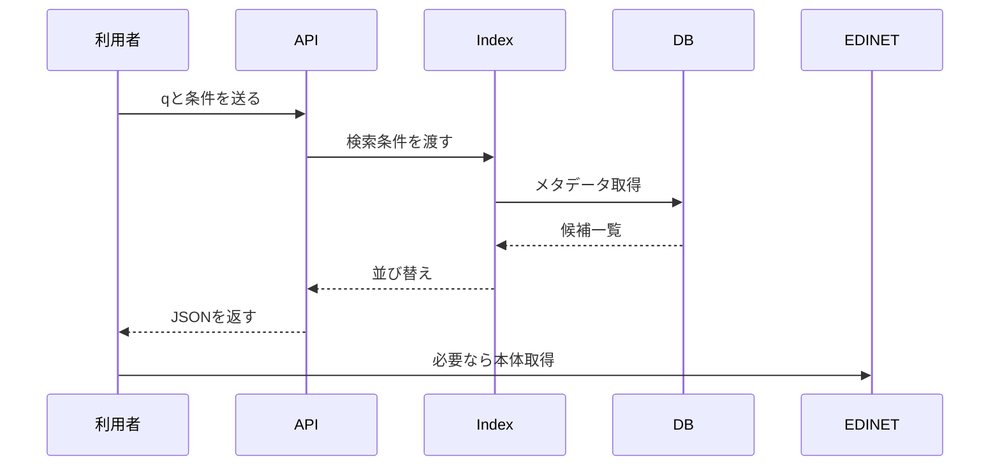
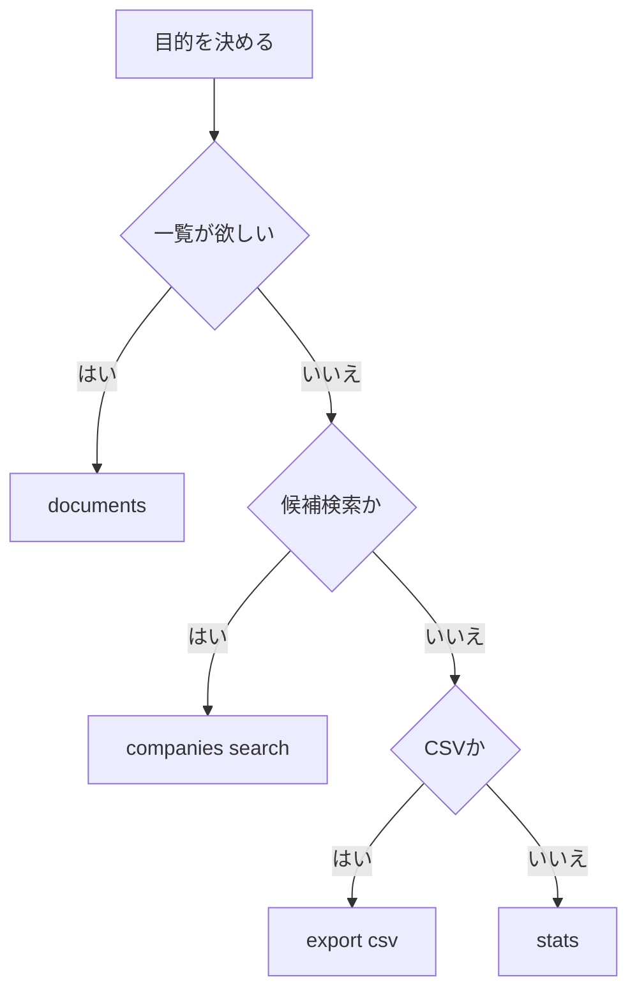
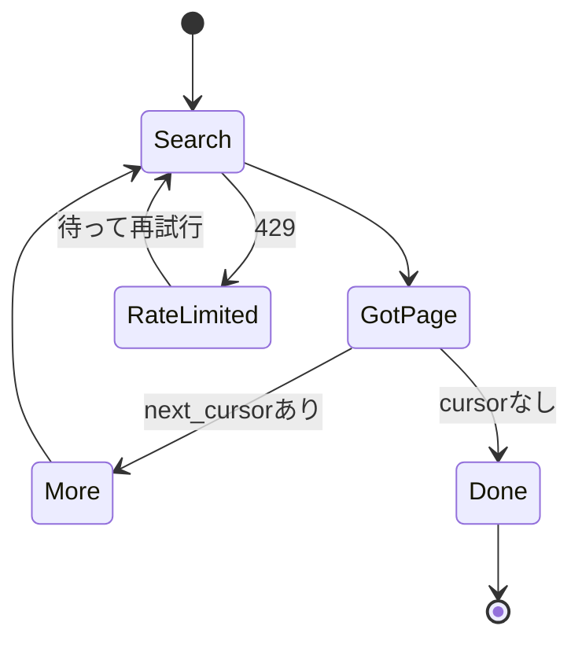
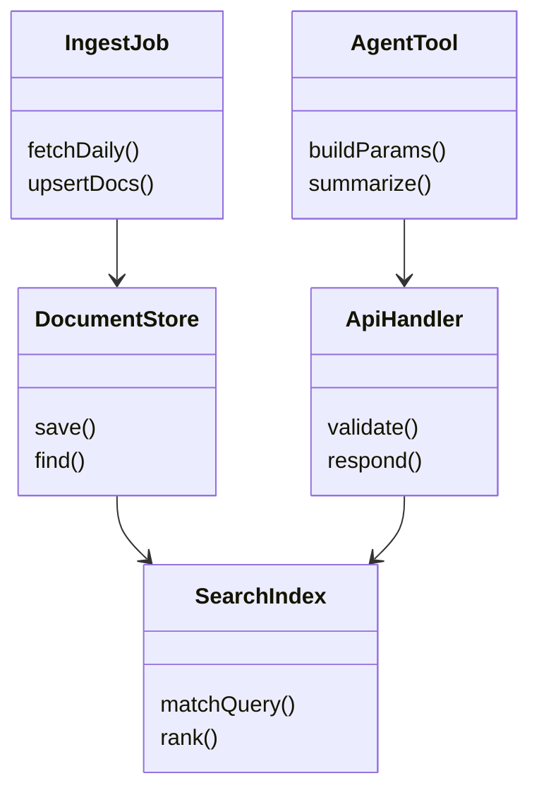
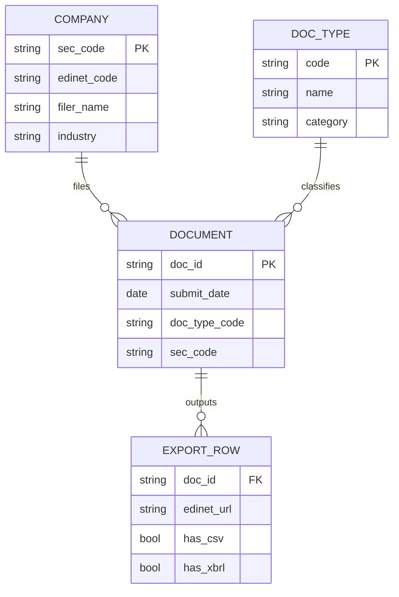
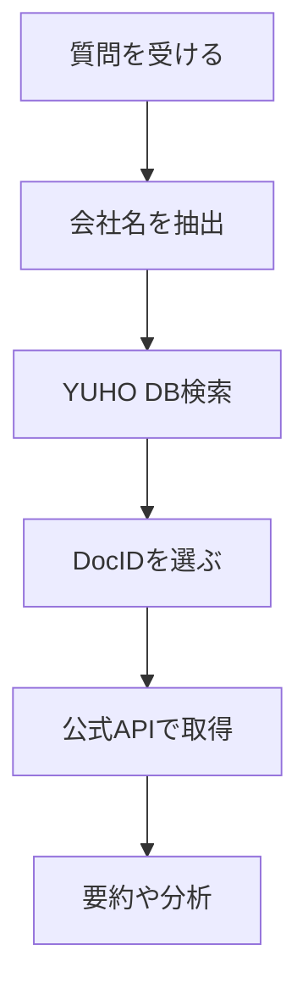
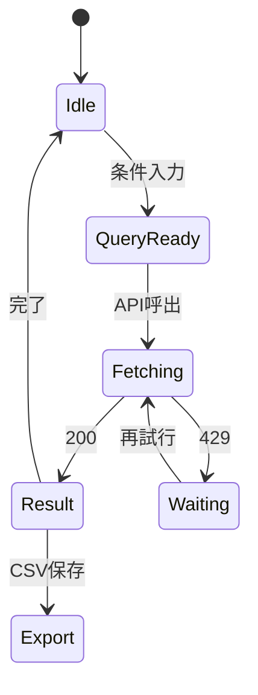

## はじめに

有価証券報告書をプログラムから扱うとき、最初にぶつかるのが **DocID の取得** です。

EDINETの書類本体を取得するにはDocIDが必要です。ところが、特定の企業について「過去10年分の有価証券報告書をまとめて取りたい」と思っても、公式APIの書類一覧は基本的に日付軸で取得します。

つまり、企業名や銘柄コードを指定して、

> トヨタの過去10年分の有価証券報告書のDocIDをください

という問い合わせを、1回で完結させるのが難しい。

そこで、EDINETの公開メタデータを企業軸で再インデックスし、会社名・銘柄コード・業種から過去の開示書類を検索できる **YUHO DB** を作りました。

ブラウザでも使えますが、主役はAPIです。

- サイト: `https://invest-aitech-yuho-db.web.app/`
- API Guide: `https://yuho-db-api-7oq53ssyja-an.a.run.app/api-reference`
- Base URL: `https://yuho-db-api-7oq53ssyja-an.a.run.app`

この記事では、なぜ作ったかよりも、**どう使えるか** に重きを置いて紹介します。

---

## この記事で伝えたいこと

YUHO DBは、EDINET公式APIを置き換えるものではありません。

役割はもっと限定的です。

> EDINETの公開メタデータを、AIエージェントやプログラムが使いやすい形に並べ替えた検索インデックス

です。

書類本体のPDF、XBRL、CSV ZIPを配信するサービスではなく、主に次の情報を素早く返すことを目的にしています。

- DocID
- 提出者名
- 銘柄コード
- EDINETコード
- 書類種別
- 提出日
- EDINET公式ページへのリンク

つまり、YUHO DBでDocIDを探し、そのDocIDを使って必要に応じてEDINET公式APIやEDINET公式サイトに進む、という使い方です。

---

## そもそもの課題：日付軸APIを企業軸で使いたい

EDINET公式APIは、提出書類一覧を日付単位で取得できます。

これは「今日提出された書類を一覧する」用途にはとても自然です。

一方で、企業分析では逆にこう聞きたくなります。

- 7203の過去10年分の有報は？
- トヨタの四半期報告書を直近3年分ほしい
- 輸送用機器の大量保有報告書を探したい
- AIエージェントから会社名でDocIDを引きたい

このとき、日付軸のAPIをそのまま使うと、日付を1日ずつ進めて検索する実装になりがちです。



読むポイント: 公式APIの取得単位は日付軸ですが、分析で欲しい単位は企業軸であることが多いです。YUHO DBは、その間に検索インデックスを置く発想です。

---

## YUHO DBでできること

現時点で、主に次のような使い方を想定しています。

| やりたいこと | 使うエンドポイント |
| --- | --- |
| 会社名で書類を探す | `GET /api/v1/documents?q=...` |
| 銘柄コードで書類を探す | `GET /api/v1/documents?sec_code=...` |
| 有報だけに絞る | `doc_type=120` |
| 過去10年に絞る | `period=10y` |
| CSVで一覧を取得する | `GET /api/v1/documents/export.csv` |
| 会社名の候補を出す | `GET /api/v1/companies/search?q=...` |
| DBの件数などを見る | `GET /api/v1/stats` |

APIキーは不要です。

ただし、公開APIなのでIP単位のレート制限があります。

| 単位 | 上限 |
| --- | ---: |
| 1分 | 10 requests |
| 1時間 | 100 requests |
| 1日 | 500 requests |

大量取得やバッチ用途ではなく、調査・分析・AIエージェントのツール呼び出しで必要な分だけ検索する、という使い方を想定しています。

---

## 全体アーキテクチャ

仕組み自体はかなり単純です。

1. EDINETの公開メタデータを定期取得
2. SQLiteに差分保存
3. 検索用インデックスを作る
4. APIから企業軸で検索できるようにする
5. Web UIやAIエージェントから使う



読むポイント: YUHO DBの中心は「書類本体の保管」ではなく「検索しやすいメタデータの再配置」です。API、UI、AI Agentは同じ検索インデックスを見ています。

---

## なぜ公開APIにしたのか

最初は自分用でした。

有報分析をするときに、毎回DocIDを探すのが面倒だったので、自前でDBを作り、定期更新するプログラムを書いていました。

それだけならローカルで十分です。

ただ、最近はAIエージェントに外部ツールを呼ばせる場面が増えてきました。

このとき、ローカルDB前提だと使いにくいです。

- 自分のPCが起動している必要がある
- エージェント環境からローカルにアクセスしづらい
- 他の人が同じ仕組みを再利用できない
- API化しないとtool callingに載せづらい

一方で、データ量はそこまで大きくありません。仕組みも単純です。運用費も、この規模であればほぼゼロに近い水準で抑えられます。

それなら、公開してAPIで使えるようにした方が、AIエージェントからも、人間のスクリプトからも使いやすくなると考えました。



読むポイント: 公開の動機は、派手な技術というより「自分用DBをAPI化した方がAI時代に自然だった」という流れです。

---

## まずはcurlで使ってみる

一番基本の検索です。

`q` に会社名、銘柄コード、業種などを入れます。

```bash
URL="https://yuho-db-api-7oq53ssyja-an.a.run.app"

curl -G "$URL/api/v1/documents" \
  --data-urlencode "q=トヨタ" \
  --data-urlencode "doc_type=120" \
  --data-urlencode "period=10y" \
  --data-urlencode "limit=20"
```

`doc_type=120` は有価証券報告書です。

`period=10y` を指定すると、過去10年分を対象に検索します。

日本語を含む検索では、`curl -G` と `--data-urlencode` を使うとURLエンコードを気にしなくて済みます。

---

## レスポンスの見方

レスポンスはJSONです。

大まかには、`results` に書類一覧、`total` に総件数、`next_cursor` に次ページ取得用のカーソルが入ります。

```json
{
  "results": [
    {
      "doc_id": "S100ABCD",
      "sec_code": "72030",
      "edinet_code": "E02144",
      "filer_name": "トヨタ自動車",
      "doc_type": {
        "code": "120",
        "name": "有価証券報告書",
        "category": "annual"
      },
      "doc_description": "第122期 有価証券報告書",
      "submit_date": "2024-06-25",
      "has_csv": true,
      "edinet_url": "https://disclosure2.edinet-fsa.go.jp/..."
    }
  ],
  "total": 142,
  "next_cursor": "eyJvZmZzZXQiOjUwfQ=="
}
```

最初に見るべき項目はこのあたりです。

| 項目 | 意味 |
| --- | --- |
| `doc_id` | EDINETの書類管理番号 |
| `sec_code` | 銘柄コード |
| `edinet_code` | EDINETコード |
| `filer_name` | 提出者名 |
| `doc_type.code` | 書類種別コード |
| `submit_date` | 提出日 |
| `edinet_url` | EDINET公式ページ |

AIエージェントに渡す場合も、まずは `doc_id`、`filer_name`、`submit_date`、`doc_description` だけを要約させると扱いやすいです。

---

## リクエストから最終出力までの流れ

APIとして見ると、処理はかなりシンプルです。



読むポイント: YUHO DBが返すのは検索済みメタデータです。PDFやXBRLなどの本体が必要な場合は、DocIDを使ってEDINET公式側へ進む設計です。

---

## よく使うパラメータ

`GET /api/v1/documents` でよく使うパラメータです。

| パラメータ | 例 | 説明 |
| --- | --- | --- |
| `q` | `トヨタ` | 社名・コード・業種の曖昧検索 |
| `sec_code` | `72030` | 銘柄コード完全一致 |
| `edinet_code` | `E02144` | EDINETコード完全一致 |
| `doc_type` | `120,140` | 書類種別コード |
| `period` | `1y` / `3y` / `5y` / `10y` / `all` | 対象期間 |
| `from` | `2020-01-01` | 開始日 |
| `to` | `2025-12-31` | 終了日 |
| `sort` | `submit_date_desc` | 並び順 |
| `limit` | `50` | 取得件数 |
| `cursor` | 前回の `next_cursor` | 次ページ取得 |

`from` と `to` を指定した場合は、`period` より日付範囲を優先する設計です。

---

## 書類種別コード

よく使うコードは次のとおりです。

| コード | 書類種別 |
| --- | --- |
| `120` | 有価証券報告書 |
| `140` | 四半期報告書 |
| `160` | 半期報告書 |
| `180` | 臨時報告書 |
| `220` | 大量保有報告書 |
| `030` | 有価証券届出書 |

たとえば、有報と四半期報告書をまとめて見たい場合は、カンマ区切りで指定します。

```bash
curl -G "$URL/api/v1/documents" \
  --data-urlencode "q=トヨタ" \
  --data-urlencode "doc_type=120,140" \
  --data-urlencode "period=5y"
```

---

## 条件分岐：どのAPIを使うべきか

迷ったら、まずは `/api/v1/documents` を使えば大丈夫です。

ただし、用途によっては他のエンドポイントの方が自然です。



読むポイント: APIの入口は複数ありますが、中心は書類検索です。UIの入力補完なら会社サジェスト、集計確認ならstats、表計算に渡すならCSVです。

---

## Pythonから使う

Pythonでは `requests` だけで使えます。

```python
import requests

BASE_URL = "https://yuho-db-api-7oq53ssyja-an.a.run.app"

def search_documents(
    q: str,
    doc_type: str = "120",
    period: str = "10y",
    limit: int = 50,
):
    res = requests.get(
        f"{BASE_URL}/api/v1/documents",
        params={
            "q": q,
            "doc_type": doc_type,
            "period": period,
            "limit": limit,
        },
        timeout=20,
    )
    res.raise_for_status()
    return res.json()

data = search_documents("トヨタ", doc_type="120", period="10y")

for doc in data["results"]:
    print(
        doc["submit_date"],
        doc["doc_id"],
        doc["filer_name"],
        doc["doc_description"],
    )
```

分析コードでは、最初にDocID一覧を取得しておき、必要な書類だけEDINET公式APIで取得する形にすると扱いやすいです。

---

## ページングする

`limit` を超える結果がある場合、`next_cursor` が返ります。

次ページが欲しいときは、その値を `cursor` に渡します。

```python
import requests

BASE_URL = "https://yuho-db-api-7oq53ssyja-an.a.run.app"

params = {
    "q": "トヨタ",
    "doc_type": "120,140",
    "period": "10y",
    "limit": 50,
}

all_docs = []

while True:
    res = requests.get(
        f"{BASE_URL}/api/v1/documents",
        params=params,
        timeout=20,
    )
    res.raise_for_status()

    data = res.json()
    all_docs.extend(data["results"])

    cursor = data.get("next_cursor")
    if not cursor:
        break

    params["cursor"] = cursor

print(len(all_docs))
```

カーソルを使うと、検索条件を保ったまま次のまとまりを取れます。



読むポイント: ページングとレート制限は別物です。`next_cursor` がある限り次ページを取れますが、429が出たら `Retry-After` に従って待つ必要があります。

---

## CSVでExcelに渡す

検索結果をそのまま表計算ソフトで見たい場合は、CSVエクスポートが便利です。

```bash
curl -G "$URL/api/v1/documents/export.csv" \
  --data-urlencode "q=トヨタ" \
  --data-urlencode "doc_type=120" \
  --data-urlencode "period=10y" \
  -o toyota_yuho.csv
```

CSVは、検索APIと同じパラメータを使えます。

主な列は次のようなものです。

- `submit_date`
- `submit_datetime`
- `sec_code`
- `edinet_code`
- `filer_name`
- `doc_type_code`
- `doc_type_name`
- `doc_description`
- `doc_id`
- `has_csv`
- `has_xbrl`
- `edinet_url`

調査の初期段階では、まずCSVで全体を眺め、必要なDocIDだけ後続処理に渡すのも便利です。

---

## JavaScriptから使う

Node.jsやサーバーサイドのJavaScriptからも普通に呼べます。

```js
const BASE_URL = "https://yuho-db-api-7oq53ssyja-an.a.run.app";

const params = new URLSearchParams({
  q: "トヨタ",
  doc_type: "120",
  period: "10y",
  limit: "20",
});

const res = await fetch(`${BASE_URL}/api/v1/documents?${params}`);
if (!res.ok) {
  throw new Error(`YUHO DB API error: ${res.status}`);
}

const data = await res.json();

for (const doc of data.results) {
  console.log(doc.submit_date, doc.doc_id, doc.doc_description);
}
```

ブラウザから直接呼ぶ場合はCORSの制約があります。

公開サイトやFirebase Hosting、ローカル開発の一部ポートは想定されていますが、任意のWebサイトから自由に読めるわけではありません。サーバーサイドやAIエージェントのツールから呼ぶ方が安定します。

---

## AIエージェントのtoolとして使う

このAPIを公開した大きな理由がここです。

AIエージェントから見ると、良いツールAPIには次の特徴があります。

- 認証が軽い
- 入力が少ない
- JSONで返る
- 1回の呼び出しで完結する
- 結果が構造化されている

YUHO DBは、会社名を `q` に入れるだけでDocID一覧を返せるため、toolとして登録しやすいです。

たとえば、以下のようなJSON Schemaでツール化できます。

```json
{
  "name": "search_yuho_documents",
  "description": "日本企業のEDINET開示書類メタデータを企業軸で検索する",
  "input_schema": {
    "type": "object",
    "properties": {
      "q": {
        "type": "string",
        "description": "会社名、銘柄コード、業種"
      },
      "doc_type": {
        "type": "string",
        "description": "書類種別コード。例: 120, 140, 160, 180, 220"
      },
      "period": {
        "type": "string",
        "enum": ["1y", "3y", "5y", "10y", "all"]
      },
      "limit": {
        "type": "integer",
        "minimum": 1,
        "maximum": 200
      }
    },
    "required": ["q"]
  }
}
```

エージェントには、たとえば次のように指示できます。

```text
企業の有価証券報告書を探すときは search_yuho_documents を使う。
原則として doc_type は 120 を使う。
ユーザーが「四半期」と言った場合は 140 も含める。
返ってきた doc_id, submit_date, doc_description を要約して答える。
```

このとき、エージェントは書類本体をいきなり読みに行く必要はありません。

まずメタデータを検索し、必要なDocIDを特定する。そこから本体取得やXBRL解析に進む、という段階的な設計にできます。

---

## 関数・コンポーネント間の呼び出し順

実装を部品に分けると、だいたい次のような責務になります。



読むポイント: 更新系と検索系を分けると理解しやすいです。日次取得はDBを更新し、APIは検索インデックスを読むだけに近い構成です。

---

## データの持ち方

重要なのは、書類と会社を分けて考えることです。

1社に対して、複数年・複数種類の書類が紐づきます。



読むポイント: YUHO DBが価値を出しているのは、日付ごとの書類一覧を、会社と書類種別で引きやすい形に整えている点です。

---

## APIでできること・できないこと

ここは大事です。

YUHO DBは便利ですが、万能APIではありません。

### できること

| できること | 説明 |
| --- | --- |
| 会社名検索 | `q=トヨタ` のように検索できる |
| 銘柄コード検索 | `sec_code=72030` で絞れる |
| EDINETコード検索 | `edinet_code=E02144` で絞れる |
| 書類種別フィルタ | 有報、四半期、大量保有などを絞れる |
| 期間フィルタ | `1y` / `3y` / `5y` / `10y` / `all` |
| CSV出力 | 検索結果をCSVで保存できる |
| AI tool利用 | JSONなのでエージェントに渡しやすい |

### できないこと

| できないこと | 理由 |
| --- | --- |
| EDINET公式の代替 | 非公式の検索インデックスです |
| 投資判断の保証 | 正確性や完全性は保証しません |
| 書類本文の解析 | 返す中心はメタデータです |
| XBRL値の抽出 | 財務数値DBではありません |
| 無制限アクセス | レート制限があります |
| 自然人提出書類の提供 | 個人情報保護のため除外されます |

特に重要なのは、**YUHO DBはDocID検索を楽にするAPIであって、財務諸表データベースではない** という点です。

DocIDが取れた後のPDF取得、XBRL取得、財務値抽出は、別の処理として設計するのが自然です。

---

## 典型的な使い方

### 1. 会社名で有報を探す

```bash
curl -G "$URL/api/v1/documents" \
  --data-urlencode "q=ソニー" \
  --data-urlencode "doc_type=120" \
  --data-urlencode "period=10y"
```

### 2. 銘柄コードで有報を探す

```bash
curl -G "$URL/api/v1/documents" \
  --data-urlencode "sec_code=67580" \
  --data-urlencode "doc_type=120" \
  --data-urlencode "period=10y"
```

### 3. 大量保有報告書を探す

```bash
curl -G "$URL/api/v1/documents" \
  --data-urlencode "q=トヨタ" \
  --data-urlencode "doc_type=220" \
  --data-urlencode "period=5y"
```

### 4. 会社サジェストを使う

```bash
curl -G "$URL/api/v1/companies/search" \
  --data-urlencode "q=トヨタ"
```

検索UIを作る場合は、ユーザーが入力している途中でこのエンドポイントを呼ぶと、候補表示に使えます。

### 5. 統計を見る

```bash
curl "$URL/api/v1/stats"
```

インデックス済み書類数、提出者数、最終更新日などを確認できます。

---

## AIエージェントに渡すときの設計例

AIエージェントにいきなり「有報を読んで」と言うと、処理が重くなります。

おすすめは段階を分けることです。



読むポイント: YUHO DBは入口です。DocIDを選ぶ段階を軽くすることで、後段のPDF取得やXBRL解析に進みやすくなります。

たとえば、エージェント側では次のような方針にできます。

1. 会社名や銘柄コードを抽出する
2. YUHO DBでDocID候補を取る
3. 提出日と書類名を見て対象を選ぶ
4. 必要な書類だけEDINET公式APIで取得する
5. PDF、XBRL、CSVを解析する

こうすると、最初から全期間・全文を読みに行くよりも、コストも時間も抑えやすいです。

---

## エラーハンドリング

主なステータスは次のとおりです。

| Status | 意味 | 対応 |
| --- | --- | --- |
| `200` | 成功 | そのまま処理 |
| `400` | クエリ不正 | パラメータを確認 |
| `404` | 不存在など | DocIDを確認 |
| `429` | レート制限 | `Retry-After` を見て待つ |
| `500` | サーバーエラー | 少し待って再試行 |

Pythonで簡単に扱うなら、429だけ特別に見ると実用上は十分です。

```python
import time
import requests

def get_with_retry(url, params, max_retry=3):
    for i in range(max_retry):
        res = requests.get(url, params=params, timeout=20)

        if res.status_code == 429:
            wait = int(res.headers.get("Retry-After", "10"))
            time.sleep(wait)
            continue

        res.raise_for_status()
        return res.json()

    raise RuntimeError("rate limit retry exceeded")
```

公開APIなので、短時間に連続で叩くより、必要な検索を絞って呼ぶ方が向いています。

---

## 状態として見るAPI利用

実際の利用は、次のような状態遷移で考えると安全です。



読むポイント: API利用は、成功パスだけでなくレート制限時の待機を状態として持つと実装が安定します。

---

## ブラウザUIとAPIの位置づけ

YUHO DBにはブラウザUIもあります。

人間が検索するなら、ブラウザUIは便利です。

ただ、個人的にはAPIで使う方がメリットが大きいと思っています。

| 使い方 | 向いている場面 |
| --- | --- |
| ブラウザUI | 目視確認、単発検索、デモ |
| REST API | 分析スクリプト、CSV出力、AI Agent |
| CSV export | Excel、スプレッドシート、共有 |
| 会社サジェスト | 自作UIの補完 |

ブラウザUIは「見える入口」です。

APIは「使える部品」です。

AIエージェント時代には、この「使える部品」として公開されていることの価値が大きいと考えています。

---

## 実装の考え方

実装で意識したのは、難しいことをしないことです。

### 1. 本体を抱え込まない

書類本体を自前で配信し始めると、容量、更新、権利、転送量、エラー処理が一気に重くなります。

YUHO DBは、まずメタデータ検索に集中します。

本体が必要な場合は、DocIDを使ってEDINET公式側に進む設計にしています。

### 2. 企業軸の検索を速くする

AIエージェントや対話UIから使う場合、1回の応答が遅いと体験が悪くなります。

そのため、日付を1日ずつ探索するのではなく、事前に企業軸で引ける形にしておきます。

### 3. 認証を増やさない

APIキー発行やユーザー登録を入れると、使い始めるまでの摩擦が増えます。

今回はデータ量と用途を限定し、IP単位のレート制限で公開する形にしました。

### 4. 運用費を重くしない

個人開発の公開APIは、継続できることが大事です。

データ量がそこまで大きくないなら、重い構成にせず、更新処理と検索APIをシンプルに保つ方が長続きします。

---

## どんな人に便利か

次のような人には便利だと思います。

- 有報分析をPythonでしている人
- EDINETのDocID取得部分を毎回書いている人
- AIエージェントに企業開示を調べさせたい人
- 銘柄コードから過去の開示一覧を見たい人
- CSVで有報提出日をざっと確認したい人
- 自作の投資分析ツールにEDINET検索を組み込みたい人

逆に、財務諸表の値そのものが欲しい人は、YUHO DBだけでは足りません。

その場合は、YUHO DBでDocIDを特定し、EDINET公式APIでXBRLやCSV ZIPを取得し、別途パースする構成がよいです。

---

## まとめ

YUHO DBは、EDINETの公開メタデータを企業軸で検索できるようにした非公式APIです。

大きな機能を持ったサービスではありません。

でも、有報分析やAIエージェント利用で最初に必要になる **DocIDを探す** という作業を、かなり軽くできます。

特に、これまではローカルDBや自前スクリプトに閉じていた処理を、公開APIとして呼べるようにしたことで、

- ブラウザから検索できる
- Pythonから使える
- CSVで落とせる
- AIエージェントのtoolにできる
- ローカル環境に依存しない

という使い方ができるようになりました。

「企業名から過去の有報DocIDを引きたい」という地味なニーズに対して、軽く、速く、扱いやすい入口になればうれしいです。

---

## 免責

YUHO DBは非公式サービスです。金融庁・EDINETとは無関係です。

収録データはEDINETの公開メタデータをもとにしていますが、正確性・完全性・最新性を保証するものではありません。投資判断の根拠として使用することは推奨しません。

正確な情報や書類本体は、必ずEDINET公式サイト・公式APIで確認してください。

